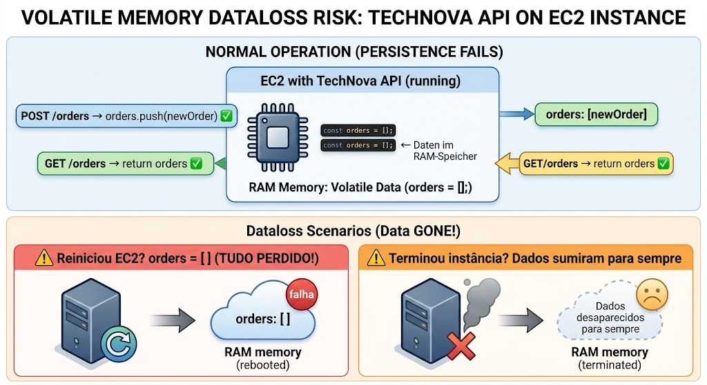
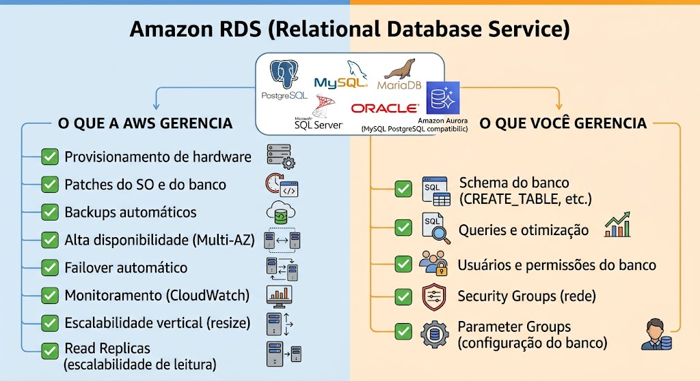
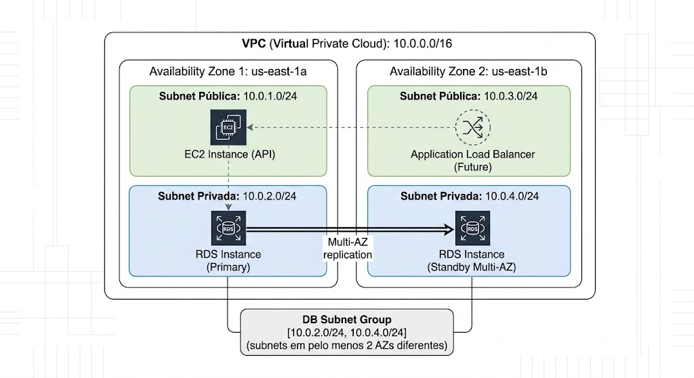
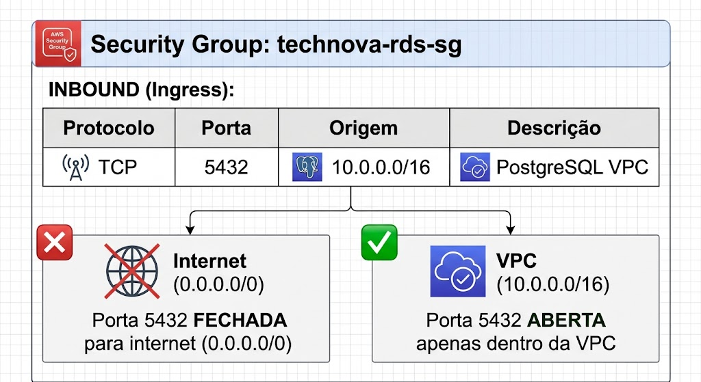
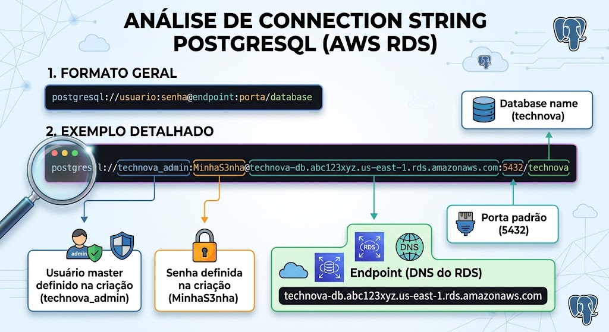
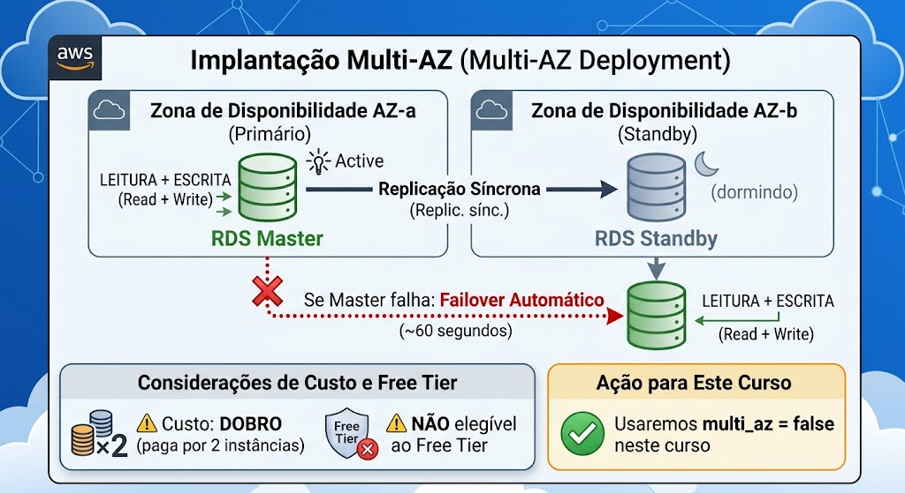
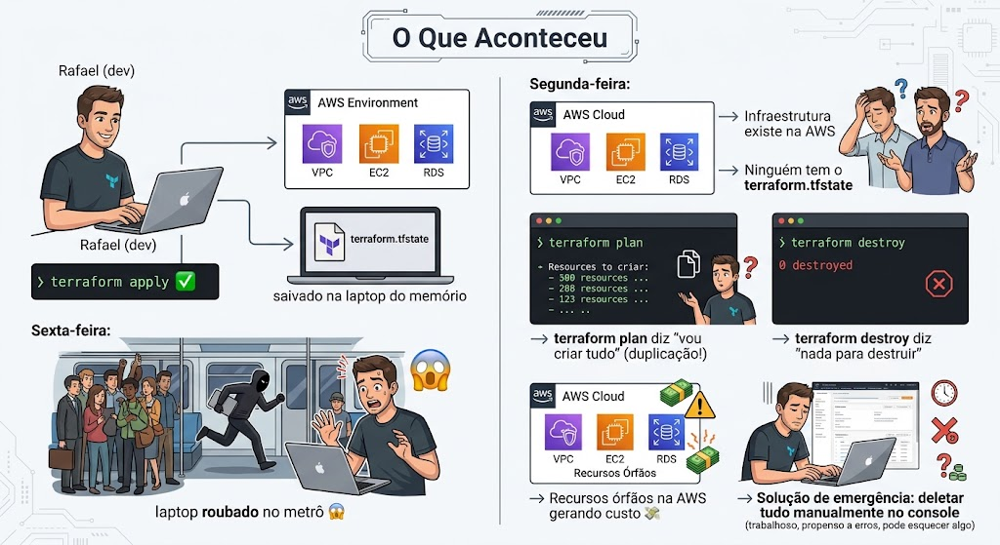
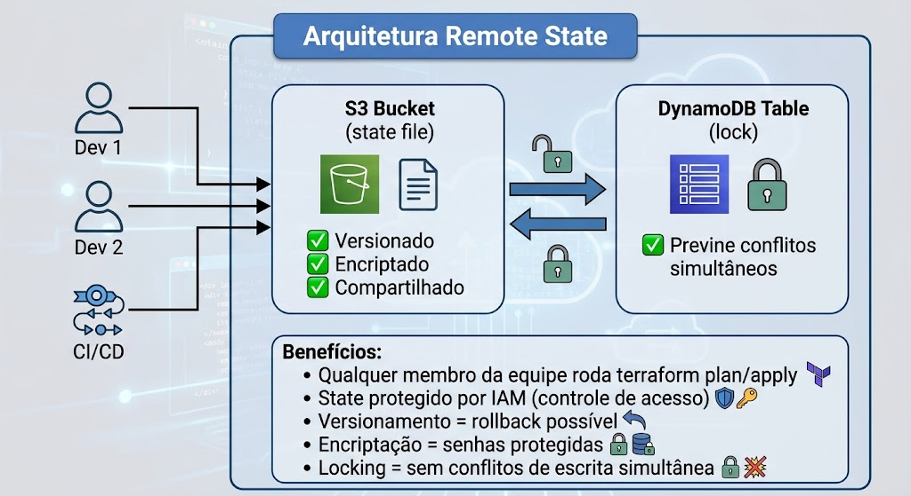
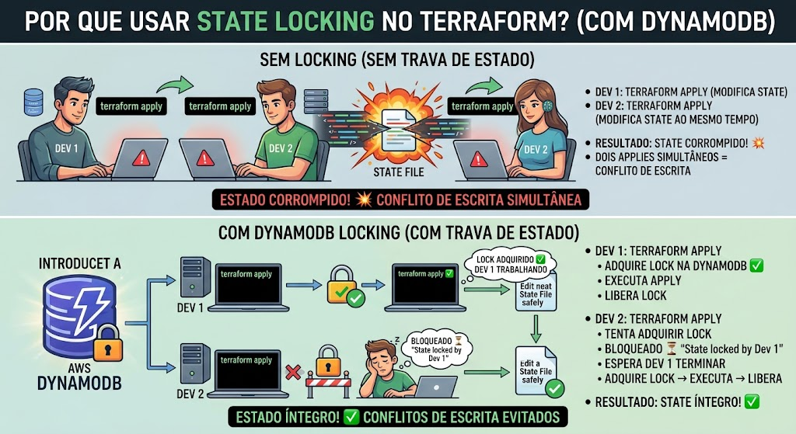

# Aula 05 — RDS e Remote State

## Objetivos de Aprendizagem

Ao final desta aula, o aluno será capaz de:

1. Compreender o conceito de banco de dados gerenciado (RDS) e suas vantagens
2. Configurar DB Subnet Groups para posicionar o RDS em subnets privadas
3. Provisionar uma instância RDS PostgreSQL usando Terraform (db.t3.micro Free Tier)
4. Conectar uma aplicação EC2 ao RDS dentro da mesma VPC
5. Compreender a importância do terraform.tfstate e riscos do state local
6. Configurar S3 como backend remoto para o Terraform state
7. Configurar DynamoDB para locking de state (prevenção de conflitos)
8. Migrar state local para backend remoto com terraform init -migrate-state

---

## Contexto Narrativo

> **O Resgate da TechNova — Episódio 5: "Dados Persistentes e Estado Protegido"**

Na última reunião com investidores, a demonstração da API rodando no EC2 impressionou — até que alguém perguntou:

> "Se eu criar uma conta e reiniciar o servidor, meus dados ainda estarão lá?"

Silêncio na sala. A resposta era **não**. A aplicação armazena tudo em memória. Reiniciou o EC2? Dados perdidos. Terminou a instância? Tudo zerado. Os investidores não ficaram felizes:

> "Vocês estão me dizendo que estamos rodando uma aplicação com dados na memória RAM? Isso não é sério. Precisamos de um banco de dados de verdade — persistente, com backup, acessível apenas internamente."

Para piorar, na sexta-feira seguinte, Rafael teve seu laptop roubado no metrô. Dentro do laptop estava o único arquivo `terraform.tfstate` da infraestrutura — o mapa completo de tudo que foi provisionado na AWS. Sem ele, o Terraform não sabe o que existe na nuvem.

A consultora Marina resumiu a situação:

> "Temos dois problemas críticos. Primeiro: precisamos de um **banco de dados gerenciado** — Amazon RDS. Ele persiste dados, faz backup automático, e fica na subnet privada onde ninguém de fora acessa. Segundo: o state do Terraform **não pode ficar no laptop de ninguém**. Vamos usar um bucket S3 como backend remoto com DynamoDB para locking. Assim, o state fica seguro, versionado, e acessível para toda a equipe."

O CTO Carlos Mendes concordou:

> "Faz sentido. Agora que a infraestrutura está complexa — VPC, subnets, EC2, e agora banco de dados — o arquivo de state é precioso demais para depender de um laptop. Vamos resolver os dois problemas hoje."

Esse é o desafio desta aula: primeiro, adicionar a **camada de dados** com Amazon RDS (PostgreSQL). Depois, **proteger o state** do Terraform com S3 + DynamoDB. Infraestrutura complexa exige state protegido.

---

## Cronograma da Aula (~5 horas)

| Bloco | Atividade | Duração |
|:-----:|-----------|:-------:|
| 1 | Revisão TA + Discussão em Grupo | 30 min |
| 2 | Conteúdo Teórico — RDS e Banco de Dados Gerenciado | 50 min |
| 3 | Laboratório Parte 1 — RDS com Terraform | 120 min |
| 4 | Conteúdo Teórico — Remote State | 50 min |
| 5 | Laboratório Parte 2 — S3 Backend + DynamoDB Lock | 120 min |
| 6 | Encerramento + Orientação TF | 15 min |

---

## Conteúdo Original Consolidado

Esta aula consolida o conteúdo das aulas originais **Aula 08 (RDS e Banco de Dados Gerenciado)** e **Aula 09 (Remote State com S3 e DynamoDB)** em uma única aula de ~5 horas. A conexão é natural: agora que a infraestrutura está complexa (VPC + EC2 + RDS), o arquivo de state é precioso demais para ficar em um laptop. RDS adiciona a camada de dados, Remote State protege o mapa da infraestrutura.

---

## Entrega do Trabalho em Aula

O trabalho em aula vale **1 ponto na nota final** do semestre (contabilizado apenas ao final, com todos os trabalhos entregues).

### Onde entregar

Na **mesma pasta** da entrega do TF, no fork da disciplina:

```
entregas/aula-05/SEU-RA/trabalho-em-aula.md
```

### O que entregar

Um arquivo `trabalho-em-aula.md` com as respostas das atividades realizadas em sala (discussões, diagramas, classificações).

### Observações

- A entrega é **individual** — mesmo que a atividade tenha sido em grupo
- O arquivo pode ser adicionado no **mesmo PR** do TF ou em PR separado
- Entregas parciais (apenas algumas aulas) **não garantem o ponto**

---

## Entrega do Trabalho de Fixação (TF)

O TF desta aula deve ser desenvolvido no **seu repositório pessoal** (`unifaat-devops-portfolio`, pasta `aula-05/`). A entrega neste repositório da disciplina consiste em um **arquivo Markdown (`entrega.md`)** contendo o **link para o seu repositório** e as evidências solicitadas.

### Passo a Passo

1. **Desenvolva o TF** no seu repositório pessoal (`unifaat-devops-portfolio/aula-05/`)
2. Faça **fork** do repositório da disciplina (se ainda não fez)
3. Crie uma **branch**: `SEU-RA/tf-05`
4. Crie a pasta `entregas/aula-05/SEU-RA/`
5. Adicione o arquivo **`entrega.md`** com o link do seu repositório + evidências
6. Faça commits descritivos seguindo [Conventional Commits](https://www.conventionalcommits.org/pt-br/)
7. Abra um **Pull Request** para o repositório original com título: `[Aula 05] RA: XXXXX - Nome Completo`

### Modelo do arquivo `entrega.md`

```markdown
# Entrega — Aula 05: RDS e Remote State

**Aluno:** [Seu nome completo]  
**RA:** [Seu RA]  
**Data:** [Data da entrega]

## Repositório

- URL: https://github.com/SEU-USUARIO/unifaat-devops-portfolio

## Evidências

- [ ] VPC com subnets públicas e privadas em 2 AZs
- [ ] RDS PostgreSQL (db.t3.micro) nas subnets privadas
- [ ] EC2 t2.micro na subnet pública, conectando ao RDS
- [ ] Security Groups corretos (porta 5432 apenas da VPC)
- [ ] Remote State configurado (S3 + DynamoDB)
- [ ] State armazenado no S3 (evidência abaixo)
- [ ] Conexão EC2 → RDS via psql (evidência abaixo)
- [ ] `terraform destroy` executado após evidências

## Evidência do State no S3

[Cole aqui o output do `aws s3 ls` ou screenshot]

## Evidência da Conexão EC2 → RDS

[Cole aqui o output do psql ou screenshot]
```

> **Importante:** O repositório pessoal do aluno deve estar **público** para que o professor consiga avaliar. PRs que não contenham o link para o repositório ou cujo repositório esteja privado serão considerados **incompletos**.

Para detalhes completos sobre os entregáveis e critérios de avaliação, consulte o arquivo [`TF.md`](TF.md).

---

## Pré-requisitos

- **Conta AWS** criada com Free Tier ativo — [Criar conta AWS](https://aws.amazon.com/free/)
- **Terraform** instalado (≥ 1.0) — [Download](https://developer.hashicorp.com/terraform/downloads)
- **AWS CLI** instalado e configurado — [Guia](https://docs.aws.amazon.com/cli/latest/userguide/getting-started-install.html)
- **Conhecimentos das Aulas 01-04:** Git, Docker, Docker Compose, Terraform (init/plan/apply/destroy), IAM, VPC (subnets públicas/privadas, IGW, Route Tables), EC2 (AMI, instance type, security groups, user data, SSH)
- Editor de texto (VS Code com extensão HashiCorp Terraform recomendada)
- **Cliente SSH** (terminal Linux/Mac ou PuTTY no Windows)

> **⚠️ Free Tier:** Todos os recursos desta aula são elegíveis ao AWS Free Tier:
> - **RDS db.t3.micro:** 750 horas/mês, 20 GB storage (12 meses)
> - **S3:** 5 GB de armazenamento gratuito (12 meses)
> - **DynamoDB:** 25 GB de armazenamento gratuito (sempre)
>
> Lembre-se de executar `terraform destroy` ao final e deletar manualmente o bucket S3.

---

## Conteúdo Teórico — Parte 1: RDS e Banco de Dados Gerenciado

*Tempo estimado: ~50 minutos*

### 1. O Problema: Dados em Memória

Na Aula 04, colocamos a API da TechNova no EC2. Ela funciona — mas onde os dados estão? Na memória RAM. Isso significa:



**Cenários de perda de dados:**
- `terraform destroy` e `terraform apply` novamente → dados zerados
- Instância reinicia por manutenção AWS → dados zerados
- Auto Scaling substitui instância → dados zerados
- Erro na aplicação que crasheia → dados zerados

**Solução:** Banco de dados externo e persistente.

### 2. Self-Managed vs Managed Database

| Aspecto | Self-Managed (PostgreSQL no EC2) | Managed (Amazon RDS) |
|---------|----------------------------------|---------------------|
| Instalação | Você instala e configura | AWS provisiona pronto |
| Patches/Updates | Sua responsabilidade | AWS aplica automaticamente |
| Backups | Você configura cron + scripts | Automáticos (diários, retenção configurável) |
| Alta Disponibilidade | Você configura replicação | Multi-AZ com 1 clique |
| Monitoramento | Você instala ferramentas | CloudWatch integrado |
| Escalabilidade | Migração manual para servidor maior | Resize com poucos cliques |
| Failover | Você implementa lógica | Automático em Multi-AZ |
| Custo operacional | Alto (horas de DBA) | Baixo (AWS gerencia) |
| Custo financeiro | Só paga o EC2 | Um pouco mais caro que EC2 puro |
| Acesso SSH ao servidor DB | ✅ Sim | ❌ Não (é gerenciado) |

**Quando usar Self-Managed?**
- Precisa de configurações muito específicas do SO
- Banco de dados não suportado pelo RDS
- Requisitos de compliance que exigem controle total

**Quando usar RDS? (maioria dos casos)**
- Quer focar na aplicação, não em administrar banco
- Precisa de backup automático e confiável
- Quer alta disponibilidade sem complexidade
- Equipe pequena sem DBA dedicado

> **Para a TechNova:** RDS é a escolha óbvia. Equipe pequena, sem DBA, precisa de confiabilidade.

### 3. O que é Amazon RDS?

**RDS** (Relational Database Service) é o serviço de banco de dados relacional gerenciado da AWS:



> **Neste curso:** Usaremos **PostgreSQL 15** por ser open source, popular, e ter excelente suporte no Free Tier.

### 4. DB Subnet Group — Por Que 2 AZs?

Um **DB Subnet Group** é um grupo de subnets onde o RDS pode ser posicionado. A AWS **exige pelo menos 2 subnets em AZs diferentes**:



**Por que 2 AZs?**
- Mesmo que você use `multi_az = false` (Free Tier), a AWS exige o DB Subnet Group em 2 AZs
- Se no futuro você ativar Multi-AZ, o standby será na outra AZ
- É um requisito de resiliência: se uma AZ cair, o banco pode migrar para outra
- **Não é opcional** — criar DB Subnet Group com subnets em apenas 1 AZ resulta em erro

### 5. Security Group para RDS

O RDS fica na subnet privada (sem acesso à internet), mas precisa aceitar conexões da aplicação EC2:


**Melhor prática:** Em vez de abrir para toda a VPC (CIDR), referencie o Security Group do EC2:

```hcl
ingress {
  from_port       = 5432
  to_port         = 5432
  protocol        = "tcp"
  security_groups = [aws_security_group.ec2_sg.id]  # Apenas EC2 com este SG
}
```

### 6. Connection String — Conectando ao RDS

Após criar o RDS, você recebe um **endpoint** (DNS name) para conexão:



**Testando conexão do EC2:**
```bash
# Instalar cliente PostgreSQL no EC2
sudo yum install -y postgresql15

# Conectar ao RDS (de dentro da VPC)
psql -h technova-db.abc123xyz.us-east-1.rds.amazonaws.com \
     -U technova_admin \
     -d technova \
     -p 5432
```

### 7. Multi-AZ — Conceito (Não Usaremos)



### 8. Free Tier RDS

| Recurso | Limite Gratuito | Período |
|---------|----------------|---------|
| RDS db.t3.micro | 750 horas/mês | 12 meses |
| Armazenamento | 20 GB SSD (gp2) | 12 meses |
| Backup | 20 GB | 12 meses |
| Multi-AZ | ❌ Não incluído | — |

> **⚠️ IMPORTANTE:**
> - Use **db.t3.micro** (não db.t2.micro, que está depreciado para algumas engines)
> - Defina `allocated_storage = 20` (não mais)
> - Defina `multi_az = false`
> - RDS leva **5-10 minutos** para ficar pronto — tenha paciência!
> - Sempre execute `terraform destroy` ao final do lab

---

## Conteúdo Teórico — Parte 2: Remote State

*Tempo estimado: ~50 minutos*

### 1. O Problema: State Local

Quando você roda `terraform apply`, o Terraform cria um arquivo `terraform.tfstate` no diretório local. Esse arquivo é o **mapa da infraestrutura** — ele mapeia cada recurso no código `.tf` para o recurso real na AWS:

```json
{
  "resources": [
    {
      "type": "aws_instance",
      "name": "api",
      "instances": [
        {
          "attributes": {
            "id": "i-0abc123def456",
            "ami": "ami-0abcdef1234567890",
            "instance_type": "t2.micro",
            "public_ip": "54.123.45.67"
          }
        }
      ]
    }
  ]
}
```

**Sem esse arquivo, o Terraform:**
- Não sabe o que existe na AWS
- Vai tentar criar tudo de novo (duplicação!)
- Ou não consegue destruir o que já existe
- Perde a capacidade de fazer `plan` e `diff`

### 2. Cenário Rafael — O Laptop Roubado



### 3. Problemas do State Local

| Problema | Descrição | Consequência |
|----------|-----------|--------------|
| Ponto único de falha | State no laptop/PC | Perdeu o arquivo = perdeu o controle |
| Sem colaboração | Só quem tem o arquivo pode rodar Terraform | Equipe bloqueada |
| Sem locking | Dois devs rodam `apply` ao mesmo tempo | State corrompido |
| Sem histórico | Sem versionamento do state | Não consegue reverter |
| Sem segurança | Arquivo com senhas em plain text | Vazamento de credenciais |

### 4. Solução: Remote State com S3 + DynamoDB



### 5. S3 Backend — Configuração

```hcl
terraform {
  backend "s3" {
    bucket         = "technova-terraform-state"   # Nome do bucket S3
    key            = "prod/terraform.tfstate"     # Caminho dentro do bucket
    region         = "us-east-1"                  # Região do bucket
    encrypt        = true                         # Encriptação SSE-S3
    dynamodb_table = "technova-terraform-locks"   # Tabela para locking
  }
}
```

**Parâmetros:**
| Parâmetro | Descrição |
|-----------|-----------|
| `bucket` | Nome do bucket S3 (deve existir antes) |
| `key` | Caminho/nome do arquivo de state dentro do bucket |
| `region` | Região AWS do bucket |
| `encrypt` | Habilita encriptação server-side |
| `dynamodb_table` | Tabela DynamoDB para locking (opcional mas recomendado) |

### 6. DynamoDB Locking — Prevenindo Conflitos



**Tabela DynamoDB para locking:**
- Nome: definido em `dynamodb_table`
- Partition Key: `LockID` (tipo String)
- O Terraform cria/deleta o lock automaticamente

### 7. Migração de State Local → Remoto

```bash
# 1. Você tem state local (terraform.tfstate no diretório)
# 2. Adiciona o bloco backend "s3" no providers.tf
# 3. Executa:

terraform init -migrate-state

# Terraform pergunta:
# "Do you want to copy existing state to the new backend?"
# Responda: yes

# 4. Pronto! State agora está no S3
# O arquivo local pode ser deletado (Terraform cria backup)
```

### 8. Free Tier — S3 e DynamoDB

| Serviço | Limite Gratuito | Período |
|---------|----------------|---------|
| S3 | 5 GB armazenamento, 20.000 GET, 2.000 PUT | 12 meses |
| DynamoDB | 25 GB armazenamento, 25 WCU, 25 RCU | Sempre gratuito |

> **Para nosso caso:** O arquivo terraform.tfstate raramente ultrapassa 100 KB. Estamos muito longe dos limites do Free Tier.

---

## Resumo dos Conceitos

| Conceito | Descrição |
|----------|-----------|
| RDS | Banco de dados relacional gerenciado pela AWS |
| DB Subnet Group | Grupo de subnets (2+ AZs) onde o RDS será posicionado |
| Multi-AZ | Réplica standby em outra AZ para alta disponibilidade |
| Connection String | URL de conexão ao banco (host:port/database) |
| terraform.tfstate | Arquivo que mapeia código Terraform ↔ recursos reais na AWS |
| Backend S3 | Armazenar state remotamente em bucket S3 |
| DynamoDB Locking | Previne modificações simultâneas no state |
| State Migration | Processo de mover state local para backend remoto |
| Encrypt | Encriptação server-side do state no S3 |
| Versioning | Histórico de versões do state no S3 |

---

## 💰 Free Tier — Resumo de Custos

| Componente | Custo |
|------------|-------|
| VPC, Subnets, IGW, Route Tables | **Gratuito** (sempre) |
| EC2 t2.micro | **Gratuito** (750h/mês, 12 meses) |
| RDS db.t3.micro | **Gratuito** (750h/mês, 12 meses) |
| RDS Storage 20 GB | **Gratuito** (12 meses) |
| S3 (state file ~100 KB) | **Gratuito** (5 GB free, 12 meses) |
| DynamoDB (lock table) | **Gratuito** (25 GB free, sempre) |
| Multi-AZ RDS | ⚠️ Dobro do custo (**NÃO usar no lab**) |
| NAT Gateway | ⚠️ ~$32/mês (**NÃO usar no lab**) |

> **⚠️ Sempre execute `terraform destroy` após o Laboratório Parte 2. Depois, delete manualmente o bucket S3 e a tabela DynamoDB (pois eles foram criados fora do Terraform principal).**

---

*Próximas etapas: Laboratório Parte 1 (RDS com Terraform) → Laboratório Parte 2 (S3 Backend + DynamoDB Lock) → TF (Trabalho de Fixação)*