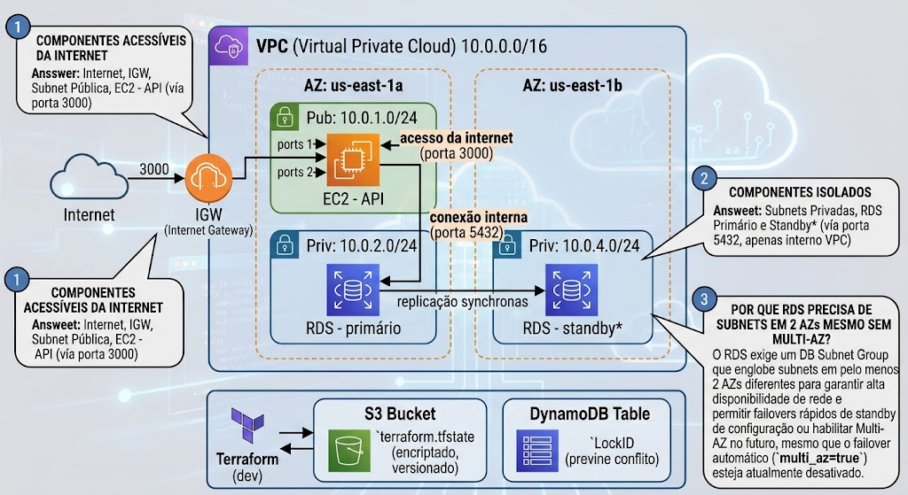

# Trabalho em Aula — Aula 05: RDS e Remote State

## Atividade em Grupo (~30 minutos)

**Objetivo:** Analisar os dois incidentes da TechNova (perda de dados + perda de state) e propor soluções arquiteturais antes de partir para a implementação nos laboratórios.

**Formação:** Grupos de 3-4 alunos

---

## Parte 1 — Análise dos Incidentes (10 min)

### Cenário A: Perda de Dados

> O investidor demonstrou a API da TechNova para um parceiro comercial. Criou 5 pedidos de teste. No dia seguinte, a instância EC2 reiniciou por manutenção programada da AWS. Todos os pedidos desapareceram.

**Discuta no grupo:**

1. Por que os dados foram perdidos? (Onde estavam armazenados?)
2. Quais outros cenários causariam a mesma perda? (Liste pelo menos 3)
3. Por que simplesmente "não reiniciar o EC2" não é uma solução válida?
4. Qual a diferença entre "dados em memória" e "dados persistentes"?

### Cenário B: Perda do State

> Rafael teve seu laptop roubado. O terraform.tfstate — único mapa da infraestrutura — estava lá. Na segunda-feira, a equipe precisa fazer uma mudança urgente no Security Group, mas o Terraform "não sabe" o que existe na AWS.

**Discuta no grupo:**

1. O que acontece se rodarem `terraform plan` sem o state? Por quê?
2. Qual é o risco de rodar `terraform apply` nessa situação?
3. Existe forma de "importar" recursos existentes? (terraform import)
4. Como essa situação poderia ter sido prevenida?

---

## Parte 2 — Design da Arquitetura (10 min)

### Exercício: Desenho Arquitetural

No quadro branco (ou papel), desenhe a arquitetura completa da TechNova incluindo:

1. **VPC** com CIDR block
2. **2 Availability Zones** (us-east-1a e us-east-1b)
3. **Subnet pública** (EC2 com API)
4. **2 Subnets privadas** em AZs diferentes (para DB Subnet Group)
5. **Internet Gateway** conectando subnet pública à internet
6. **EC2** na subnet pública com Security Group (portas 22, 3000)
7. **RDS PostgreSQL** nas subnets privadas com Security Group (porta 5432 apenas do EC2)
8. **Seta de conexão** EC2 → RDS (porta 5432, dentro da VPC)
9. **S3 Bucket** (fora da VPC) para o state do Terraform
10. **DynamoDB Table** (fora da VPC) para locking

**Dica:** Use o seguinte template como base:


**Identifique no desenho:**
- Quais componentes estão acessíveis da internet?
- Quais componentes estão isolados?
- Por que o RDS precisa de subnets em 2 AZs mesmo sem Multi-AZ?

---

## Parte 3 — Discussão: Conflito Simultâneo (10 min)

### Cenário: Dois Devs, Um State

> Dev A e Dev B clonam o repositório Terraform no mesmo instante. Ambos fazem alterações diferentes:
> - Dev A: muda o instance_type do EC2 de t2.micro para t2.small
> - Dev B: adiciona uma nova regra no Security Group
>
> Ambos rodam `terraform apply` ao mesmo tempo.

**Sem locking (state local), o que acontece?**

1. Ambos lêem o mesmo state
2. Dev A aplica sua mudança, escreve novo state
3. Dev B aplica sua mudança baseada no state antigo
4. State de Dev B sobrescreve o de Dev A
5. Resultado: mudança de Dev A é "esquecida" pelo Terraform

**Com DynamoDB locking, o que acontece?**

1. Dev A adquire lock → aplica → libera lock
2. Dev B tenta adquirir lock → **bloqueado** → espera
3. Dev B adquire lock → lê state atualizado → aplica → libera
4. Resultado: ambas as mudanças preservadas corretamente

**Discuta:**
- Em que cenários do mundo real isso poderia acontecer?
- CI/CD rodando apply + dev rodando apply manualmente?
- Qual é o impacto de um state corrompido?

---

## Entrega

### Onde entregar

No fork do repositório da disciplina, na pasta de entrega da aula:

```
entregas/aula-05/SEU-RA/trabalho-em-aula.md
```

### O que entregar

Um arquivo `trabalho-em-aula.md` com as respostas das atividades realizadas em sala:

```markdown
# Trabalho em Aula — Aula 05: RDS e Remote State

**Aluno:** [Seu nome completo]  
**RA:** [Seu RA]  
**Data:** [Data da aula]

## Parte 1 — Análise dos Incidentes

### Cenário A: Perda de Dados

1. Por que os dados foram perdidos: ...
2. Outros cenários de perda (mín. 3): ...
3. Por que "não reiniciar" não resolve: ...
4. Dados em memória vs persistentes: ...

### Cenário B: Perda do State

1. O que acontece com terraform plan sem state: ...
2. Risco de terraform apply nessa situação: ...
3. Terraform import como solução de emergência: ...
4. Como prevenir: ...

## Parte 2 — Design da Arquitetura

[Descreva ou cole o diagrama que seu grupo desenhou]

- Componentes acessíveis da internet: ...
- Componentes isolados: ...
- Por que RDS precisa de 2 AZs: ...

## Parte 3 — Discussão: Conflito Simultâneo

- Cenários reais onde isso ocorreria: ...
- Impacto de um state corrompido: ...
- Como locking resolve: ...
```

### Como entregar

- O arquivo pode ser adicionado no **mesmo PR** do TF ou em PR separado
- A entrega é **individual** — mesmo que a atividade tenha sido em grupo
- O trabalho em aula vale **1 ponto na nota final** do semestre (contabilizado apenas ao final, com **todos** os trabalhos entregues)

---

## Critérios de Avaliação

| Critério | Peso |
|----------|------|
| Identificação correta dos problemas nos cenários A e B | 25% |
| Desenho arquitetural completo (VPC, subnets, EC2, RDS, S3, DynamoDB) | 30% |
| Compreensão do fluxo de conexão EC2 → RDS | 20% |
| Explicação clara do problema de conflito e solução com locking | 25% |

> **Nota:** Esta atividade prepara o raciocínio para os laboratórios que seguem.