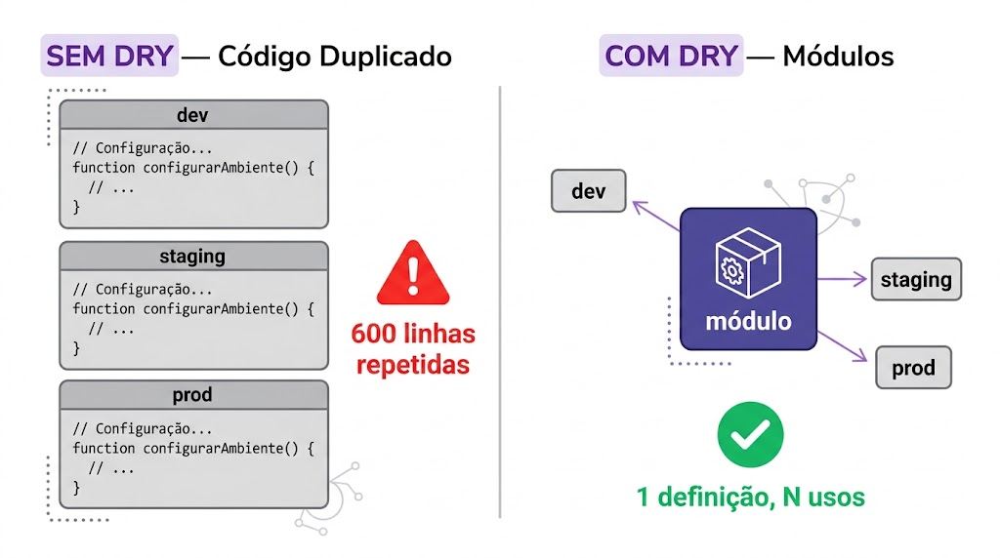
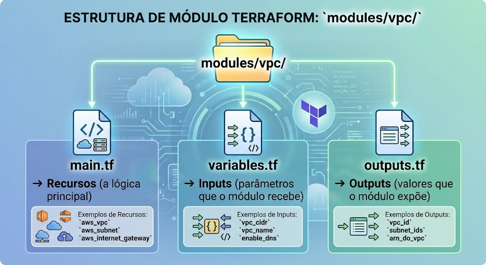
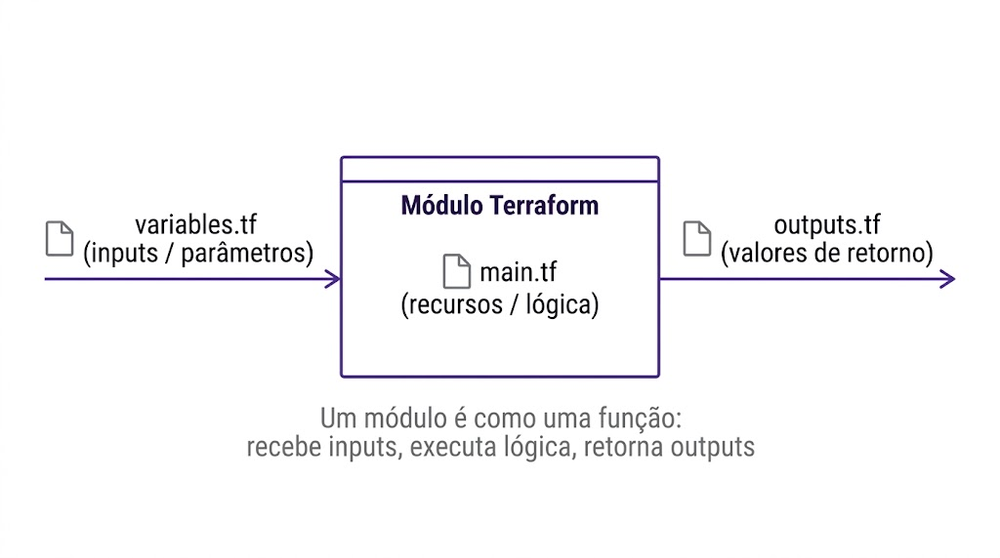
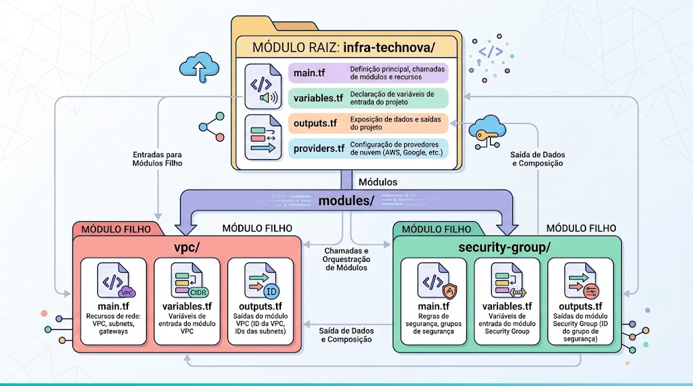
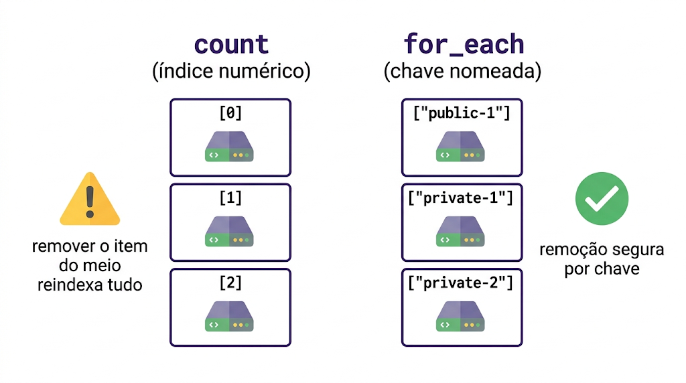
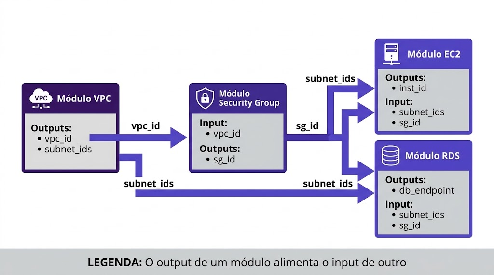
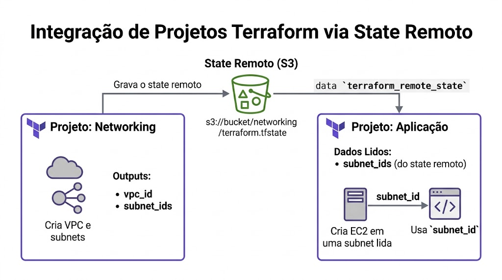

# Aula 06 — Trabalho Anterior (TA)

## Objetivo

Preparar-se para a Aula 06 através de leitura prévia sobre **Terraform Modules** — desde os fundamentos (o que são, por que usar, como criar) até padrões avançados (for_each, Registry, composição, versionamento).

> **⚙️ Ambiente do curso — AWS Academy Learner Lab:** Usamos o **AWS Academy Learner Lab** (não conta AWS pessoal). Credenciais são temporárias (com **Session Token**, carregadas via `source aws-creds.sh` a cada sessão) e a região é sempre **us-east-1**. O Lab bloqueia a criação de IAM users/groups/roles — quando precisar de permissões de serviço, use a role pré-existente **`LabRole`** e o instance profile **`LabInstanceProfile`**.

---

## Parte 1 — Modules Fundamentals

### 1.1 O Problema: Duplicação de Código em Terraform

Conforme sua infraestrutura cresce, você percebe padrões repetidos:
- A VPC para dev e staging é essencialmente o mesmo código com CIDRs diferentes
- Security Groups para API, banco de dados e bastion seguem a mesma estrutura
- Cada novo ambiente significa copiar centenas de linhas e alterar meia dúzia de valores

Isso gera problemas reais:
- **Inconsistência:** Você altera uma regra em dev mas esquece em staging
- **Manutenção:** 600 linhas onde 500 são repetição → difícil de navegar
- **Risco:** Drift silencioso entre ambientes
- **Velocidade:** Criar um novo ambiente leva horas ao invés de minutos

### 1.2 O Princípio DRY Aplicado a Infraestrutura

**DRY (Don't Repeat Yourself):** Cada pedaço de lógica deve existir em um único lugar. Quando você precisa mudar, altera em um ponto e o efeito se propaga automaticamente.

Em programação, usamos funções e classes para evitar repetição. Em Terraform, usamos **módulos**.



### 1.3 O que é um Módulo Terraform?

Um módulo é simplesmente um **diretório contendo arquivos `.tf`**. Qualquer diretório com código Terraform é um módulo.

- **Root Module:** O diretório principal onde você executa `terraform init/plan/apply`. Você já usa um módulo sem perceber!
- **Child Module:** Um diretório separado que é chamado pelo root module através de um bloco `module {}`.

### 1.4 Estrutura Padrão de um Módulo

A convenção aceita pela comunidade é organizar cada módulo com 3 arquivos:


Pense em um módulo como uma **função**:
- `variables.tf` = parâmetros da função
- `main.tf` = corpo da função
- `outputs.tf` = valor de retorno



### 1.5 Root Module vs Child Module


### 1.6 Módulos Locais vs Módulos do Registry

| Tipo | Source | Quando Usar |
|------|--------|-------------|
| Local | `source = "./modules/vpc"` | Lógica específica do seu projeto |
| Registry | `source = "terraform-aws-modules/vpc/aws"` | Módulos prontos e testados |
| Git | `source = "git::https://github.com/org/repo.git//modules/vpc"` | Módulos compartilhados entre times |

### 1.7 Input Variables — Passando Parâmetros para o Módulo

Dentro do módulo, você declara variáveis em `variables.tf`:

```hcl
variable "vpc_cidr" {
  description = "CIDR block para a VPC"
  type        = string
}

variable "project_name" {
  description = "Nome do projeto"
  type        = string
}
```

Quem chama o módulo passa os valores:

```hcl
module "vpc" {
  source       = "./modules/vpc"
  vpc_cidr     = "10.0.0.0/16"
  project_name = "technova"
}
```

### 1.8 Output Values — Obtendo Dados de Volta

O módulo expõe valores em `outputs.tf`:

```hcl
output "vpc_id" {
  value = aws_vpc.main.id
}
```

Quem chamou o módulo acessa assim:

```hcl
# Sintaxe: module.<nome_do_modulo>.<nome_do_output>
resource "aws_subnet" "example" {
  vpc_id = module.vpc.vpc_id
}
```

### 1.9 Chamando um Módulo (Bloco module {})

O bloco `module {}` é como uma chamada de função:

```hcl
module "vpc_dev" {
  source = "./modules/vpc"    # Onde está o módulo (obrigatório)

  # Inputs (variáveis do módulo)
  vpc_cidr     = "10.0.0.0/16"
  project_name = "technova"
  environment  = "dev"
}
```

Após `terraform init`, o Terraform carrega o módulo. Após `terraform apply`, os recursos são criados.

### 1.10 Exemplo: Refatorando uma VPC em Módulo

**Antes (código inline no root):**
```hcl
resource "aws_vpc" "main" {
  cidr_block = "10.0.0.0/16"
  tags       = { Name = "technova-dev-vpc" }
}
```

**Depois (módulo reutilizável):**
```hcl
# modules/vpc/main.tf
resource "aws_vpc" "main" {
  cidr_block = var.vpc_cidr
  tags       = { Name = "${var.project_name}-${var.environment}-vpc" }
}

# root/main.tf
module "vpc_dev" {
  source       = "./modules/vpc"
  vpc_cidr     = "10.0.0.0/16"
  project_name = "technova"
  environment  = "dev"
}
```

Agora, criar staging é uma questão de copiar o bloco `module` e mudar os valores.

---

## Parte 2 — Padrões Avançados

### 2.1 count e for_each — Criando N Recursos de 1 Definição

**count** cria recursos por índice numérico:
```hcl
resource "aws_subnet" "public" {
  count      = 3
  cidr_block = var.subnet_cidrs[count.index]
}
# Resultado: aws_subnet.public[0], aws_subnet.public[1], aws_subnet.public[2]
```

**for_each** cria recursos por chave nomeada:
```hcl
resource "aws_subnet" "this" {
  for_each   = var.subnets_map
  cidr_block = each.value.cidr
}
# Resultado: aws_subnet.this["public-1"], aws_subnet.this["private-1"]
```

### 2.2 Quando Usar count vs for_each

| Situação | Recomendação |
|----------|-------------|
| Recursos idênticos sem identidade única | count |
| Recursos com nomes/identificadores distintos | for_each |
| Precisa remover um item do meio da lista | for_each (count reindexaria tudo) |
| Mapa de configurações com chaves significativas | for_each |
| Criar N réplicas idênticas | count |

**Recomendação geral:** Prefira `for_each` na maioria dos casos. É mais seguro para operações de remoção e mais legível.


 

### 2.3 Terraform Registry — Encontrando e Usando Módulos

O [Terraform Registry](https://registry.terraform.io/) é o marketplace oficial:

- **terraform-aws-modules/vpc/aws** — 50M+ downloads, VPC completa com todas as opções
- **terraform-aws-modules/ec2-instance/aws** — EC2 com best practices
- **terraform-aws-modules/rds/aws** — RDS com parameter groups configurados
- **terraform-aws-modules/security-group/aws** — SG com regras predefinidas

Como avaliar um módulo do Registry:
1. **Downloads** — Módulos populares são mais confiáveis
2. **Última atualização** — Módulos ativos são mantidos
3. **Documentação** — Inputs, outputs e exemplos claros
4. **Issues abertas** — Muitas issues sem resposta = red flag
5. **Verificado** — Badge "Verified" = mantido pela HashiCorp ou parceiro oficial

### 2.4 Usando Módulo do Registry: terraform-aws-modules/vpc/aws

```hcl
module "vpc" {
  source  = "terraform-aws-modules/vpc/aws"
  version = "~> 5.0"

  name = "technova-vpc"
  cidr = "10.0.0.0/16"

  azs             = ["us-east-1a", "us-east-1b"]
  public_subnets  = ["10.0.1.0/24", "10.0.2.0/24"]
  private_subnets = ["10.0.3.0/24", "10.0.4.0/24"]

  enable_nat_gateway = false
  enable_dns_hostnames = true
}
```

Após `terraform init`, o Terraform baixa o módulo do Registry automaticamente.

### 2.5 Composição de Módulos: Conectando via Outputs→Inputs

A composição é o padrão de conectar módulos entre si:

```
VPC Module ──(vpc_id)──► SG Module ──(sg_id)──► EC2 Module
```

O output de um módulo se torna input do próximo. Isso cria um grafo de dependências que o Terraform resolve automaticamente na ordem correta.



### 2.6 Versionamento de Módulos

Para módulos locais em repositórios Git:
```hcl
module "vpc" {
  source = "git::https://github.com/org/modules.git//vpc?ref=v1.0.0"
}
```

Para módulos do Registry:
```hcl
module "vpc" {
  source  = "terraform-aws-modules/vpc/aws"
  version = "~> 5.0"   # Aceita 5.x.x mas nunca 6.0.0
}
```

Versionamento garante que uma atualização no módulo não quebre sua infraestrutura sem você decidir atualizar.

### 2.7 terraform_remote_state — Lendo Outputs de Outro Projeto

Quando a infraestrutura é dividida em projetos separados (networking, aplicação, banco), você pode ler outputs de um no outro:

```hcl
data "terraform_remote_state" "networking" {
  backend = "s3"
  config = {
    bucket = "technova-state"
    key    = "networking/terraform.tfstate"
    region = "us-east-1"
  }
}

# Usar output do projeto de networking
resource "aws_instance" "api" {
  subnet_id = data.terraform_remote_state.networking.outputs.public_subnet_ids[0]
}
```



### 2.8 Quando Usar Módulos Locais vs Registry

| Cenário | Recomendação |
|---------|-------------|
| Aprendizado e estudo | Local (para entender a mecânica) |
| Protótipos rápidos | Registry (mais rápido de configurar) |
| Lógica específica do negócio | Local |
| Infraestrutura padrão (VPC, ECS, RDS) | Registry |
| Produção enterprise | Registry + módulos locais para customização |

---

## Questões de Múltipla Escolha

Responda as questões abaixo para verificar sua compreensão. Traga suas respostas para a discussão em aula.

### Questão 1

**Qual é o principal benefício de usar módulos Terraform?**

a) Módulos tornam o código mais difícil de entender
b) Módulos permitem reutilizar código e eliminar duplicação (DRY)
c) Módulos são obrigatórios para usar Terraform com AWS
d) Módulos substituem a necessidade de variáveis

### Questão 2

**Qual a principal diferença entre `count` e `for_each`?**

a) `count` é mais rápido que `for_each`
b) `for_each` só funciona com módulos do Registry
c) `count` indexa por número (0, 1, 2); `for_each` indexa por chave nomeada
d) `for_each` não pode ser usado com maps

### Questão 3

**Em qual situação é mais recomendado usar um módulo do Terraform Registry ao invés de criar um módulo local?**

a) Quando você quer aprender como módulos funcionam internamente
b) Quando precisa de infraestrutura padrão (VPC, RDS) com muitas opções e em produção
c) Quando seu código tem apenas 10 linhas
d) Quando você não tem acesso à internet

### Questão 4

**Como funciona a composição de módulos no Terraform?**

a) Módulos não podem se comunicar entre si
b) Você precisa usar um arquivo especial de conexão entre módulos
c) O output de um módulo é passado como input (variável) para outro módulo
d) Módulos se conectam automaticamente por nome

---

## Preparação para a Aula

- [ ] Li toda a Parte 1 (Modules Fundamentals)
- [ ] Li toda a Parte 2 (Padrões Avançados)
- [ ] Respondi as 4 questões de múltipla escolha
- [ ] Anotei dúvidas para discutir em aula
- [ ] Explorei o [Terraform Registry](https://registry.terraform.io/) e busquei o módulo `terraform-aws-modules/vpc/aws`

> As respostas das questões serão discutidas no início da aula.

---

## Referências

### Terraform — Módulos

- HashiCorp. **Modules Overview**. Terraform Documentation. Disponível em: [https://developer.hashicorp.com/terraform/language/modules](https://developer.hashicorp.com/terraform/language/modules)
- HashiCorp. **Module Blocks**. Terraform Documentation. Disponível em: [https://developer.hashicorp.com/terraform/language/modules/syntax](https://developer.hashicorp.com/terraform/language/modules/syntax)
- HashiCorp. **Creating Modules**. Terraform Documentation. Disponível em: [https://developer.hashicorp.com/terraform/language/modules/develop](https://developer.hashicorp.com/terraform/language/modules/develop)
- HashiCorp. **Standard Module Structure**. Terraform Documentation. Disponível em: [https://developer.hashicorp.com/terraform/language/modules/develop/structure](https://developer.hashicorp.com/terraform/language/modules/develop/structure)

### Terraform — Meta-Arguments

- HashiCorp. **The count Meta-Argument**. Terraform Documentation. Disponível em: [https://developer.hashicorp.com/terraform/language/meta-arguments/count](https://developer.hashicorp.com/terraform/language/meta-arguments/count)
- HashiCorp. **The for_each Meta-Argument**. Terraform Documentation. Disponível em: [https://developer.hashicorp.com/terraform/language/meta-arguments/for_each](https://developer.hashicorp.com/terraform/language/meta-arguments/for_each)

### Terraform Registry e State Remoto

- HashiCorp. **Terraform Registry**. Disponível em: [https://registry.terraform.io/](https://registry.terraform.io/)
- HashiCorp. **terraform-aws-modules/vpc/aws**. Terraform Registry. Disponível em: [https://registry.terraform.io/modules/terraform-aws-modules/vpc/aws/latest](https://registry.terraform.io/modules/terraform-aws-modules/vpc/aws/latest)
- HashiCorp. **The terraform_remote_state Data Source**. Terraform Documentation. Disponível em: [https://developer.hashicorp.com/terraform/language/state/remote-state-data](https://developer.hashicorp.com/terraform/language/state/remote-state-data)

### Boas Práticas

- HashiCorp. **Module Composition**. Terraform Documentation. Disponível em: [https://developer.hashicorp.com/terraform/language/modules/develop/composition](https://developer.hashicorp.com/terraform/language/modules/develop/composition)
- Semantic Versioning. **SemVer 2.0.0**. Disponível em: [https://semver.org/](https://semver.org/)
