<!-- _class: title -->

# Aula 06 — Terraform Modules

**Do Básico ao Avançado**
DevOps — Centro Universitário UniFAAT
Prof. Alexandre Tavares | Semestre 2026-2

---

# Por que Módulos Terraform?

**Evolução do projeto TechNova:**
- Aula 05: RDS + Remote State ✅
- **Aula 06: eliminar código duplicado com módulos reutilizáveis**

**O pedido do CTO:**
> "Os investidores querem a aplicação em três ambientes: dev, staging e produção. E para ontem."

**O problema do Rafael:**
> "Para criar staging, eu teria que copiar 300 linhas e mudar meia dúzia de valores. Três ambientes = três cópias. Isso não escala."

**A solução:** modularizar — extrair o código comum em **módulos** e chamá-los com variáveis diferentes por ambiente.

> **Fio condutor:** o Spec-Driven continua como método. Você pode descrever a biblioteca de módulos no Kiro Spec e validar a estrutura gerada.

---

# Objetivos de Aprendizagem

### Modules Fundamentals
- Compreender o conceito de módulos e o princípio DRY
- Criar módulos com estrutura padrão (main/variables/outputs)
- Passar inputs e consumir outputs de módulos
- Reutilizar módulos para múltiplos ambientes

### Padrões Avançados
- Usar `count` e `for_each` para recursos dinâmicos
- Consumir módulos do Terraform Registry
- Compor módulos (output de um → input de outro)
- Versionar módulos e ler `terraform_remote_state`

---

# O Problema: Código Duplicado

O `main.tf` da TechNova após 5 aulas — dev e staging quase idênticos:

```hcl
resource "aws_vpc" "dev" {
  cidr_block = "10.0.0.0/16"   # ...
}
resource "aws_vpc" "staging" {
  cidr_block = "10.1.0.0/16"   # só muda o CIDR!
}
```

**O que há de errado?**
- 90% do código é idêntico entre ambientes
- Produção = mais uma cópia inteira
- Mudar 1 regra = alterar em todos os ambientes
- `main.tf` com 600+ linhas → impossível de manter

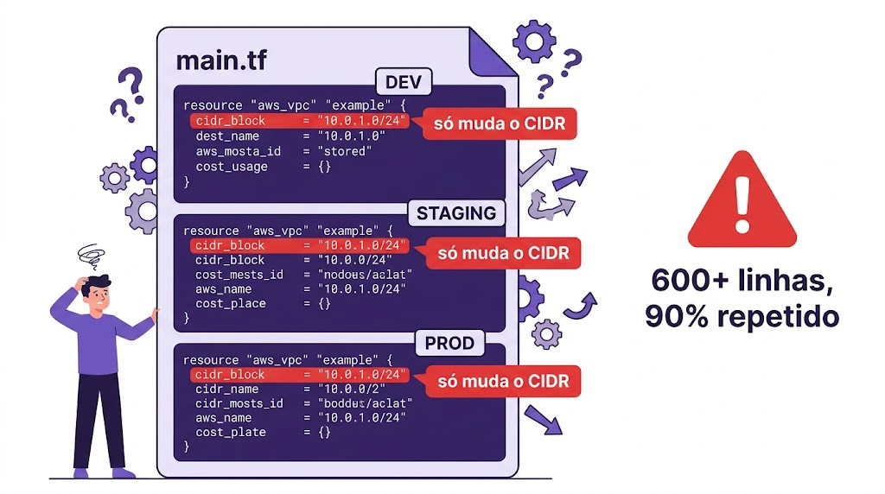

---

# O Princípio DRY — Don't Repeat Yourself

> "Cada peça de conhecimento deve ter uma representação única, inequívoca e autoritativa dentro de um sistema."

| Sem DRY (duplicado) | Com DRY (módulos) |
|---|---|
| VPC definida 3x para 3 ambientes | VPC 1x no módulo, chamada 3x |
| Mudança = alterar em 3 lugares | Mudança no módulo reflete em todos |
| 600 linhas repetidas | 100 no módulo + 30 de chamadas |
| Risco de drift entre ambientes | Consistência garantida |

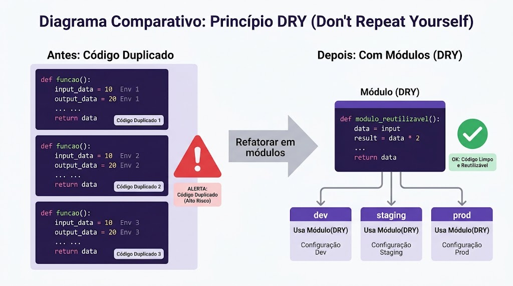

---

# O que é um Módulo Terraform?

Um módulo é simplesmente um **diretório contendo arquivos `.tf`**. Só isso.

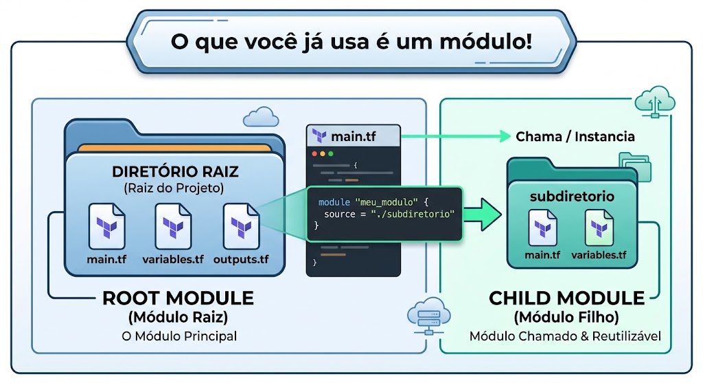

- **Root Module:** onde você executa `terraform plan/apply`
- **Child Module:** qualquer diretório referenciado por um bloco `module {}`

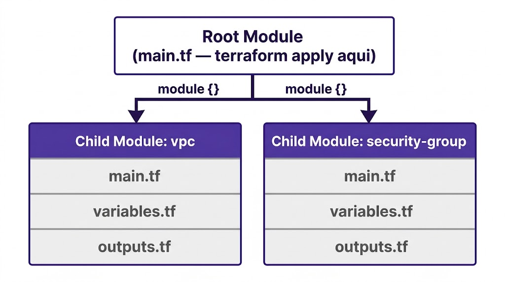

---

# Estrutura Padrão de um Módulo

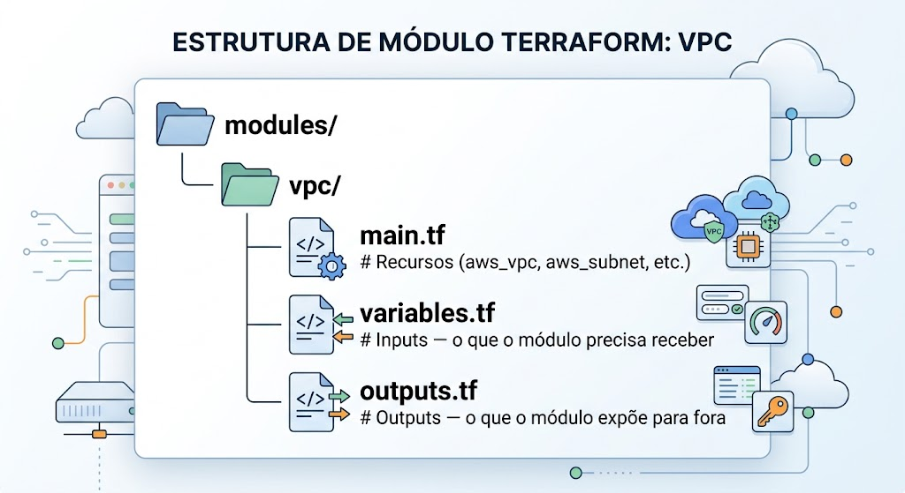

| Arquivo | Responsabilidade | Analogia |
|---------|-----------------|----------|
| `main.tf` | Define os recursos | Corpo da função |
| `variables.tf` | Parâmetros de entrada | Parâmetros da função |
| `outputs.tf` | Valores de saída | Return da função |

---

# Módulo é como uma Função

```python
# Um módulo faz basicamente isso:
def criar_vpc(cidr, project_name, environment):   # variables.tf
    vpc = aws.create_vpc(cidr=cidr)                # main.tf
    subnet = aws.create_subnet(vpc_id=vpc.id)
    return {"vpc_id": vpc.id, "subnet_id": subnet.id}  # outputs.tf
```

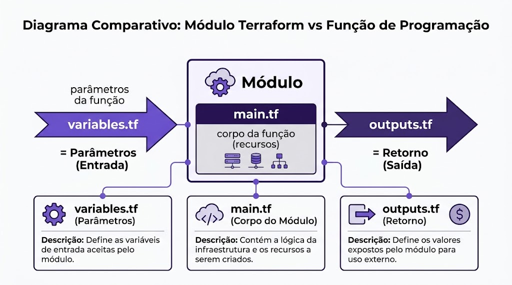

---

# Inputs e Outputs

**`variables.tf` — o que o módulo recebe:**
```hcl
variable "vpc_cidr" {
  type    = string
  default = "10.0.0.0/16"
}
variable "environment" {
  type = string
}
```

**`outputs.tf` — o que o módulo retorna:**
```hcl
output "vpc_id" {
  value = aws_vpc.main.id
}
output "public_subnet_ids" {
  value = aws_subnet.public[*].id
}
```

---

# Chamando um Módulo — o bloco `module {}`

```hcl
module "vpc_dev" {
  source = "./modules/vpc"       # caminho do módulo

  vpc_cidr     = "10.0.0.0/16"   # inputs
  project_name = "technova"
  environment  = "dev"
}

# Consumindo o output do módulo
resource "aws_instance" "api" {
  subnet_id = module.vpc_dev.public_subnet_ids[0]
}
```

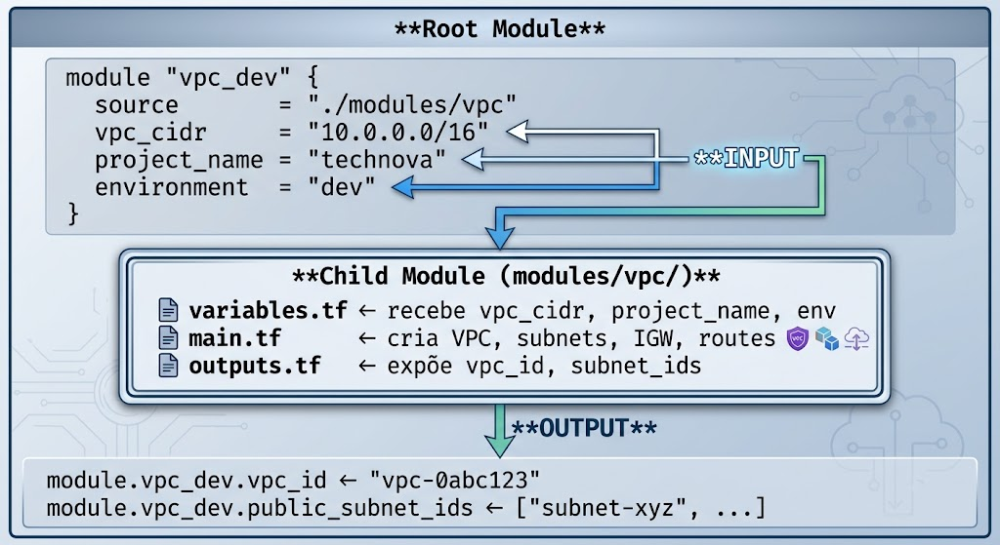

---

# Reutilização — O Poder dos Módulos

```hcl
module "vpc_dev" {
  source = "./modules/vpc"
  vpc_cidr = "10.0.0.0/16"
  environment = "dev"
}

module "vpc_staging" {          # mesmo módulo, variáveis diferentes!
  source = "./modules/vpc"
  vpc_cidr = "10.1.0.0/16"
  environment = "staging"
}

module "vpc_prod" {             # mais uma chamada!
  source = "./modules/vpc"
  vpc_cidr = "10.2.0.0/16"
  environment = "prod"
}
```

> **Resultado:** 3 VPCs completas em ~18 linhas, em vez de 300+.

---

# Meta-Arguments: count vs for_each

**`count` — por índice numérico:**
```hcl
resource "aws_subnet" "public" {
  count      = length(var.subnet_cidrs)
  cidr_block = var.subnet_cidrs[count.index]
}
# Acesso: aws_subnet.public[0], [1], ...
```

**`for_each` — por chave nomeada:**
```hcl
resource "aws_subnet" "this" {
  for_each   = var.subnets
  cidr_block = each.value.cidr
}
# Acesso: aws_subnet.this["public-1"], ...
```

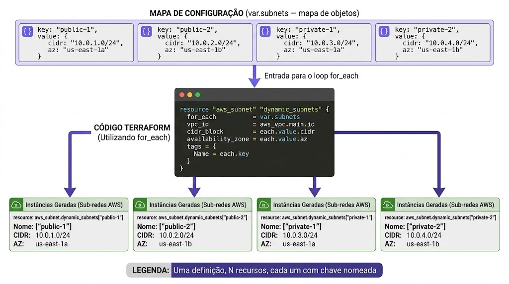

---

# count vs for_each — Quando Usar

| Aspecto | count | for_each |
|---------|-------|----------|
| Identificação | Por índice (0,1,2) | Por chave ("public-1") |
| Remover item do meio | Reindexa TUDO | Só aquele recurso |
| Tipo de dado | list | map ou set |
| Recomendação | Recursos idênticos | Recursos nomeados |

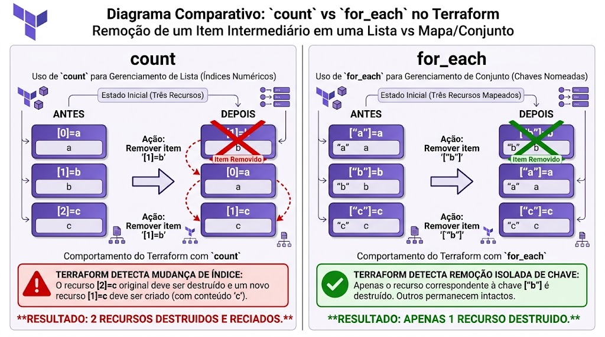

> **Regra prática:** use `for_each` na maioria dos casos; `count` só para réplicas verdadeiramente intercambiáveis.

---

# Terraform Registry — Módulos da Comunidade

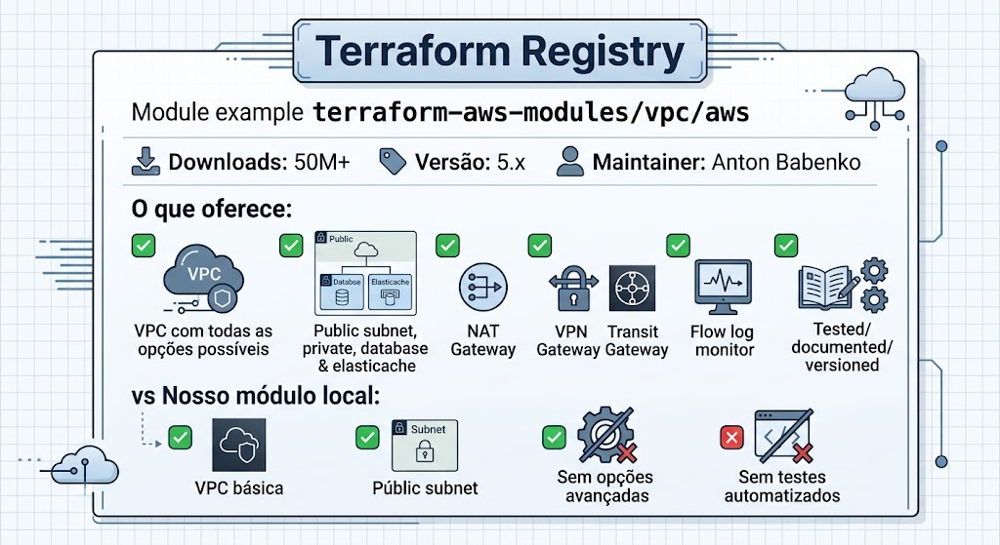

```hcl
module "vpc" {
  source  = "terraform-aws-modules/vpc/aws"
  version = "~> 5.0"

  name = "technova-vpc"
  cidr = "10.0.0.0/16"
  azs             = ["us-east-1a", "us-east-1b"]
  public_subnets  = ["10.0.1.0/24", "10.0.2.0/24"]
  enable_nat_gateway = false
}
```

---

# Local vs Registry

| Critério | Módulo Local | Módulo Registry |
|----------|-------------|----------------|
| Controle total | ✅ | ❌ (código de terceiros) |
| Rapidez | ❌ você escreve | ✅ pronto para usar |
| Manutenção | Sua | Comunidade |
| Aprendizado | ✅ excelente | ❌ abstrai a complexidade |
| Produção | Casos específicos | ✅ recomendado |

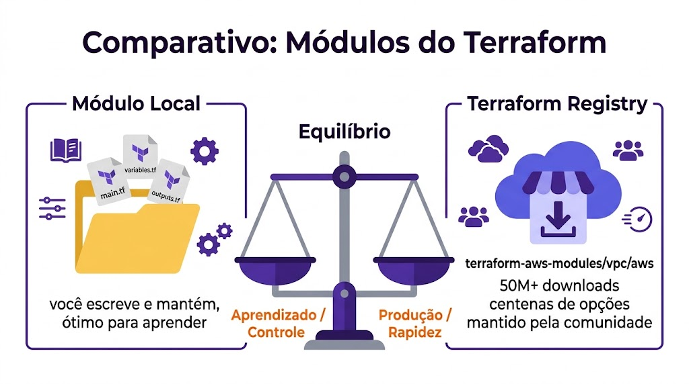

> **Neste curso:** módulos locais para **aprender**; em produção, Registry como base + locais para lógica específica.

---

# Composição de Módulos

O output de um módulo alimenta o input de outro:

```hcl
module "vpc" {
  source = "./modules/vpc"
}

module "api_sg" {
  source = "./modules/security-group"
  vpc_id = module.vpc.vpc_id          # ← output do VPC
}

module "api_server" {
  source            = "./modules/ec2"
  subnet_id         = module.vpc.public_subnet_ids[0]  # ← output VPC
  security_group_id = module.api_sg.sg_id              # ← output SG
}
```


---

# Versionamento de Módulos

```hcl
# Git com tag de versão
module "vpc" {
  source = "git::https://github.com/technova/modules.git//vpc?ref=v1.2.0"
}

# Registry com version constraint
module "vpc" {
  source  = "terraform-aws-modules/vpc/aws"
  version = "~> 5.0"   # aceita 5.x.x, não 6.0.0
}
```

| Constraint | Significado |
|-----------|------------|
| `= 1.0.0` | Exatamente 1.0.0 |
| `>= 1.0.0` | 1.0.0 ou maior |
| `~> 1.0` | >= 1.0, < 2.0 |
| `~> 1.0.0` | >= 1.0.0, < 1.1.0 |

---

# terraform_remote_state

Ler outputs de outro projeto Terraform (ex: networking separado da aplicação):

```hcl
data "terraform_remote_state" "networking" {
  backend = "s3"
  config = {
    bucket = "technova-terraform-state"
    key    = "networking/terraform.tfstate"
    region = "us-east-1"
  }
}

resource "aws_instance" "api" {
  subnet_id = data.terraform_remote_state.networking.outputs.public_subnet_ids[0]
}
```

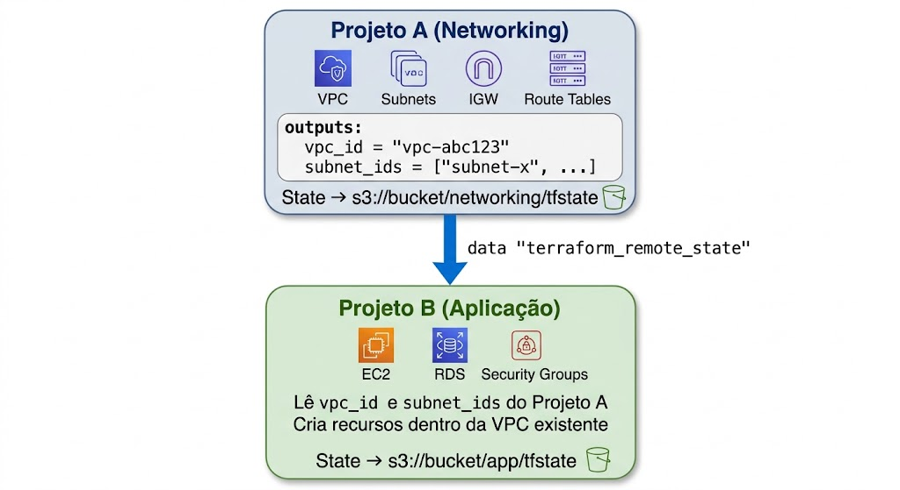

---

# Spec-Driven aplicado a Módulos

Você pode usar o **Kiro Spec** para gerar a biblioteca de módulos:

| Etapa | O que você faz |
|---|---|
| **1. Requisitos** | Descreve: módulos VPC, SG, EC2, RDS + 2 ambientes (dev/staging) |
| **2. Design** | Kiro propõe a estrutura de pastas `modules/` |
| **3. Tarefas** | Kiro ordena: criar cada módulo → compor → chamar por ambiente |
| **4. Código** | Kiro gera; você valida com `terraform validate` e `plan` |

**Checklist de validação:**
- Estrutura padrão (main/variables/outputs) em cada módulo
- `for_each` em vez de `count` para recursos nomeados
- Composição correta (outputs → inputs)
- Sem duplicação — mesmos módulos para dev e staging

---

# Resumo dos Conceitos

| Conceito | Descrição |
|----------|-----------|
| Módulo | Diretório com `.tf` que encapsula recursos reutilizáveis |
| Root / Child Module | Onde roda o apply / módulo chamado por `module {}` |
| variables.tf / outputs.tf | Inputs / valores expostos |
| DRY | Don't Repeat Yourself — eliminar duplicação |
| count / for_each | Criar N recursos por índice / por chave |
| Terraform Registry | Repositório oficial de módulos da comunidade |
| Composição | Conectar módulos via outputs → inputs |
| Versionamento | Referenciar versão específica (tags, constraints) |
| terraform_remote_state | Ler outputs de outro projeto Terraform |

---

# Recursos no AWS Academy Learner Lab

Todos os recursos são criados no **AWS Academy Learner Lab**, sem custo para o aluno:

| Componente | Observação |
|------------|-----------|
| VPC, Subnets, IGW, Route Tables | Recursos de rede — leves |
| Security Groups | Sem custo |
| EC2 t2.micro | Instância mínima |
| S3 (state file) | Consumo mínimo |
| NAT Gateway | ⚠️ **NÃO usar** |

> Dois ambientes (dev + staging) ao mesmo tempo consomem o dobro. Teste um por vez ou valide só com `terraform plan`. **Sempre** `terraform destroy` ao final.

---

# Referências e Próximos Passos

**Referências:**
- Terraform Modules — [developer.hashicorp.com/terraform/language/modules](https://developer.hashicorp.com/terraform/language/modules)
- Terraform Registry — [registry.terraform.io](https://registry.terraform.io/)
- `for_each` — [developer.hashicorp.com/terraform/language/meta-arguments/for_each](https://developer.hashicorp.com/terraform/language/meta-arguments/for_each)
- AWS Academy Learner Lab (ambiente da disciplina)

**Para a próxima aula:**
- Completar o TF (portfólio + PR + execução no AWS Academy)
- Estudar o `TA.md` da Aula 07
- `terraform destroy` em todos os ambientes

**Próxima aula:**
**Aula 07 — Revisão de Arquitetura + IA para IaC**
Consolidação da infraestrutura AWS e geração de Terraform com IA.
