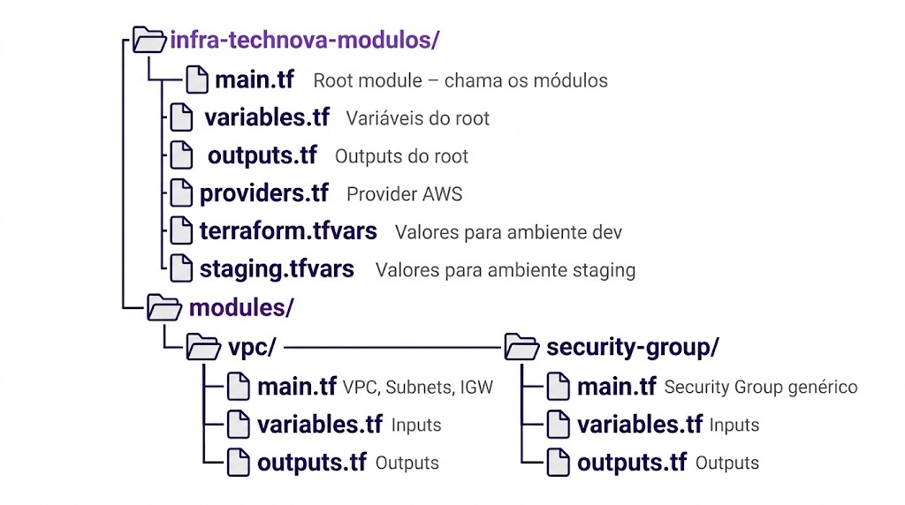
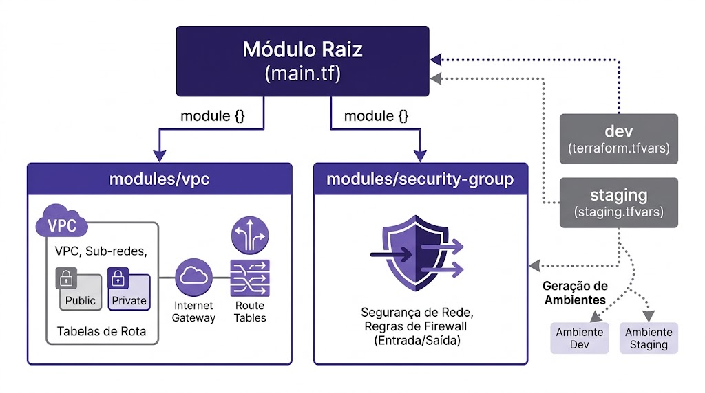
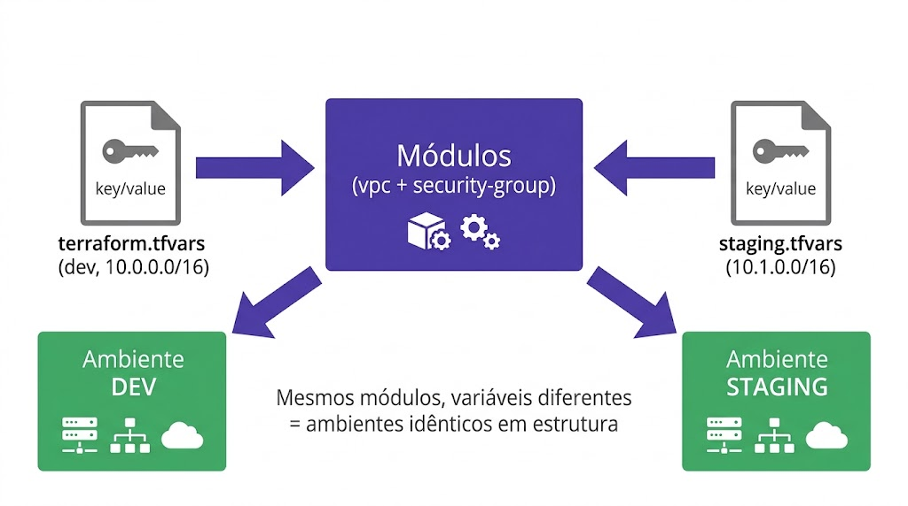

# Aula 06 — Laboratório Parte 1: Criando Módulos Locais

## Missão

Refatorar a infraestrutura da TechNova — que atualmente tem código duplicado — em **módulos reutilizáveis**. Ao final, você terá uma estrutura modular capaz de provisionar ambientes idênticos com apenas uma chamada de módulo e variáveis diferentes.

**Pré-requisitos:** Acesso ao AWS Academy Learner Lab, AWS CLI e Terraform instalados (Aula 03), Kiro instalado, chave SSH criada (`~/.ssh/technova-key`)

---

## Arquitetura Final




---

## Parte 0 — Estrutura do Projeto e Credenciais do AWS Academy

> As credenciais do **AWS Academy Learner Lab** são **temporárias** e **expiram entre sessões**. Vamos criar um script `.sh` dentro da pasta do lab para carregar as credenciais como **variáveis de ambiente**.

### 0.1 Criar a pasta do projeto e abrir no Kiro

```bash
mkdir -p infra-technova-modulos/modules/vpc
mkdir -p infra-technova-modulos/modules/security-group
cd infra-technova-modulos
git init

# Abrir no Kiro
kiro .
```

> A partir daqui, crie todos os arquivos pela interface do **Kiro** (New File na árvore de arquivos). Use o terminal apenas para rodar comandos.

### 0.2 Iniciar o Learner Lab e obter as credenciais

1. Acesse o **AWS Academy** → curso → **Modules → Learner Lab**
2. Clique em **Start Lab** e aguarde o indicador ficar **verde** (🟢)
3. Clique em **AWS Details → AWS CLI → Show** — anote os 3 valores

### 0.3 Criar o script de credenciais no Kiro

No Kiro, crie o arquivo `aws-creds.sh` na raiz da pasta. Cole e **substitua** pelos valores do Learner Lab:

```bash
#!/bin/bash
# aws-creds.sh - Credenciais temporárias do AWS Academy Learner Lab
# Uso: source aws-creds.sh
# ATENÇÃO: nunca versione este arquivo no Git!

export AWS_ACCESS_KEY_ID="ASIA_SUA_KEY_AQUI"
export AWS_SECRET_ACCESS_KEY="SUA_SECRET_AQUI"
export AWS_SESSION_TOKEN="SEU_TOKEN_AQUI"
export AWS_DEFAULT_REGION="us-east-1"

echo "Credenciais AWS Academy carregadas nesta sessão."
```

### 0.4 Carregar as credenciais

No terminal integrado do Kiro (`Ctrl+'`):

```bash
source aws-creds.sh
aws sts get-caller-identity
```

Se retornar o ARN do role temporário (`voclabs`), está pronto. Se der `ExpiredToken`, reinicie o lab, atualize o `aws-creds.sh` e rode `source aws-creds.sh` novamente.

✅ **Checkpoint:** Pasta criada, aberta no Kiro e credenciais do Learner Lab carregadas.

---

## Parte 1: Setup do Projeto

> Crie os arquivos a seguir pela interface do **Kiro**, dentro da pasta `infra-technova-modulos`.

### Estrutura de pastas do projeto

Preste atenção **em qual pasta** cada arquivo é criado. O projeto tem o **root module** (a raiz) e os **child modules** (dentro de `modules/`):

```
infra-technova-modulos/          ← ROOT MODULE (aqui você roda o terraform)
├── providers.tf                 ← root
├── variables.tf                 ← root (declara as variáveis que o .tfvars preenche)
├── main.tf                      ← root (chama os módulos)
├── outputs.tf                   ← root
├── terraform.tfvars             ← root (valores do ambiente dev)
├── staging.tfvars               ← root (valores do ambiente staging)
├── aws-creds.sh                 ← root (credenciais — no .gitignore)
└── modules/
    ├── vpc/
    │   ├── variables.tf         ← módulo vpc (inputs do módulo)
    │   ├── main.tf              ← módulo vpc (recursos)
    │   └── outputs.tf           ← módulo vpc (saídas)
    └── security-group/
        ├── variables.tf         ← módulo security-group
        ├── main.tf
        └── outputs.tf
```

> **Regra de ouro:** o `terraform.tfvars` fica no **root** e só pode conter variáveis que estão declaradas no **`variables.tf` do root** (Passo 4.1). As variáveis dentro de `modules/vpc/variables.tf` pertencem ao módulo — o root as preenche ao chamar o módulo com `module "vpc" { ... }`. Se você rodar `terraform plan` antes de criar o `variables.tf` do root, verá o aviso *"Value for undeclared variable"*.

### Passo 1.1 — Criar `.gitignore` (na raiz do projeto)

Crie o arquivo `.gitignore`:

```
# Terraform
.terraform/
*.tfstate
*.tfstate.backup
*.tfplan
.terraform.lock.hcl

# Credenciais AWS Academy (NUNCA versionar)
aws-creds.sh

# Secrets
*.pem
.env
```

### Passo 1.2 — Criar `providers.tf` (na raiz do projeto)

Arquivo: `infra-technova-modulos/providers.tf`

```hcl
# providers.tf (ROOT)

terraform {
  required_version = ">= 1.0"

  required_providers {
    aws = {
      source  = "hashicorp/aws"
      version = "~> 5.0"
    }
  }
}

provider "aws" {
  region = var.aws_region
}
```

---

## Parte 2: Criar Módulo VPC

> Os arquivos desta parte ficam em **`modules/vpc/`** — são os arquivos do **child module**, não do root.

### Passo 2.1 — `modules/vpc/variables.tf`

```hcl
# modules/vpc/variables.tf

variable "vpc_cidr" {
  description = "CIDR block principal da VPC"
  type        = string
}

variable "project_name" {
  description = "Nome do projeto para tags"
  type        = string
}

variable "environment" {
  description = "Ambiente (dev, staging, prod)"
  type        = string
}

variable "public_subnet_cidrs" {
  description = "Lista de CIDRs para subnets públicas"
  type        = list(string)
}

variable "private_subnet_cidrs" {
  description = "Lista de CIDRs para subnets privadas"
  type        = list(string)
  default     = []
}

variable "availability_zones" {
  description = "Lista de Availability Zones"
  type        = list(string)
}
```

### Passo 2.2 — modules/vpc/main.tf

```hcl
# modules/vpc/main.tf

# ========================================
# VPC
# ========================================
resource "aws_vpc" "main" {
  cidr_block           = var.vpc_cidr
  enable_dns_hostnames = true
  enable_dns_support   = true

  tags = {
    Name        = "${var.project_name}-${var.environment}-vpc"
    Environment = var.environment
    Project     = var.project_name
    ManagedBy   = "terraform"
  }
}

# ========================================
# Internet Gateway
# ========================================
resource "aws_internet_gateway" "main" {
  vpc_id = aws_vpc.main.id

  tags = {
    Name        = "${var.project_name}-${var.environment}-igw"
    Environment = var.environment
  }
}

# ========================================
# Subnets Públicas
# ========================================
resource "aws_subnet" "public" {
  count = length(var.public_subnet_cidrs)

  vpc_id                  = aws_vpc.main.id
  cidr_block              = var.public_subnet_cidrs[count.index]
  availability_zone       = var.availability_zones[count.index % length(var.availability_zones)]
  map_public_ip_on_launch = true

  tags = {
    Name        = "${var.project_name}-${var.environment}-public-${count.index + 1}"
    Environment = var.environment
    Type        = "public"
  }
}

# ========================================
# Subnets Privadas
# ========================================
resource "aws_subnet" "private" {
  count = length(var.private_subnet_cidrs)

  vpc_id            = aws_vpc.main.id
  cidr_block        = var.private_subnet_cidrs[count.index]
  availability_zone = var.availability_zones[count.index % length(var.availability_zones)]

  tags = {
    Name        = "${var.project_name}-${var.environment}-private-${count.index + 1}"
    Environment = var.environment
    Type        = "private"
  }
}

# ========================================
# Route Table Pública
# ========================================
resource "aws_route_table" "public" {
  vpc_id = aws_vpc.main.id

  route {
    cidr_block = "0.0.0.0/0"
    gateway_id = aws_internet_gateway.main.id
  }

  tags = {
    Name        = "${var.project_name}-${var.environment}-public-rt"
    Environment = var.environment
  }
}

# ========================================
# Associação Route Table ↔ Subnets Públicas
# ========================================
resource "aws_route_table_association" "public" {
  count = length(var.public_subnet_cidrs)

  subnet_id      = aws_subnet.public[count.index].id
  route_table_id = aws_route_table.public.id
}
```

### Passo 2.3 — modules/vpc/outputs.tf

```hcl
# modules/vpc/outputs.tf

output "vpc_id" {
  description = "ID da VPC criada"
  value       = aws_vpc.main.id
}

output "vpc_cidr" {
  description = "CIDR block da VPC"
  value       = aws_vpc.main.cidr_block
}

output "public_subnet_ids" {
  description = "Lista de IDs das subnets públicas"
  value       = aws_subnet.public[*].id
}

output "private_subnet_ids" {
  description = "Lista de IDs das subnets privadas"
  value       = aws_subnet.private[*].id
}

output "internet_gateway_id" {
  description = "ID do Internet Gateway"
  value       = aws_internet_gateway.main.id
}
```

### Verificação do Módulo VPC

Neste ponto, sua estrutura deve ser:

```bash
ls modules/vpc/
# main.tf  outputs.tf  variables.tf
```

O módulo VPC:
- **Recebe:** vpc_cidr, project_name, environment, public_subnet_cidrs, private_subnet_cidrs, availability_zones
- **Cria:** VPC, IGW, Subnets (públicas e privadas), Route Table, Associações
- **Expõe:** vpc_id, vpc_cidr, public_subnet_ids, private_subnet_ids, internet_gateway_id

---

## Parte 3: Criar Módulo Security Group

> Os arquivos desta parte ficam em **`modules/security-group/`** — child module.

### Passo 3.1 — `modules/security-group/variables.tf`

```hcl
# modules/security-group/variables.tf

variable "name" {
  description = "Nome do Security Group"
  type        = string
}

variable "description" {
  description = "Descrição do Security Group"
  type        = string
  default     = "Managed by Terraform"
}

variable "vpc_id" {
  description = "ID da VPC onde o SG será criado"
  type        = string
}

variable "ingress_rules" {
  description = "Lista de regras de entrada"
  type = list(object({
    from_port   = number
    to_port     = number
    protocol    = string
    cidr_blocks = list(string)
    description = string
  }))
  default = []
}

variable "egress_rules" {
  description = "Lista de regras de saída"
  type = list(object({
    from_port   = number
    to_port     = number
    protocol    = string
    cidr_blocks = list(string)
    description = string
  }))
  default = [
    {
      from_port   = 0
      to_port     = 0
      protocol    = "-1"
      cidr_blocks = ["0.0.0.0/0"]
      description = "Allow all outbound"
    }
  ]
}

variable "environment" {
  description = "Ambiente (dev, staging, prod)"
  type        = string
}

variable "project_name" {
  description = "Nome do projeto para tags"
  type        = string
}
```

### Passo 3.2 — modules/security-group/main.tf

```hcl
# modules/security-group/main.tf

resource "aws_security_group" "this" {
  name        = var.name
  description = var.description
  vpc_id      = var.vpc_id

  tags = {
    Name        = var.name
    Environment = var.environment
    Project     = var.project_name
    ManagedBy   = "terraform"
  }
}

resource "aws_security_group_rule" "ingress" {
  count = length(var.ingress_rules)

  type              = "ingress"
  from_port         = var.ingress_rules[count.index].from_port
  to_port           = var.ingress_rules[count.index].to_port
  protocol          = var.ingress_rules[count.index].protocol
  cidr_blocks       = var.ingress_rules[count.index].cidr_blocks
  description       = var.ingress_rules[count.index].description
  security_group_id = aws_security_group.this.id
}

resource "aws_security_group_rule" "egress" {
  count = length(var.egress_rules)

  type              = "egress"
  from_port         = var.egress_rules[count.index].from_port
  to_port           = var.egress_rules[count.index].to_port
  protocol          = var.egress_rules[count.index].protocol
  cidr_blocks       = var.egress_rules[count.index].cidr_blocks
  description       = var.egress_rules[count.index].description
  security_group_id = aws_security_group.this.id
}
```

### Passo 3.3 — modules/security-group/outputs.tf

```hcl
# modules/security-group/outputs.tf

output "sg_id" {
  description = "ID do Security Group criado"
  value       = aws_security_group.this.id
}

output "sg_name" {
  description = "Nome do Security Group"
  value       = aws_security_group.this.name
}
```

### Verificação do Módulo Security Group

```bash
ls modules/security-group/
# main.tf  outputs.tf  variables.tf
```

O módulo Security Group:
- **Recebe:** name, vpc_id, ingress_rules, egress_rules, environment, project_name
- **Cria:** Security Group + regras dinâmicas (ingress e egress)
- **Expõe:** sg_id, sg_name

---

## Parte 4: Chamar Módulos a partir do Root

> Os arquivos desta parte ficam na **raiz do projeto** (`infra-technova-modulos/`) — root module.
>
> **Atenção:** o `variables.tf` do root (Passo 4.1) é **obrigatório** — é ele que declara as variáveis que o `terraform.tfvars` vai preencher. Sem ele, o Terraform emite o aviso *"Value for undeclared variable"*.

### Passo 4.1 — `variables.tf` (raiz do projeto — Root Module)

Arquivo: `infra-technova-modulos/variables.tf`

```hcl
# variables.tf (ROOT)

variable "aws_region" {
  description = "Região AWS"
  type        = string
  default     = "us-east-1"
}

variable "project_name" {
  description = "Nome do projeto"
  type        = string
  default     = "technova"
}

variable "environment" {
  description = "Ambiente (dev, staging, prod)"
  type        = string
  default     = "dev"
}

variable "vpc_cidr" {
  description = "CIDR da VPC"
  type        = string
  default     = "10.0.0.0/16"
}

variable "public_subnet_cidrs" {
  description = "CIDRs das subnets públicas"
  type        = list(string)
  default     = ["10.0.1.0/24", "10.0.2.0/24"]
}

variable "private_subnet_cidrs" {
  description = "CIDRs das subnets privadas"
  type        = list(string)
  default     = ["10.0.3.0/24", "10.0.4.0/24"]
}

variable "availability_zones" {
  description = "AZs para as subnets"
  type        = list(string)
  default     = ["us-east-1a", "us-east-1b"]
}
```

### Passo 4.2 — `main.tf` (raiz do projeto — Root Module)

Arquivo: `infra-technova-modulos/main.tf`

```hcl
# main.tf (ROOT)

# ========================================
# Módulo VPC
# ========================================
module "vpc" {
  source = "./modules/vpc"

  vpc_cidr             = var.vpc_cidr
  project_name         = var.project_name
  environment          = var.environment
  public_subnet_cidrs  = var.public_subnet_cidrs
  private_subnet_cidrs = var.private_subnet_cidrs
  availability_zones   = var.availability_zones
}

# ========================================
# Módulo Security Group — API
# ========================================
module "api_sg" {
  source = "./modules/security-group"

  name         = "${var.project_name}-${var.environment}-api-sg"
  vpc_id       = module.vpc.vpc_id
  environment  = var.environment
  project_name = var.project_name

  ingress_rules = [
    {
      from_port   = 80
      to_port     = 80
      protocol    = "tcp"
      cidr_blocks = ["0.0.0.0/0"]
      description = "HTTP from anywhere"
    },
    {
      from_port   = 22
      to_port     = 22
      protocol    = "tcp"
      cidr_blocks = ["0.0.0.0/0"]
      description = "SSH from anywhere"
    }
  ]
}

# ========================================
# Módulo Security Group — RDS
# ========================================
module "rds_sg" {
  source = "./modules/security-group"

  name         = "${var.project_name}-${var.environment}-rds-sg"
  vpc_id       = module.vpc.vpc_id
  environment  = var.environment
  project_name = var.project_name

  ingress_rules = [
    {
      from_port   = 5432
      to_port     = 5432
      protocol    = "tcp"
      cidr_blocks = [var.vpc_cidr]
      description = "PostgreSQL from VPC"
    }
  ]
}
```

### Passo 4.3 — `outputs.tf` (raiz do projeto — Root Module)

Arquivo: `infra-technova-modulos/outputs.tf`

```hcl
# outputs.tf (ROOT)

output "vpc_id" {
  description = "ID da VPC"
  value       = module.vpc.vpc_id
}

output "public_subnet_ids" {
  description = "IDs das subnets públicas"
  value       = module.vpc.public_subnet_ids
}

output "private_subnet_ids" {
  description = "IDs das subnets privadas"
  value       = module.vpc.private_subnet_ids
}

output "api_sg_id" {
  description = "ID do Security Group da API"
  value       = module.api_sg.sg_id
}

output "rds_sg_id" {
  description = "ID do Security Group do RDS"
  value       = module.rds_sg.sg_id
}
```

### Passo 4.4 — Inicializar o Terraform

Neste ponto você já tem **todos os arquivos do root** (`providers.tf`, `variables.tf`, `main.tf`, `outputs.tf`) e os **dois módulos** (`modules/vpc/` e `modules/security-group/`). Agora sim, inicialize o Terraform na **raiz do projeto**:

```bash
# Confirme que está na raiz do projeto
cd infra-technova-modulos

# Carregue as credenciais (se ainda não carregou nesta sessão)
source aws-creds.sh

# Inicialize — baixa o provider AWS e registra os módulos
terraform init
```

**Saída esperada:**
```
Initializing modules...
- api_sg in modules/security-group
- rds_sg in modules/security-group
- vpc in modules/vpc

Initializing provider plugins...
- Installing hashicorp/aws v5.x.x...

Terraform has been successfully initialized!
```

> **`terraform init` é obrigatório antes de qualquer `plan` ou `apply`.** Rode-o sempre que adicionar/alterar módulos ou o provider. Se rodar `plan` sem `init`, o Terraform reclama que os módulos/provider não foram inicializados.

### Passo 4.5 — Validar a configuração

```bash
terraform validate
```

Resultado esperado: `Success! The configuration is valid.`

---

## Parte 5: Segundo Ambiente com os Mesmos Módulos

> Os arquivos `.tfvars` ficam na **raiz do projeto** e só podem conter variáveis declaradas no `variables.tf` do root (Passo 4.1).

### Passo 5.1 — Criar `terraform.tfvars` para dev (na raiz do projeto)

Arquivo: `infra-technova-modulos/terraform.tfvars`

```hcl
# terraform.tfvars (ambiente DEV)

project_name         = "technova"
environment          = "dev"
vpc_cidr             = "10.0.0.0/16"
public_subnet_cidrs  = ["10.0.1.0/24", "10.0.2.0/24"]
private_subnet_cidrs = ["10.0.3.0/24", "10.0.4.0/24"]
availability_zones   = ["us-east-1a", "us-east-1b"]
```

### Passo 5.2 — Criar `staging.tfvars` (na raiz do projeto)

Arquivo: `infra-technova-modulos/staging.tfvars`

```hcl
# staging.tfvars (ambiente STAGING)

project_name         = "technova"
environment          = "staging"
vpc_cidr             = "10.1.0.0/16"
public_subnet_cidrs  = ["10.1.1.0/24", "10.1.2.0/24"]
private_subnet_cidrs = ["10.1.3.0/24", "10.1.4.0/24"]
availability_zones   = ["us-east-1a", "us-east-1b"]
```

### Passo 5.3 — Demonstração de Reutilização

**Para provisionar DEV (usa terraform.tfvars automaticamente):**
```bash
terraform plan
terraform apply
```

**Para provisionar STAGING (especifica o arquivo de variáveis):**
```bash
terraform plan -var-file="staging.tfvars"
terraform apply -var-file="staging.tfvars"
```

> **Importante:** Ambos usam os **mesmos módulos**! A única diferença são os valores das variáveis. Isso é o poder da modularização.



**Comparação:**

| Aspecto | Sem Módulos | Com Módulos |
|---------|-------------|-------------|
| Linhas para 1 ambiente | ~90 linhas | ~50 linhas (root + módulos) |
| Linhas para 2 ambientes | ~180 linhas (cópia!) | ~55 linhas (só muda tfvars) |
| Linhas para 3 ambientes | ~270 linhas | ~60 linhas |
| Risco de inconsistência | Alto | Zero (mesmo módulo) |
| Mudar regra de SG | Alterar em N lugares | Alterar no módulo 1x |

---

## Parte 6: terraform plan/apply e Verificação

> Você já rodou `terraform init` e `terraform validate` no Passo 4.4/4.5. Se abriu um novo terminal, rode `source aws-creds.sh` antes de continuar.

### Passo 6.1 — Executar terraform plan (ambiente dev)

```bash
terraform plan
```

O `plan` usa automaticamente o `terraform.tfvars` (ambiente dev). Se aparecer o aviso *"Value for undeclared variable"*, significa que o `variables.tf` do root (Passo 4.1) está faltando ou incompleto — revise antes de prosseguir.

**Saída esperada (resumo):**
```
Plan: 9 to add, 0 to change, 0 to destroy.

Changes to Outputs:
  + api_sg_id         = (known after apply)
  + private_subnet_ids = (known after apply)
  + public_subnet_ids  = (known after apply)
  + rds_sg_id         = (known after apply)
  + vpc_id            = (known after apply)
```

**Recursos que serão criados:**
1. `module.vpc.aws_vpc.main` — VPC
2. `module.vpc.aws_internet_gateway.main` — IGW
3. `module.vpc.aws_subnet.public[0]` — Subnet pública 1
4. `module.vpc.aws_subnet.public[1]` — Subnet pública 2
5. `module.vpc.aws_subnet.private[0]` — Subnet privada 1
6. `module.vpc.aws_subnet.private[1]` — Subnet privada 2
7. `module.vpc.aws_route_table.public` — Route table
8. `module.vpc.aws_route_table_association.public[0]` — Associação 1
9. `module.vpc.aws_route_table_association.public[1]` — Associação 2
10. `module.api_sg.aws_security_group.this` — SG API
11. `module.api_sg.aws_security_group_rule.ingress[0]` — Regra HTTP
12. `module.api_sg.aws_security_group_rule.ingress[1]` — Regra SSH
13. `module.api_sg.aws_security_group_rule.egress[0]` — Regra egress
14. `module.rds_sg.aws_security_group.this` — SG RDS
15. `module.rds_sg.aws_security_group_rule.ingress[0]` — Regra PostgreSQL
16. `module.rds_sg.aws_security_group_rule.egress[0]` — Regra egress

### Passo 6.2 — Aplicar a infraestrutura

```bash
terraform apply
```

Confirme com `yes` quando solicitado.

### Passo 6.3 — Verificar os outputs

```bash
terraform output
```

**Saída esperada:**
```
api_sg_id = "sg-0abc123def456"
private_subnet_ids = [
  "subnet-0111aaa",
  "subnet-0222bbb",
]
public_subnet_ids = [
  "subnet-0333ccc",
  "subnet-0444ddd",
]
rds_sg_id = "sg-0xyz789ghi012"
vpc_id = "vpc-0abc123xyz"
```

### Passo 6.4 — Verificar no Console AWS

1. Acesse **VPC** → Suas VPCs → Confirme `technova-dev-vpc`
2. Acesse **VPC** → Subnets → Confirme 4 subnets (2 públicas + 2 privadas)
3. Acesse **VPC** → Security Groups → Confirme `technova-dev-api-sg` e `technova-dev-rds-sg`

---

## Parte 7: terraform destroy

### Passo 7.1 — Destruir infraestrutura

```bash
terraform destroy
```

Confirme com `yes`. Todos os recursos serão removidos.

> **⚠️ IMPORTANTE:** Sempre execute `terraform destroy` ao final do lab para evitar custos! VPC e Security Groups são gratuitos, mas é boa prática não deixar recursos órfãos na conta.

---

## Parte 8: Versionar com Git

### Passo 8.1 — Adicionar e commitar

```bash
git add .
git status
git commit -m "feat: refatorar infraestrutura em módulos reutilizáveis (VPC + SG)"
```

### Passo 8.2 — Verificar estrutura final

```bash
find . -name "*.tf" | sort
```

**Saída esperada:**
```
./main.tf
./modules/security-group/main.tf
./modules/security-group/outputs.tf
./modules/security-group/variables.tf
./modules/vpc/main.tf
./modules/vpc/outputs.tf
./modules/vpc/variables.tf
./outputs.tf
./providers.tf
./variables.tf
```

---

## Troubleshooting

### Erro: "Module not found"

```
Error: Module not installed
  module.vpc: This module is not yet installed. Run "terraform init" to install all modules.
```

**Solução:** Execute `terraform init`. Sempre que criar ou modificar referências a módulos, rode init novamente.

### Erro: "Missing required argument"

```
Error: Missing required argument
  on main.tf line 5, in module "vpc":
  5: module "vpc" {
The argument "vpc_cidr" is required, but no definition was found.
```

**Solução:** Verifique se todos os inputs obrigatórios (sem `default`) estão sendo passados no bloco `module {}`.

### Erro: "Unsupported argument"

```
Error: Unsupported argument
  on main.tf line 8, in module "vpc":
  8:   cidr = "10.0.0.0/16"
An argument named "cidr" is not expected here. Did you mean "vpc_cidr"?
```

**Solução:** O nome do argumento deve corresponder exatamente ao nome da variável declarada em `variables.tf` do módulo.

### Erro: "Reference to undeclared output value"

```
Error: Unsupported attribute
  module.vpc.subnet_id is not defined in module "vpc"
```

**Solução:** Verifique o nome exato do output em `modules/vpc/outputs.tf`. Provavelmente é `public_subnet_ids` (plural) ao invés de `subnet_id`.

---

## Checklist de Validação

Antes de prosseguir para o Laboratório Parte 2, verifique:

- [ ] Módulo VPC criado com main.tf, variables.tf e outputs.tf
- [ ] Módulo Security Group criado com main.tf, variables.tf e outputs.tf
- [ ] Root module chama ambos os módulos corretamente
- [ ] `terraform init` executado com sucesso (módulos detectados)
- [ ] `terraform plan` mostra recursos a serem criados
- [ ] `terraform apply` cria a infraestrutura sem erros
- [ ] `terraform output` mostra vpc_id, subnet_ids e sg_ids
- [ ] `terraform destroy` remove tudo com sucesso
- [ ] Arquivo staging.tfvars criado demonstrando reutilização
- [ ] Código versionado com Git

> **Parabéns!** Você refatorou código duplicado em módulos reutilizáveis. Na Parte 2, vamos aplicar padrões avançados: for_each, Terraform Registry, composição e versionamento.
