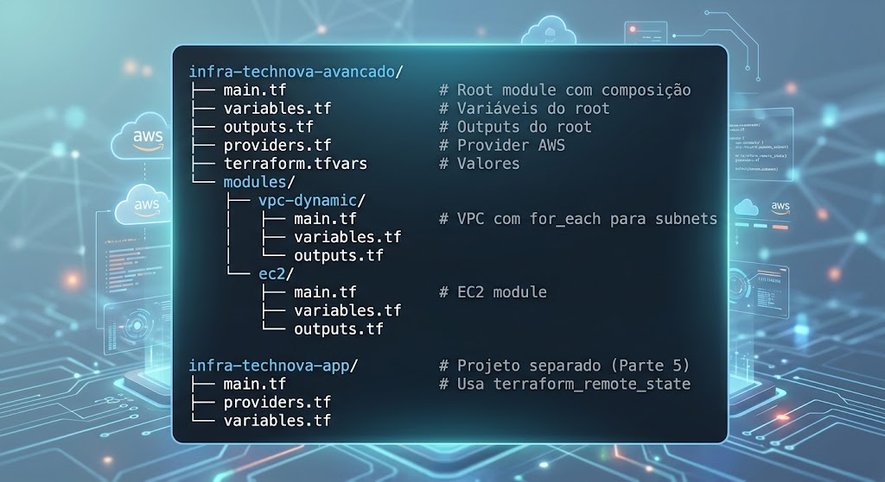
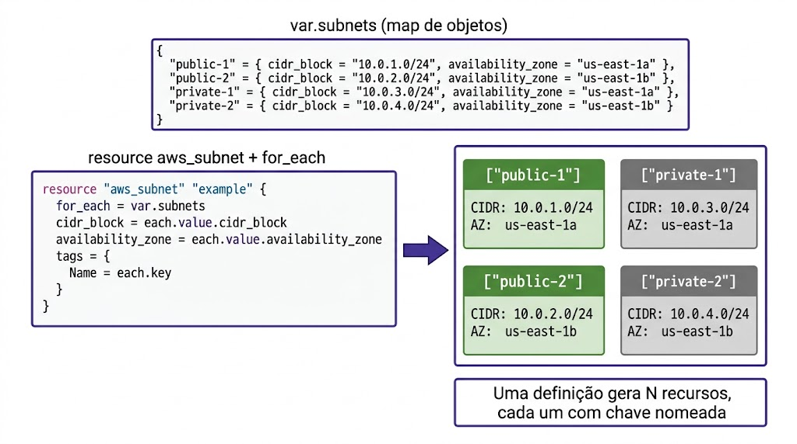
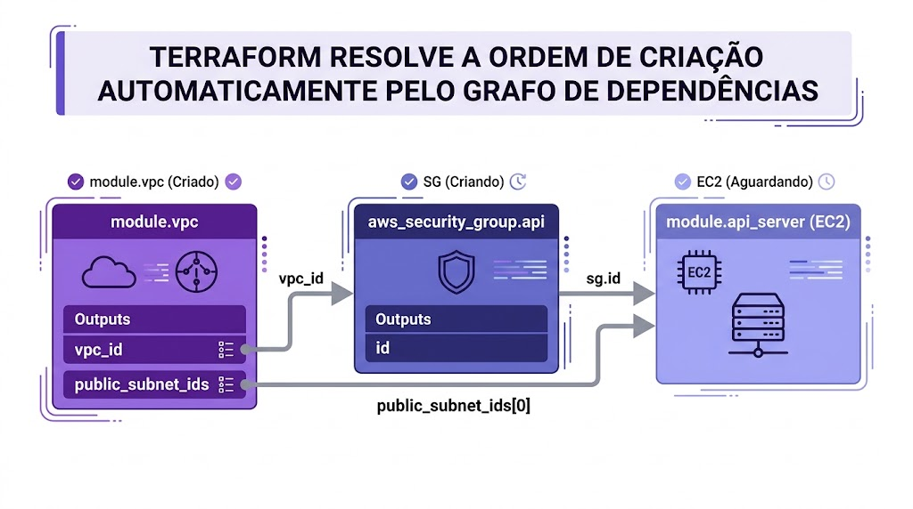
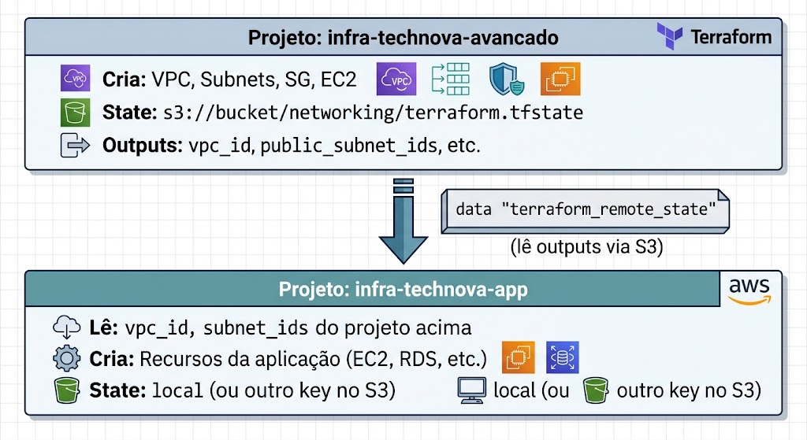

# Aula 06 — Laboratório Parte 2: for_each, Registry e Composição

## Missão

Escalar a infraestrutura modular da TechNova com **padrões avançados**: criação dinâmica de recursos com `for_each`, consumo de módulos do Terraform Registry, composição entre módulos, versionamento, e leitura de state remoto com `terraform_remote_state`.

**Pré-requisitos:** Laboratório Parte 1 concluído, acesso ao AWS Academy Learner Lab, Kiro instalado

---

## Arquitetura Final



---

## Parte 0 — Pasta do Projeto e Credenciais do AWS Academy

### 0.1 Criar a pasta e abrir no Kiro

```bash
mkdir -p infra-technova-avancado/modules/vpc-dynamic
mkdir -p infra-technova-avancado/modules/ec2
cd infra-technova-avancado
git init

# Abrir no Kiro
kiro .
```

### 0.2 Carregar as credenciais do Learner Lab

Reutilize o `aws-creds.sh` do Lab Parte 1 (copie para esta pasta) ou crie um novo pela interface do Kiro com os valores atualizados do **AWS Details → AWS CLI → Show**. No terminal integrado do Kiro:

```bash
source aws-creds.sh
aws sts get-caller-identity
```

> **Lembrete:** As credenciais expiram entre sessões. Se der `ExpiredToken`, reinicie o lab, atualize o `aws-creds.sh` e rode `source aws-creds.sh`. O `aws-creds.sh` deve estar no `.gitignore`.

✅ **Checkpoint:** Pasta criada, aberta no Kiro e credenciais carregadas.

---

## Parte 1: VPC com for_each — Subnets Dinâmicas

### Contexto

No Lab Parte 1, usamos `count` para criar subnets a partir de uma lista. Agora vamos evoluir para `for_each` com um **mapa de configurações**, onde cada subnet tem nome, CIDR, AZ e tipo.

> Crie os arquivos a seguir pela interface do **Kiro**, dentro da pasta `infra-technova-avancado`.

### Estrutura de pastas

Preste atenção **em qual pasta** cada arquivo é criado:

```
infra-technova-avancado/          ← ROOT MODULE (rode o terraform aqui)
├── providers.tf                  ← root
├── variables.tf                  ← root (declara variáveis do .tfvars)
├── main.tf                       ← root (chama os módulos)
├── outputs.tf                    ← root
├── aws-creds.sh                  ← root (no .gitignore)
└── modules/
    ├── vpc-dynamic/              ← child module (variables/main/outputs)
    └── ec2/                      ← child module
```

> **Regra de ouro:** rode `terraform init` na **raiz** sempre que criar/alterar módulos, **antes** de `plan`/`apply`. Variáveis usadas no root precisam estar declaradas no `variables.tf` do root.

### Passo 1.1 — `providers.tf` (raiz do projeto)

```hcl
# providers.tf

terraform {
  required_version = ">= 1.0"

  required_providers {
    aws = {
      source  = "hashicorp/aws"
      version = "~> 5.0"
    }
  }
}

provider "aws" {
  region = var.aws_region
}
```

### Passo 1.2 — modules/vpc-dynamic/variables.tf

```hcl
# modules/vpc-dynamic/variables.tf

variable "vpc_cidr" {
  description = "CIDR block principal da VPC"
  type        = string
}

variable "project_name" {
  description = "Nome do projeto"
  type        = string
}

variable "environment" {
  description = "Ambiente (dev, staging, prod)"
  type        = string
}

variable "subnets" {
  description = "Mapa de subnets a serem criadas"
  type = map(object({
    cidr = string
    az   = string
    type = string  # "public" ou "private"
  }))
}
```

### Passo 1.3 — modules/vpc-dynamic/main.tf

```hcl
# modules/vpc-dynamic/main.tf

# ========================================
# VPC
# ========================================
resource "aws_vpc" "main" {
  cidr_block           = var.vpc_cidr
  enable_dns_hostnames = true
  enable_dns_support   = true

  tags = {
    Name        = "${var.project_name}-${var.environment}-vpc"
    Environment = var.environment
    Project     = var.project_name
    ManagedBy   = "terraform"
  }
}

# ========================================
# Internet Gateway
# ========================================
resource "aws_internet_gateway" "main" {
  vpc_id = aws_vpc.main.id

  tags = {
    Name        = "${var.project_name}-${var.environment}-igw"
    Environment = var.environment
  }
}

# ========================================
# Subnets — Criadas dinamicamente com for_each
# ========================================
resource "aws_subnet" "this" {
  for_each = var.subnets

  vpc_id                  = aws_vpc.main.id
  cidr_block              = each.value.cidr
  availability_zone       = each.value.az
  map_public_ip_on_launch = each.value.type == "public" ? true : false

  tags = {
    Name        = "${var.project_name}-${var.environment}-${each.key}"
    Environment = var.environment
    Type        = each.value.type
  }
}

# ========================================
# Route Table Pública
# ========================================
resource "aws_route_table" "public" {
  vpc_id = aws_vpc.main.id

  route {
    cidr_block = "0.0.0.0/0"
    gateway_id = aws_internet_gateway.main.id
  }

  tags = {
    Name        = "${var.project_name}-${var.environment}-public-rt"
    Environment = var.environment
  }
}

# ========================================
# Associação — Apenas subnets públicas com a route table
# ========================================
locals {
  public_subnets = {
    for key, subnet in var.subnets : key => subnet
    if subnet.type == "public"
  }
}

resource "aws_route_table_association" "public" {
  for_each = local.public_subnets

  subnet_id      = aws_subnet.this[each.key].id
  route_table_id = aws_route_table.public.id
}
```

**O que há de diferente aqui?**
- `for_each = var.subnets` — Cria uma subnet para cada entrada do mapa
- `each.key` — A chave do mapa (ex: "public-1", "private-1")
- `each.value.cidr` — Acessa atributos do objeto
- `locals.public_subnets` — Filtra apenas subnets públicas para associar à route table
- Expressão condicional `each.value.type == "public" ? true : false` — Atribui IP público apenas a subnets públicas



### Passo 1.4 — modules/vpc-dynamic/outputs.tf

```hcl
# modules/vpc-dynamic/outputs.tf

output "vpc_id" {
  description = "ID da VPC"
  value       = aws_vpc.main.id
}

output "vpc_cidr" {
  description = "CIDR da VPC"
  value       = aws_vpc.main.cidr_block
}

output "subnet_ids" {
  description = "Mapa de todos os subnet IDs (chave → ID)"
  value       = { for key, subnet in aws_subnet.this : key => subnet.id }
}

output "public_subnet_ids" {
  description = "Lista de IDs das subnets públicas"
  value = [
    for key, subnet in aws_subnet.this : subnet.id
    if var.subnets[key].type == "public"
  ]
}

output "private_subnet_ids" {
  description = "Lista de IDs das subnets privadas"
  value = [
    for key, subnet in aws_subnet.this : subnet.id
    if var.subnets[key].type == "private"
  ]
}
```

### Passo 1.5 — Chamar o módulo no root

Adicione ao `main.tf` do root:

```hcl
# main.tf

module "vpc" {
  source = "./modules/vpc-dynamic"

  vpc_cidr     = var.vpc_cidr
  project_name = var.project_name
  environment  = var.environment

  subnets = {
    "public-1" = {
      cidr = "10.0.1.0/24"
      az   = "us-east-1a"
      type = "public"
    }
    "public-2" = {
      cidr = "10.0.2.0/24"
      az   = "us-east-1b"
      type = "public"
    }
    "private-1" = {
      cidr = "10.0.3.0/24"
      az   = "us-east-1a"
      type = "private"
    }
    "private-2" = {
      cidr = "10.0.4.0/24"
      az   = "us-east-1b"
      type = "private"
    }
  }
}
```

### Passo 1.6 — Testar

```bash
terraform init
terraform plan
```

Observe como os recursos aparecem com chaves nomeadas:
```
module.vpc.aws_subnet.this["public-1"] will be created
module.vpc.aws_subnet.this["public-2"] will be created
module.vpc.aws_subnet.this["private-1"] will be created
module.vpc.aws_subnet.this["private-2"] will be created
```

**Vantagem:** Se você remover `"private-2"` do mapa, apenas essa subnet será destruída. Com `count`, isso causaria reindexação e recriação de outros recursos.

```bash
terraform apply
```

---

## Parte 2: Módulo do Terraform Registry

### Contexto

Agora que você entende como módulos funcionam internamente, vamos usar um módulo **pronto e testado** do Terraform Registry: `terraform-aws-modules/vpc/aws`.

### Passo 2.1 — Criar arquivo para Registry module

Crie o arquivo `registry-vpc.tf`:

```hcl
# registry-vpc.tf
# Exemplo usando módulo do Terraform Registry
# (Este módulo cria VPC com dezenas de opções pré-configuradas)

module "vpc_registry" {
  source  = "terraform-aws-modules/vpc/aws"
  version = "~> 5.0"

  name = "${var.project_name}-${var.environment}-registry-vpc"
  cidr = "10.2.0.0/16"

  azs             = ["us-east-1a", "us-east-1b"]
  public_subnets  = ["10.2.1.0/24", "10.2.2.0/24"]
  private_subnets = ["10.2.3.0/24", "10.2.4.0/24"]

  # Configurações importantes (evitar recursos que consomem o Learner Lab)
  enable_nat_gateway = false   # NAT Gateway custa ~$32/mês!
  enable_vpn_gateway = false   # Não precisamos de VPN

  enable_dns_hostnames = true
  enable_dns_support   = true

  # Tags aplicadas a todos os recursos do módulo
  tags = {
    Environment = var.environment
    Project     = var.project_name
    Source      = "terraform-registry"
    ManagedBy   = "terraform"
  }

  # Tags específicas para subnets públicas
  public_subnet_tags = {
    Type = "public"
  }

  # Tags específicas para subnets privadas
  private_subnet_tags = {
    Type = "private"
  }
}
```

### Passo 2.2 — Inicializar e baixar o módulo

```bash
terraform init
```

**Saída esperada:**
```
Initializing modules...
Downloading registry.terraform.io/terraform-aws-modules/vpc/aws 5.x.x for vpc_registry...
- vpc_registry in .terraform/modules/vpc_registry
```

O Terraform baixa o módulo do Registry e o armazena em `.terraform/modules/`.

### Passo 2.3 — Comparar: Local vs Registry

```bash
terraform plan
```

Observe quantos recursos o módulo do Registry cria vs o nosso módulo local:

| Aspecto | Nosso Módulo Local | terraform-aws-modules/vpc/aws |
|---------|-------------------|-------------------------------|
| Linhas de código (no módulo) | ~70 linhas | ~2000+ linhas |
| Recursos criados | VPC, IGW, Subnets, RT | VPC, IGW, Subnets, RT + NAT, VPN, Flow Logs, etc. |
| Configurabilidade | O que você escreveu | Dezenas de variáveis |
| Testes | Nenhum | Suite completa de testes |
| Documentação | O que você escreveu | Gerada automaticamente |
| Manutenção | Sua responsabilidade | Comunidade (100+ contribuidores) |

> **Quando usar cada um:**
> - **Local:** Para aprender, para lógica muito específica do negócio, ou para componentes simples
> - **Registry:** Para produção, para infraestrutura padrão, quando precisar de muitas opções


### Passo 2.4 — Explorar outputs do módulo Registry

Adicione ao `outputs.tf`:

```hcl
output "registry_vpc_id" {
  description = "VPC ID do módulo Registry"
  value       = module.vpc_registry.vpc_id
}

output "registry_public_subnets" {
  description = "Subnets públicas do módulo Registry"
  value       = module.vpc_registry.public_subnets
}

output "registry_private_subnets" {
  description = "Subnets privadas do módulo Registry"
  value       = module.vpc_registry.private_subnets
}
```

```bash
terraform apply
terraform output
```

> **Nota:** Neste lab estamos criando duas VPCs (nossa local + Registry) para fins de comparação. Em produção, você escolheria uma ou outra.

### Passo 2.5 — Destruir a VPC do Registry (manter a local)

Para o restante do lab, vamos trabalhar com nosso módulo local. Remova ou comente o arquivo `registry-vpc.tf`:

```bash
# Renomear para não ser processado pelo Terraform
mv registry-vpc.tf registry-vpc.tf.example
terraform plan  # Mostrará destroy da VPC Registry
terraform apply
```

---

## Parte 3: Composição de Módulos

### Contexto

Agora vamos implementar o padrão de **composição**: o output de um módulo alimenta o input de outro. Criaremos um módulo EC2 que depende do módulo VPC.

### Passo 3.1 — modules/ec2/variables.tf

```hcl
# modules/ec2/variables.tf

variable "instance_name" {
  description = "Nome da instância EC2"
  type        = string
}

variable "instance_type" {
  description = "Tipo da instância"
  type        = string
  default     = "t2.micro"
}

variable "ami_id" {
  description = "AMI ID para a instância"
  type        = string
}

variable "subnet_id" {
  description = "ID da subnet onde a instância será criada"
  type        = string
}

variable "security_group_ids" {
  description = "Lista de Security Group IDs"
  type        = list(string)
}

variable "key_name" {
  description = "Nome do key pair para SSH"
  type        = string
}

variable "user_data" {
  description = "User data script (base64 encoded)"
  type        = string
  default     = ""
}

variable "environment" {
  description = "Ambiente"
  type        = string
}

variable "project_name" {
  description = "Nome do projeto"
  type        = string
}
```

### Passo 3.2 — modules/ec2/main.tf

```hcl
# modules/ec2/main.tf

resource "aws_instance" "this" {
  ami                    = var.ami_id
  instance_type          = var.instance_type
  subnet_id              = var.subnet_id
  vpc_security_group_ids = var.security_group_ids
  key_name               = var.key_name

  user_data = var.user_data != "" ? var.user_data : null

  tags = {
    Name        = var.instance_name
    Environment = var.environment
    Project     = var.project_name
    ManagedBy   = "terraform"
  }
}
```

### Passo 3.3 — modules/ec2/outputs.tf

```hcl
# modules/ec2/outputs.tf

output "instance_id" {
  description = "ID da instância EC2"
  value       = aws_instance.this.id
}

output "public_ip" {
  description = "IP público da instância"
  value       = aws_instance.this.public_ip
}

output "private_ip" {
  description = "IP privado da instância"
  value       = aws_instance.this.private_ip
}
```

### Passo 3.4 — Composição no Root: VPC → SG → EC2

Atualize o `main.tf` do root para demonstrar a composição completa:

```hcl
# main.tf — Composição de Módulos

# ========================================
# Módulo 1: VPC (base de tudo)
# ========================================
module "vpc" {
  source = "./modules/vpc-dynamic"

  vpc_cidr     = var.vpc_cidr
  project_name = var.project_name
  environment  = var.environment

  subnets = {
    "public-1" = { cidr = "10.0.1.0/24", az = "us-east-1a", type = "public" }
    "public-2" = { cidr = "10.0.2.0/24", az = "us-east-1b", type = "public" }
    "private-1" = { cidr = "10.0.3.0/24", az = "us-east-1a", type = "private" }
    "private-2" = { cidr = "10.0.4.0/24", az = "us-east-1b", type = "private" }
  }
}

# ========================================
# Módulo 2: Security Group API
# Composição: usa vpc_id do módulo VPC ↑
# ========================================
resource "aws_security_group" "api" {
  name        = "${var.project_name}-${var.environment}-api-sg"
  description = "Security Group para API"
  vpc_id      = module.vpc.vpc_id  # ← OUTPUT do módulo VPC

  ingress {
    from_port   = 80
    to_port     = 80
    protocol    = "tcp"
    cidr_blocks = ["0.0.0.0/0"]
    description = "HTTP"
  }

  ingress {
    from_port   = 22
    to_port     = 22
    protocol    = "tcp"
    cidr_blocks = ["0.0.0.0/0"]
    description = "SSH"
  }

  egress {
    from_port   = 0
    to_port     = 0
    protocol    = "-1"
    cidr_blocks = ["0.0.0.0/0"]
  }

  tags = {
    Name        = "${var.project_name}-${var.environment}-api-sg"
    Environment = var.environment
  }
}

# ========================================
# Data Source: AMI Amazon Linux 2023
# ========================================
data "aws_ami" "amazon_linux" {
  most_recent = true
  owners      = ["amazon"]

  filter {
    name   = "name"
    values = ["al2023-ami-*-x86_64"]
  }

  filter {
    name   = "virtualization-type"
    values = ["hvm"]
  }
}

# ========================================
# Módulo 3: EC2
# Composição: usa subnet_id do VPC + sg_id
# ========================================
module "api_server" {
  source = "./modules/ec2"

  instance_name      = "${var.project_name}-${var.environment}-api"
  instance_type      = "t2.micro"
  ami_id             = data.aws_ami.amazon_linux.id
  subnet_id          = module.vpc.public_subnet_ids[0]   # ← OUTPUT do VPC
  security_group_ids = [aws_security_group.api.id]       # ← OUTPUT do SG
  key_name           = var.key_name
  environment        = var.environment
  project_name       = var.project_name
}
```

**Fluxo de composição:**
```
module.vpc (cria VPC + subnets)
    │
    ├── vpc_id ──────────► aws_security_group.api
    │
    └── public_subnet_ids ──► module.api_server
                                      ▲
         aws_security_group.api.id ───┘
```



### Passo 3.5 — Variáveis adicionais

Adicione ao `variables.tf`:

```hcl
variable "aws_region" {
  description = "Região AWS"
  type        = string
  default     = "us-east-1"
}

variable "project_name" {
  description = "Nome do projeto"
  type        = string
  default     = "technova"
}

variable "environment" {
  description = "Ambiente"
  type        = string
  default     = "dev"
}

variable "vpc_cidr" {
  description = "CIDR da VPC"
  type        = string
  default     = "10.0.0.0/16"
}

variable "key_name" {
  description = "Nome do key pair SSH"
  type        = string
  default     = "technova-key"
}
```

### Passo 3.6 — Testar composição

```bash
terraform init
terraform plan
terraform apply
```

Verifique que o Terraform cria os recursos na ordem correta (VPC → SG → EC2) automaticamente pelo grafo de dependências.

```bash
terraform output
```

---

## Parte 4: Versionamento de Módulos

### Contexto

Em projetos reais, módulos evoluem. Você precisa garantir que atualizações no módulo não quebrem ambientes existentes. A solução é **versionar** com Git tags.

### Passo 4.1 — Taggear o módulo com Git

```bash
# No diretório do projeto
git add .
git commit -m "feat: módulos com for_each, composição VPC→SG→EC2"

# Criar tag de versão
git tag -a v1.0.0 -m "Versão 1.0.0 - Módulos VPC, EC2 com composição"

# Listar tags
git tag
```

### Passo 4.2 — Simular evolução do módulo

Vamos simular que o módulo VPC recebeu uma nova funcionalidade (enable_flow_logs):

```bash
# Adicionar uma nova variável ao módulo VPC
# (apenas para demonstrar o conceito de versão)
```

Adicione ao `modules/vpc-dynamic/variables.tf`:

```hcl
variable "enable_flow_logs" {
  description = "Habilitar VPC Flow Logs (não usar no Learner Lab)"
  type        = bool
  default     = false
}
```

```bash
git add .
git commit -m "feat(vpc): adicionar suporte a flow logs"
git tag -a v1.1.0 -m "Versão 1.1.0 - Adicionado enable_flow_logs à VPC"
```

### Passo 4.3 — Referenciar módulo por versão (conceito)

Se seus módulos estivessem em um repositório Git separado, você referenciaria assim:

```hcl
# Usando versão específica de um repositório Git
module "vpc" {
  source = "git::https://github.com/technova/terraform-modules.git//modules/vpc-dynamic?ref=v1.0.0"
  # ...
}

# Atualizando para nova versão
module "vpc" {
  source = "git::https://github.com/technova/terraform-modules.git//modules/vpc-dynamic?ref=v1.1.0"
  # ...
}
```

**Boas práticas de versionamento:**
- Use [Semantic Versioning](https://semver.org/) (MAJOR.MINOR.PATCH)
- **MAJOR:** Breaking changes (removeu/renomeou variável)
- **MINOR:** Nova funcionalidade retrocompatível (nova variável com default)
- **PATCH:** Bug fixes

---

## Parte 5: terraform_remote_state

### Contexto

Em equipes grandes, a infraestrutura é dividida em projetos separados. O time de networking gerencia VPC/subnets, e o time de aplicação precisa saber o `vpc_id` e `subnet_ids` para criar EC2/RDS. A solução é `terraform_remote_state`.

### Passo 5.1 — Configurar backend S3 no projeto principal

Primeiro, vamos configurar o projeto atual para usar backend remoto. Adicione ao `providers.tf`:

```hcl
terraform {
  required_version = ">= 1.0"

  # Backend S3 para state remoto
  backend "s3" {
    bucket         = "technova-terraform-state-SEURA"  # Substitua SEURA pelo seu RA
    key            = "networking/terraform.tfstate"
    region         = "us-east-1"
    encrypt        = true
    dynamodb_table = "technova-terraform-locks"
  }

  required_providers {
    aws = {
      source  = "hashicorp/aws"
      version = "~> 5.0"
    }
  }
}
```

> **⚠️ Nota:** O bucket S3 e a tabela DynamoDB precisam existir antes. Se você já os criou na Aula 05, use-os. Caso contrário, crie-os manualmente no Console AWS ou com um script Terraform separado.

### Passo 5.2 — Migrar state para S3

```bash
terraform init -migrate-state
```

Confirme com `yes` quando perguntado. O state agora está no S3.

### Passo 5.3 — Criar projeto separado que lê o state

Crie um novo diretório simulando o "projeto da aplicação":

```bash
mkdir -p ../infra-technova-app
cd ../infra-technova-app
```

### Passo 5.4 — providers.tf do projeto app

```hcl
# infra-technova-app/providers.tf

terraform {
  required_version = ">= 1.0"

  required_providers {
    aws = {
      source  = "hashicorp/aws"
      version = "~> 5.0"
    }
  }
}

provider "aws" {
  region = "us-east-1"
}
```

### Passo 5.5 — main.tf com terraform_remote_state

```hcl
# infra-technova-app/main.tf

# ========================================
# Lendo outputs do projeto de networking
# ========================================
data "terraform_remote_state" "networking" {
  backend = "s3"

  config = {
    bucket = "technova-terraform-state-SEURA"  # Mesmo bucket do projeto de networking
    key    = "networking/terraform.tfstate"
    region = "us-east-1"
  }
}

# ========================================
# Usando dados do projeto de networking
# ========================================
output "vpc_id_from_networking" {
  description = "VPC ID lido do state remoto do projeto de networking"
  value       = data.terraform_remote_state.networking.outputs.vpc_id
}

output "public_subnets_from_networking" {
  description = "Subnet IDs lidos do state remoto"
  value       = data.terraform_remote_state.networking.outputs.public_subnet_ids
}

# ========================================
# Criar recurso usando dados do outro projeto
# ========================================
data "aws_ami" "amazon_linux" {
  most_recent = true
  owners      = ["amazon"]

  filter {
    name   = "name"
    values = ["al2023-ami-*-x86_64"]
  }

  filter {
    name   = "virtualization-type"
    values = ["hvm"]
  }
}

resource "aws_instance" "app" {
  ami           = data.aws_ami.amazon_linux.id
  instance_type = "t2.micro"

  # Subnet vem do projeto de NETWORKING via remote_state!
  subnet_id = data.terraform_remote_state.networking.outputs.public_subnet_ids[0]

  tags = {
    Name        = "technova-app-from-remote-state"
    Environment = "dev"
    Source      = "terraform_remote_state"
  }
}
```

### Passo 5.6 — Testar terraform_remote_state

```bash
cd ../infra-technova-app
terraform init
terraform plan
```

**Saída esperada:**
```
data.terraform_remote_state.networking: Reading...
data.terraform_remote_state.networking: Read complete after 1s

  + resource "aws_instance" "app" {
      + subnet_id = "subnet-0abc123..."  ← Lido do state remoto!
    }

Plan: 1 to add, 0 to change, 0 to destroy.
```

> **Importante:** NÃO execute `terraform apply` neste projeto separado durante o lab (para não criar EC2 extra). O objetivo é demonstrar que o `terraform_remote_state` funciona.

### Passo 5.7 — Entender o fluxo completo



---

## Parte 6: terraform destroy e Cleanup

### Passo 6.1 — Destruir o projeto principal

```bash
cd ../infra-technova-avancado
terraform destroy
```

Confirme com `yes`.

### Passo 6.2 — Limpar o projeto app (se aplicou)

```bash
cd ../infra-technova-app
terraform destroy  # Apenas se você aplicou na Parte 5
```

### Passo 6.3 — Verificar no Console AWS

1. **VPC** → Não deve haver VPCs com tag "technova"
2. **EC2** → Não deve haver instâncias "technova"
3. **Security Groups** → Apenas o "default" de cada VPC

> **⚠️ Learner Lab:** Sempre destrua os recursos ao final. Se esqueceu, vá ao Console AWS e termine as instâncias manualmente, e encerre a sessão do Learner Lab.

---

## Troubleshooting

### Erro: "Error acquiring state lock"

```
Error: Error acquiring the state lock
Lock Info:
  ID: xxxxxxxx-xxxx-xxxx-xxxx
  Who: user@hostname
```

**Solução:** Outro processo está usando o state. Se você tem certeza que não há outro apply rodando:
```bash
terraform force-unlock <LOCK-ID>
```

### Erro: "for_each value depends on resource attributes"

```
Error: Invalid for_each argument
The "for_each" value depends on resource attributes that cannot be determined until apply
```

**Solução:** `for_each` precisa de valores conhecidos no momento do `plan`. Use variáveis ao invés de outputs de outros recursos.

### Erro: "Module version not found"

```
Error: Module version requirements have changed
Could not find version matching "~> 5.0" for module "vpc_registry"
```

**Solução:** Verifique a versão mais recente no [Registry](https://registry.terraform.io/modules/terraform-aws-modules/vpc/aws/latest) e ajuste o constraint.

### Erro: "No outputs found" (terraform_remote_state)

```
Error: Unsupported attribute
data.terraform_remote_state.networking.outputs.vpc_id: This object has no argument, nested block, or exported attribute named "vpc_id"
```

**Solução:** Verifique se o projeto de networking tem o output declarado em `outputs.tf` E se o state no S3 está atualizado (`terraform apply` foi executado após adicionar o output).

---

## Checklist de Validação

- [ ] Módulo vpc-dynamic criado com for_each para subnets
- [ ] for_each funciona com mapa de objetos (nome → {cidr, az, type})
- [ ] Módulo do Terraform Registry (vpc) baixado e testado
- [ ] Entendeu diferenças entre módulo local e Registry
- [ ] Composição VPC → SG → EC2 implementada e funcionando
- [ ] Módulo versionado com git tag (v1.0.0, v1.1.0)
- [ ] terraform_remote_state configurado e testado (leitura de outputs)
- [ ] terraform destroy executado em todos os projetos
- [ ] Código commitado no Git

> **Excelente!** Você agora domina os padrões avançados de módulos Terraform. No TF (Trabalho de Fixação), você vai consolidar tudo criando uma biblioteca completa de módulos para a TechNova.
