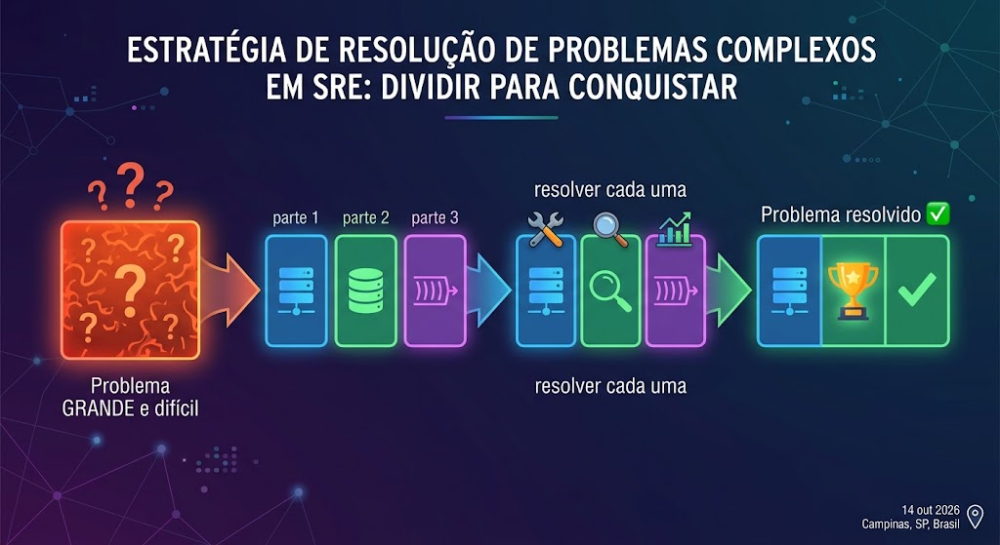
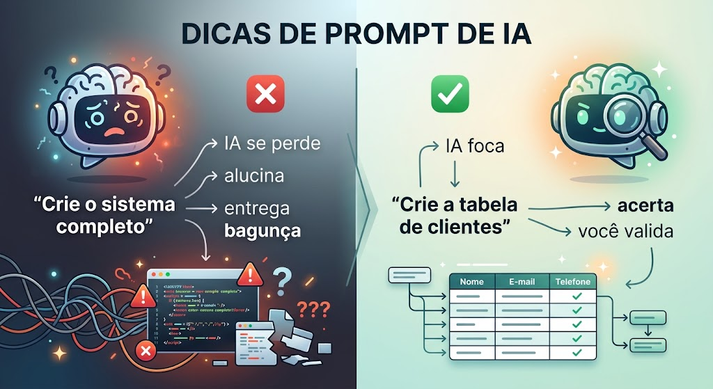
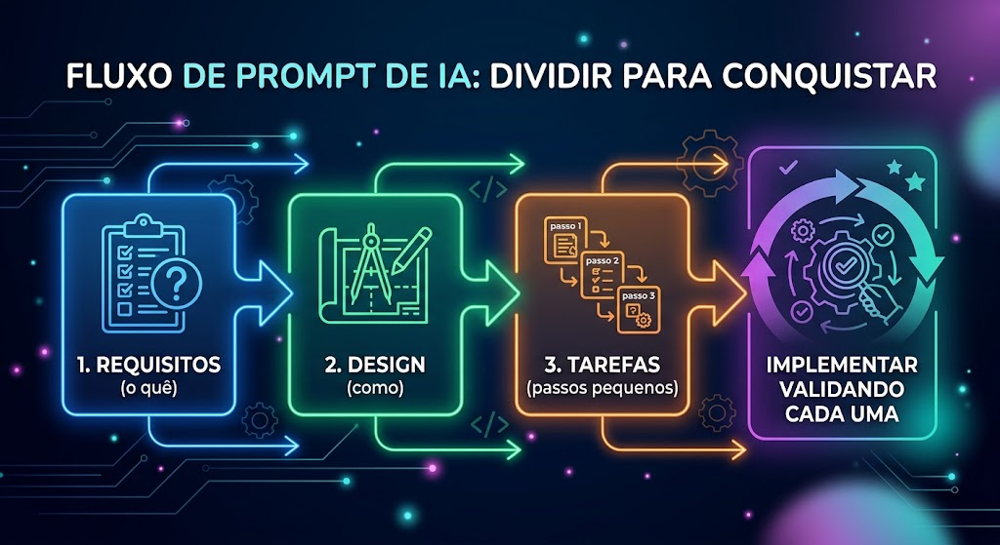

# Aula 07 — Resolvendo Problemas Complexos com IA (Decomposição, Harness e Spec-Driven)

## Objetivos de Aprendizagem

Ao final desta aula, o aluno será capaz de:

1. Explicar por que problemas complexos são difíceis de resolver "de uma vez só"
2. Aplicar o conceito de **decomposição** ("dividir para conquistar") para quebrar problemas em partes menores
3. Entender o que é **alucinação** de uma IA e o que aumenta a chance dela acontecer
4. Compreender o conceito de **Harness** (o "arreio" que guia a IA) e seus elementos
5. Explicar o que é **Spec-Driven Development** e como o Kiro o aplica (Requisitos → Design → Tarefas)
6. Demonstrar, na prática, que a IA resolve problemas complexos melhor quando eles são divididos
7. Usar o modo **Spec** do Kiro para decompor e resolver um problema complexo passo a passo

---

## Contexto Narrativo

> **O Resgate da TechNova — Episódio 7: "Um Problema Grande Demais"**

A TechNova cresceu. O CTO Carlos Mendes chega na reunião com um pedido enorme:

> "Precisamos de um novo sistema completo de fidelidade: cadastro de clientes, pontos por compra, resgate de prêmios, histórico, notificações... e para ontem!"

A equipe olha para aquilo e **congela**. É muita coisa. Ninguém sabe por onde começar.

Rafael, animado, tenta um atalho. Abre a IA e escreve: *"Crie um sistema de fidelidade completo com tudo funcionando."* O resultado vem rápido — mas é uma bagunça: partes faltando, tecnologias misturadas, código que nem roda. A IA **alucinou** porque o pedido era grande e vago demais.

Marina, a consultora, sorri e dá a dica que vai guiar a aula inteira:

> "O problema não é a IA. É como vocês pediram. Ninguém resolve um problema gigante de uma vez — nem gente, nem IA. A gente **divide para conquistar**. E quando trabalhamos com IA, colocamos um **arreio** nela: damos contexto, estrutura e pedimos **uma parte de cada vez**. É isso que o Kiro faz no modo **Spec** — ele transforma o caos em Requisitos, Design e Tarefas pequenas. Deixa eu mostrar."

Nesta aula, você vai aprender a **domar problemas complexos** — quebrando-os em partes menores e usando o Kiro para resolver cada pedaço com controle, em vez de rezar para a IA acertar tudo de uma vez.

---

## Cronograma da Aula

| Bloco | Atividade |
|:-----:|-----------|
| 1 | Revisão do TA + Discussão em Grupo |
| 2 | Conteúdo Teórico — Decomposição, Alucinação, Harness e Spec-Driven |
| 3 | Trabalho em Aula — Praticando decomposição no papel |
| 4 | Laboratório Interativo — Resolvendo um problema complexo com Kiro (Spec) |
| 5 | Encerramento + Orientação do TF |

> Esta aula é **conceitual e prática com o Kiro**. Não há material de slides — o aprendizado acontece no TA (leitura), na discussão e no **laboratório construído ao vivo, junto com o professor**.

---

## Pré-requisitos

- **Kiro** instalado e funcional — utilizado desde a Aula 02 ([download](https://kiro.dev/))
- **Node.js** instalado (para rodar o pequeno projeto do laboratório) — [download](https://nodejs.org/)
- Ter lido o **TA.md** desta aula (conceitos de decomposição, Harness e Spec-Driven)
- Editor de texto (VS Code recomendado)

> **Boa notícia:** esta aula **não usa AWS**. O foco é aprender a **pensar** e a **usar a IA como copiloto**. O laboratório usa um projeto simples em Node.js, executável na sua própria máquina.

---

## Conteúdo Teórico — Resumo

O conteúdo teórico completo está no **TA.md** (leitura prévia obrigatória). Em aula, revisamos e aprofundamos:

### 1. Dividir para Conquistar

Problemas complexos travam a gente quando tentamos resolvê-los inteiros. A solução é **decompor**: quebrar em partes pequenas, resolver uma de cada vez e juntar no final.



**Benefícios:** cada parte é mais fácil, você erra menos, vê progresso e testa aos poucos.

### 2. A IA Também Precisa de Partes Menores

A IA **alucina** (inventa coisas erradas) mais quando recebe pedidos **grandes e vagos**. Ela funciona muito melhor com pedidos **pequenos e específicos**, um de cada vez.



### 3. Harness — o Arreio da IA

**Harness** é a estrutura que colocamos ao redor da IA para guiá-la: **contexto + estrutura + regras + validação + escopo pequeno**. Como o arreio guia o cavalo, o Harness guia a IA.

### 4. Spec-Driven — o Harness na Prática

O modo **Spec** do Kiro aplica a decomposição como método:



Você revisa cada etapa antes de a IA avançar — o que **evita alucinação** e dá controle total.

---

## Entrega do Trabalho em Aula

O trabalho em aula vale **1 ponto na nota final** do semestre (contabilizado apenas ao final, com todos os trabalhos entregues).

### Onde entregar

No fork da disciplina, na pasta de entrega da aula:

```
entregas/aula-07/SEU-RA/trabalho-em-aula.md
```

### O que entregar

Um arquivo `trabalho-em-aula.md` com o resultado da atividade de decomposição feita em sala (o problema quebrado em partes menores).

### Observações

- A entrega é **individual** — mesmo que a atividade tenha sido em grupo
- O arquivo pode ser adicionado no **mesmo PR** do TF ou em PR separado
- Entregas parciais (apenas algumas aulas) **não garantem o ponto**

---

## Entrega do Trabalho de Fixação (TF)

O TF desta aula é **conceitual e prático** (não usa AWS). Você entrega o **código do projeto** construído com o Kiro + o documento **`processo-spec.md`** na pasta de entrega do fork da disciplina.

### Passo a Passo

1. Faça **fork** do repositório da disciplina (se ainda não fez)
2. Crie uma **branch**: `SEU-RA/tf-07`
3. Crie a pasta `entregas/aula-07/SEU-RA/`
4. Adicione o **código do projeto** + o arquivo **`processo-spec.md`** (o `processo-spec.md` é o que mais vale)
5. Faça commits descritivos seguindo [Conventional Commits](https://www.conventionalcommits.org/pt-br/)
6. Abra um **Pull Request** para o repositório original com título: `[Aula 07] RA: XXXXX - Nome Completo`

Para detalhes completos sobre o desafio, entregáveis e critérios de avaliação, consulte o arquivo [`TF.md`](TF.md).

---

## Estrutura de Arquivos desta Aula

| Arquivo | Descrição |
|---------|-----------|
| `README.md` | Este arquivo — visão geral da aula |
| `TA.md` | Trabalho Anterior — leitura prévia obrigatória (teoria) |
| `trabalho-em-aula.md` | Atividade de decomposição no papel (em grupo) |
| `laboratorio-parte1.md` | Laboratório interativo — resolver um problema complexo com Kiro (Spec) |
| `TF.md` | Trabalho de Fixação — decompor e resolver outro problema com Spec-Driven |
| `materiais-complementares.md` | Recursos adicionais sobre o tema |

---

## Conexão com o Curso

Esta é a **última aula do Módulo 2** e uma das mais importantes para a sua vida profissional. Nos módulos anteriores, você aprendeu **ferramentas** (Git, Docker, Terraform). Aqui você aprende uma **forma de pensar** que serve para qualquer tecnologia:

> **Todo problema complexo vira simples quando você o divide nas partes certas — e a IA é uma aliada poderosa quando você a guia por essas partes.**

Essa habilidade será usada em **todos os módulos seguintes** e em toda a sua carreira.

---

*Próximas etapas: leitura do TA.md → Trabalho em Aula (decomposição no papel) → Laboratório Interativo (Kiro + Spec) → TF (Trabalho de Fixação).*
