<!-- _class: title -->

# Aula 07 — Resolvendo Problemas Complexos com IA

**Decomposição, Harness e Spec-Driven Development**
DevOps — Centro Universitário UniFAAT
Prof. Alexandre Tavares | Semestre 2026-2

---

# Por que esta aula é diferente

Nos módulos anteriores você aprendeu **ferramentas** (Git, Docker, Terraform). Aqui você aprende uma **forma de pensar** que serve para qualquer tecnologia:

> **Todo problema complexo vira simples quando você o divide nas partes certas — e a IA é uma aliada poderosa quando você a guia por essas partes.**

**O que veremos hoje:**
- Por que problemas grandes travam a gente (e a IA)
- Decomposição — dividir para conquistar
- Alucinação da IA e como evitá-la
- Harness — o "arreio" que guia a IA
- Spec-Driven Development — o método do Kiro

> Aula **conceitual e prática**: no laboratório vamos resolver um problema complexo ao vivo, com o Kiro em modo Spec.

---

# O Problema da TechNova

> **Episódio Final do Módulo 2: "Um Problema Grande Demais"**

O CTO pede um **sistema de fidelidade completo**: cadastro, pontos, resgate, histórico, notificações... "e para ontem!". A equipe **congela** — é muita coisa.

Rafael tenta um atalho e pede à IA: *"Crie um sistema de fidelidade completo com tudo funcionando."* O resultado vem rápido, mas é uma **bagunça**: partes faltando, tecnologias misturadas, código que nem roda.

> **A dica da Marina:** "O problema não é a IA. É como vocês pediram. Ninguém resolve um problema gigante de uma vez — nem gente, nem IA. A gente **divide para conquistar** e coloca um **arreio** na IA."

---

# Complexo ≠ Complicado

Um problema é difícil por três fatores:

| Fator | O que significa | Exemplo |
|-------|-----------------|---------|
| **Tamanho** | Muitas partes para fazer | E-commerce tem dezenas de funções |
| **Conexões** | As partes dependem umas das outras | Carrinho depende do catálogo |
| **Incerteza** | Não está claro o que fazer | "Faça algo bom para os clientes" |

- **Complicado** — muitas peças, mas previsível (um relógio)
- **Complexo** — as peças se influenciam de formas difíceis de prever

> Quanto mais desses fatores, mais a mente (e a IA) sofre para resolver **de uma vez**.

---

# Por que a mente "trava": Carga Cognitiva

Nossa **memória de trabalho** tem capacidade limitada — seguramos só um punhado de itens ao mesmo tempo ("7 ± 2", Miller, 1956).

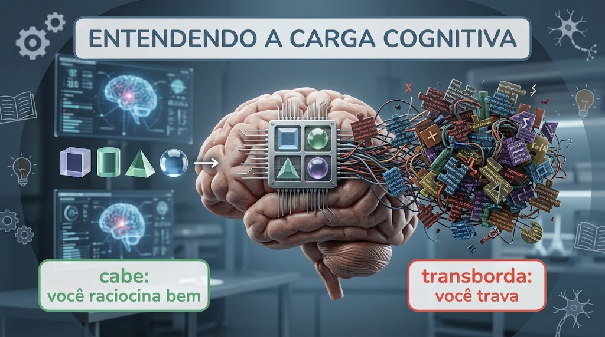

> Você não trava por incapacidade — trava por tentar segurar coisas demais de uma vez. A solução não é "pensar mais forte", é **reduzir quantas coisas você segura por vez**.

---

# Dividir para Conquistar

Um dos pilares da computação (*Divide and Conquer*): três movimentos — **dividir**, **conquistar** cada pedaço, e **combinar**.

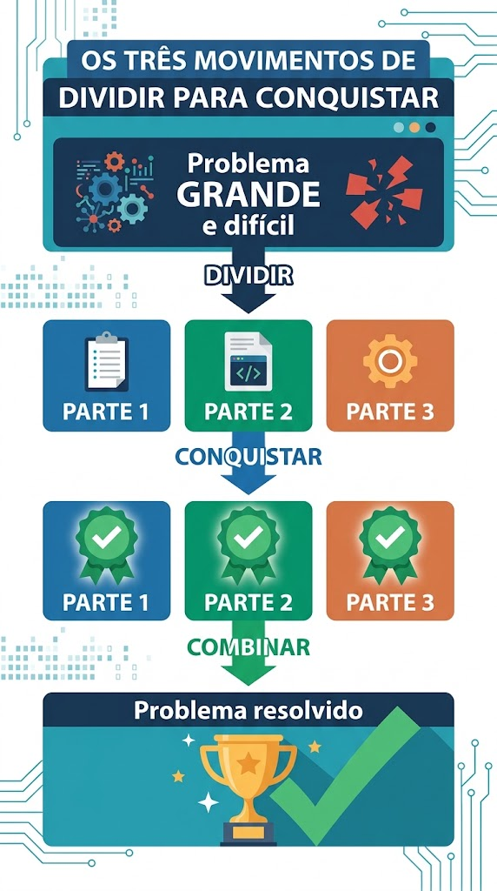

Roda bilhões de vezes por dia: busca binária, merge sort, carregamento de páginas web. E na vida: estudar por capítulos, planejar viagem por partes.

---

# Por que dividir melhora tudo

| Benefício | Por quê acontece |
|-----------|------------------|
| **Cada parte cabe na cabeça** | Respeita o limite da memória de trabalho |
| **Erra menos e acha o erro rápido** | O problema fica confinado a uma parte pequena |
| **Testa e valida aos poucos** | Descobre problemas cedo, não no final |
| **Vê progresso** | Cada parte concluída é uma vitória |
| **Dá para dividir o trabalho** | Partes independentes em paralelo (pessoas ou IA) |

> **Analogia:** montar um móvel — uma peça de cada vez, seguindo o manual. Se apertar o parafuso errado, você percebe **naquele passo**, não no final.

---

# A parte difícil: dividir BEM

O desafio não é "dividir", é **dividir bem**. Uma boa divisão tem:

- **Partes coesas** — cada parte trata de **uma coisa só** e faz sentido sozinha
- **Partes pouco acopladas** — dependem **o mínimo** umas das outras

E pensar na **ordem/dependências**: não dá para "fazer uma reserva" antes de "cadastrar a sala".

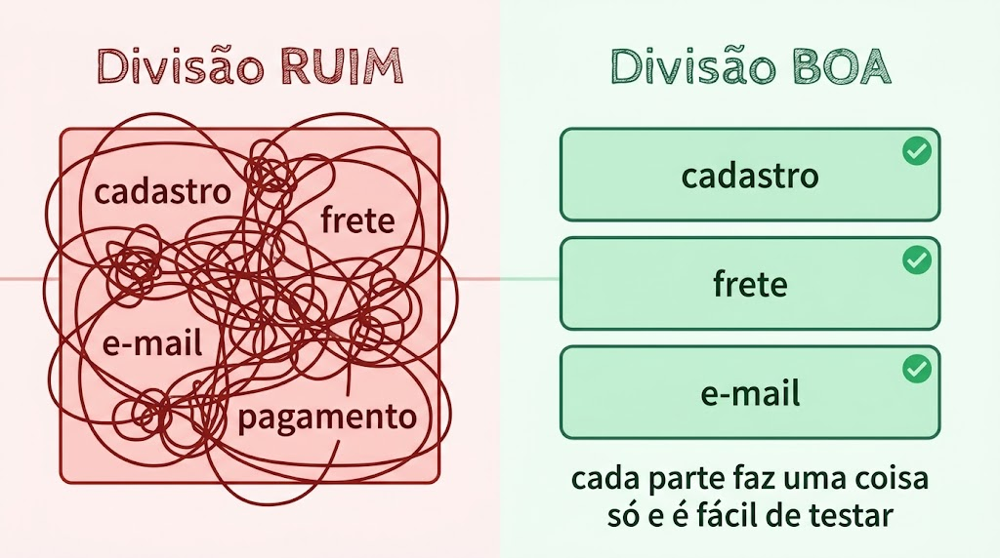

> Decompor é uma **habilidade que melhora com a prática** — e o Kiro ajuda a organizar as partes.

---

# Você já fez isso o bimestre todo

O problemão "colocar a TechNova na nuvem" foi quebrado em partes, uma por aula:

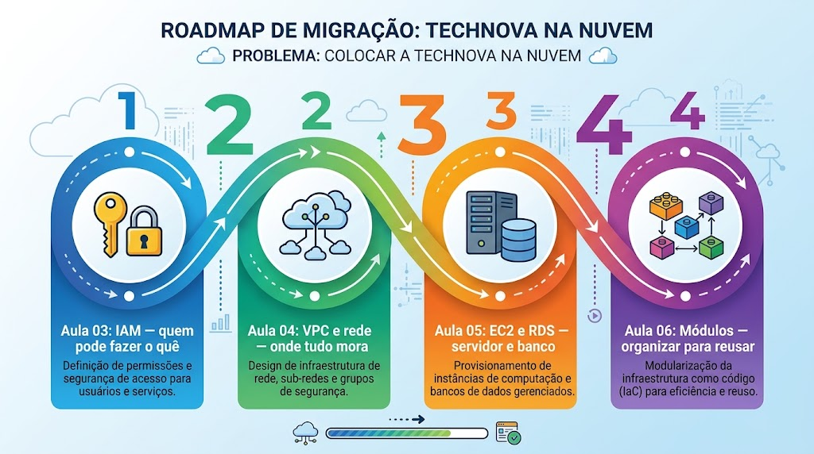

Cada aula resolveu **uma parte**, na **ordem certa** (rede antes do servidor, servidor antes de modularizar). Decompor bem foi o que tornou o curso possível.

---

# A IA também tem limites

> **Quanto maior e mais vago o pedido, maior a chance de a IA errar.**

Quando você pede "crie um sistema completo com tudo funcionando", a IA tenta **adivinhar** centenas de decisões que você não explicou. Aí acontece a **alucinação**.

**Alucinação** = a IA responde algo que parece confiante e correto, mas está **errado ou inventado**:
- Cita uma função que não existe
- Usa configuração inválida
- "Esquece" um pedaço do pedido
- Mistura soluções incompatíveis

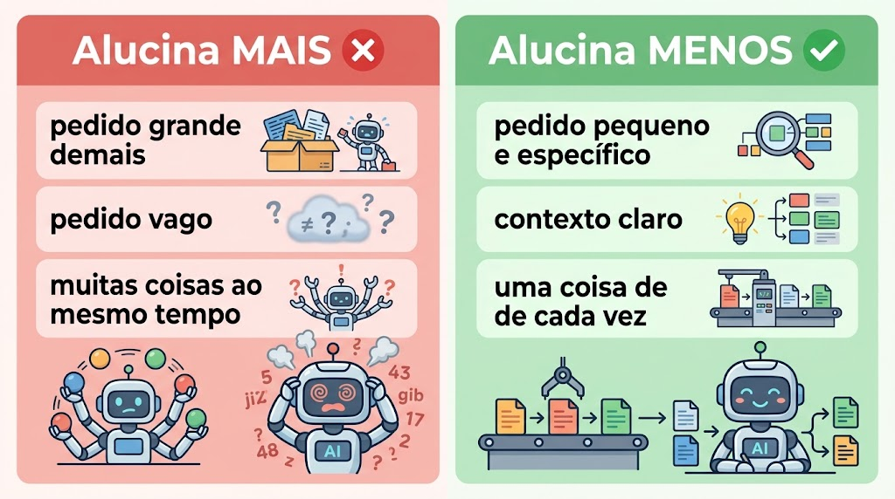

---

# A mesma regra vale para a IA

> **A IA resolve problemas complexos muito melhor quando você os divide em partes menores — exatamente como um humano.**

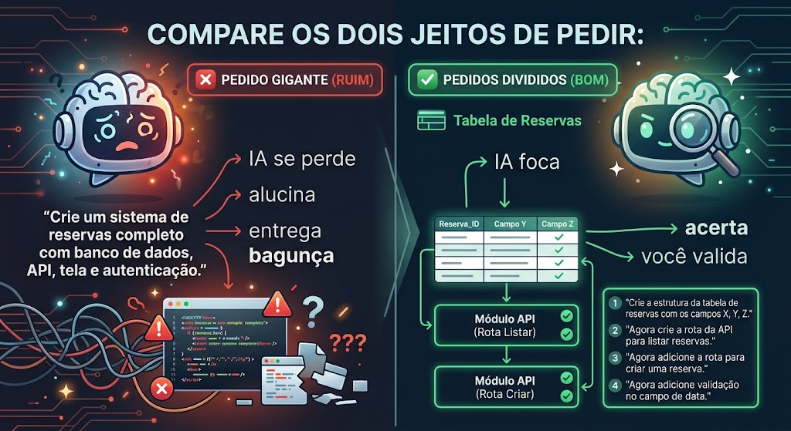

No pedido gigante: resposta grande, difícil de revisar, erros escondidos.
Nos pedidos divididos: cada resposta é **pequena, fácil de validar**, e você percebe o erro na hora.

> **Regra de ouro:** você é o piloto, a IA é o copiloto. Bom piloto quebra a rota em etapas e confere o mapa a cada trecho.

---

# Harness — o "arreio" da IA

**Harness** = arreio. O que guia o cavalo (forte, mas sem direção sozinho). No mundo da IA, é a camada de **estrutura, contexto, regras e ferramentas** ao redor do modelo para ele trabalhar de forma **guiada e confiável**.

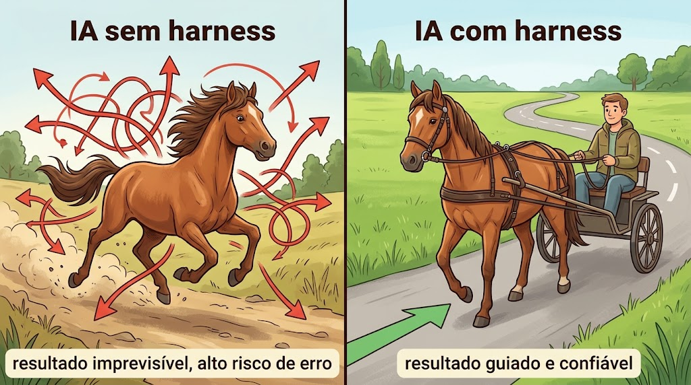

> Usar o Kiro não é usar "só um modelo" — é usar um modelo **dentro de um harness** bem construído.

---

# A janela de contexto

A **janela de contexto** é quanto de texto a IA consegue "olhar" de uma vez — seu "campo de visão". O que fica de fora, ela **não vê**.

Duas consequências:
1. **A IA não lembra de tudo para sempre** — em conversas longas ou pedidos gigantes, informações "escorregam para fora" da janela
2. **Contexto de qualidade > quantidade** — encher de informação irrelevante empurra o que importa para fora

> O Harness existe, em boa parte, para **gerenciar a janela de contexto**: a informação certa, na hora certa. Por isso "escopo pequeno" e "um passo por vez" funcionam tão bem.

---

# Do que é feito um bom Harness

| Elemento | O que é | Que problema evita |
|----------|---------|--------------------|
| **Contexto** | Projeto, tecnologias, objetivo, restrições | A IA adivinhar e inventar premissas |
| **Estrutura** | Um caminho claro de etapas | Fazer tudo fora de ordem |
| **Regras** | Limites do que pode/não pode | Decisões proibidas ou perigosas |
| **Ferramentas** | Ler arquivos, rodar, testar | "Achar" em vez de verificar |
| **Validação** | Conferência entre etapas | Erro pequeno contaminar o resto |
| **Escopo pequeno** | Uma parte por vez | Estourar a janela de contexto |

> O Harness **reduz** o risco de erro, mas não elimina. Quem garante a qualidade final é **você**.

---

# Spec-Driven Development

**Spec** = especificação: uma descrição clara do que deve ser feito **antes de sair fazendo**. Não é código — é o **acordo** sobre o que construir.

Não nasceu com a IA: ninguém constrói uma ponte improvisando — primeiro o projeto, depois a obra.

**O custo de corrigir tarde:**

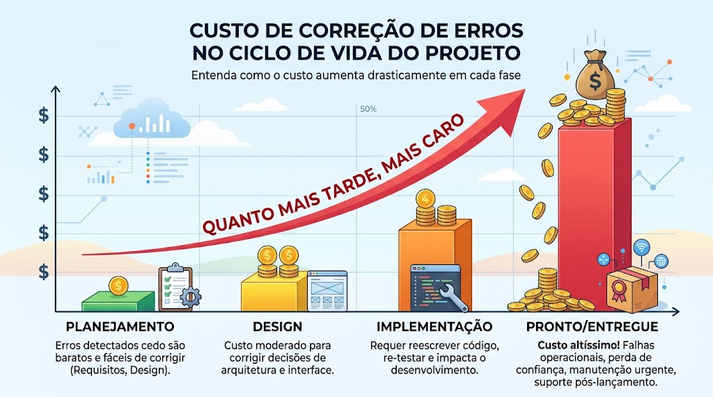

> Investir tempo planejando no início **derruba o custo dos erros** — você os pega quando ainda são só palavras num documento.

---

# Uma boa especificação

Responde três perguntas, em ordem, separando bem cada uma:

- **O QUÊ** (Requisitos) — o que o sistema faz, do ponto de vista de quem usa. Ainda sem decidir como.
- **COMO** (Design) — de que forma vamos construir: estrutura, arquivos, decisões técnicas.
- **EM QUE PASSOS** (Tarefas) — a sequência de pedaços pequenos.

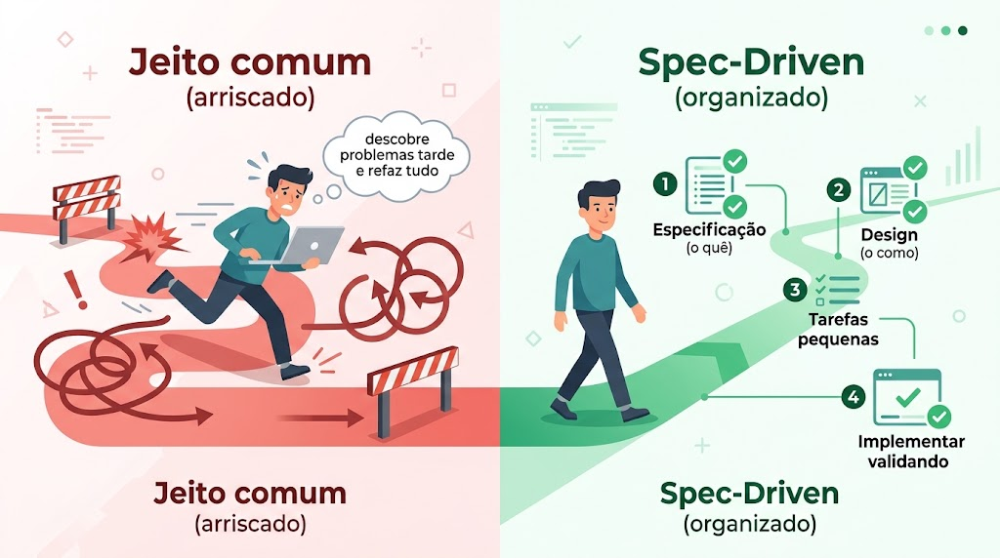

> Separar "o quê" de "como" evita uma das maiores fontes de confusão em projetos.

---

# Como o Kiro usa Spec-Driven

O modo **Spec** te guia por três documentos, em ordem:

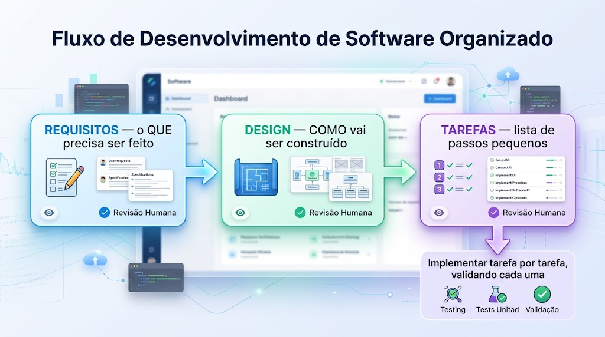

1. **Requisitos** — o Kiro escreve o **que** o sistema deve fazer. Você revisa e corrige.
2. **Design** — o Kiro descreve **como** vai construir. Você revisa de novo.
3. **Tarefas** — o Kiro quebra em **passos pequenos**. Você aprova.

Só então implementa — **uma tarefa por vez**, validando cada pedaço.

---

# Por que o Spec-Driven combate a alucinação

É a decomposição transformada em **método**:

- Em vez de um pedido gigante → **três etapas de planejamento** + tarefas pequenas
- Em vez de a IA adivinhar → ela **escreve o que entendeu** e **você corrige** antes de codar
- Em vez de descobrir erros no final → você **valida a cada tarefa**

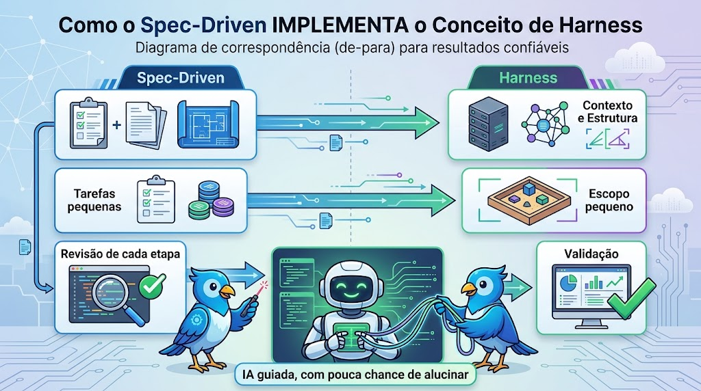

---

# O ciclo completo

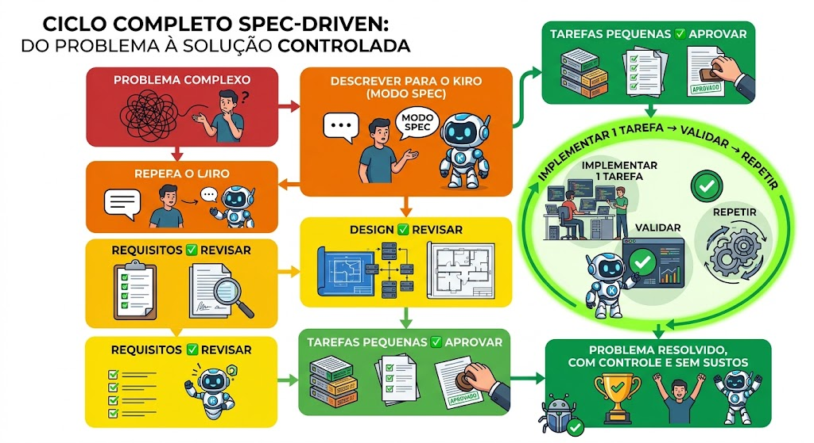

> **Decompor (dividir) + Harness (guiar) = trabalhar bem com IA.** O Spec-Driven é isso na prática.

---

# Fechando as ideias

1. **Problemas complexos** travam a gente quando resolvidos de uma vez
2. **Decompor** torna cada parte fácil, reduz erros e mostra progresso
3. A **IA também erra mais** com problemas grandes e vagos (alucinação)
4. Dividir em partes menores faz a **IA trabalhar muito melhor**
5. O **Harness** é o arreio: contexto, estrutura, regras, validação, escopo pequeno
6. O **Spec-Driven** (Kiro) é o Harness na prática: Requisitos → Design → Tarefas → validar cada passo

> **No laboratório:** vamos pegar um problema propositalmente complexo e resolvê-lo **juntos**, ao vivo, com o Kiro em modo Spec.

---

# Referências e Próximos Passos

**Referências (leitura opcional):**
- Miller (1956) — *The Magical Number Seven* (carga cognitiva)
- Cormen et al. — *Introduction to Algorithms* (Divide and Conquer)
- Wing (2006) — *Computational Thinking* (decomposição)
- Kiro Docs — modo Spec ([kiro.dev/docs](https://kiro.dev/docs/))
- IBM — *What are AI hallucinations?*

**Para o TF:**
- Decompor e resolver um problema **diferente** do laboratório com Spec-Driven
- Documentar o processo no `processo-spec.md` (é o que mais vale)

> **A habilidade mais valiosa que você leva do bimestre:** transformar qualquer problema complexo em partes pequenas e resolvê-las com a IA como copiloto — no controle, sem sustos.
