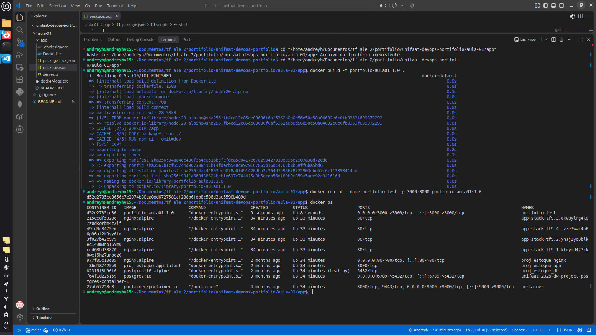
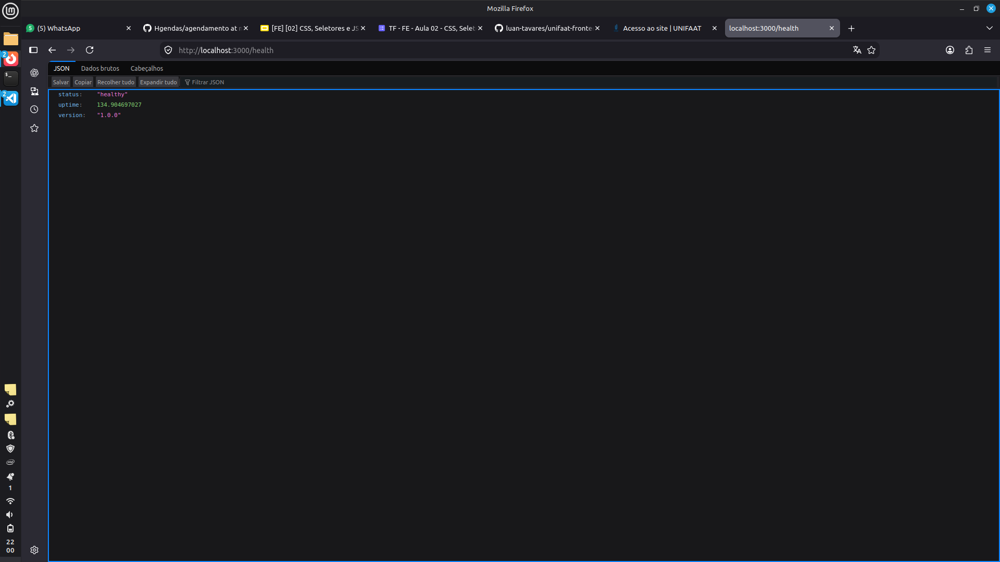

# Entrega — Aula 01: Fundamentos de Git e Docker

**Aluno:** Andreyh Rodrigues de Souza  
**RA:** 6325231  
**Data:** 25/08/2026

## Repositório

- URL: https://github.com/Andreyh117/unifaat-devops-portfolio

## Evidências

- [x] Repositório público com estrutura completa
- [x] Mínimo de 5 commits demonstrando workflow Git
- [x] Dockerfile funcional
- [x] Container rodando (evidência abaixo)

## Evidência de Container Rodando

