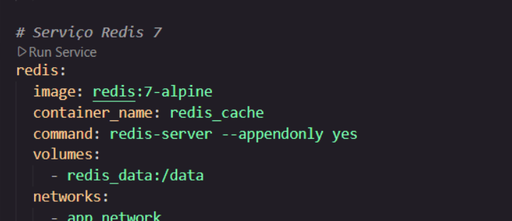
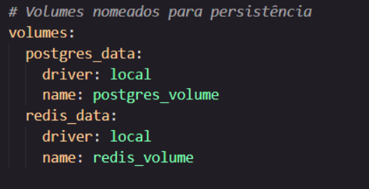
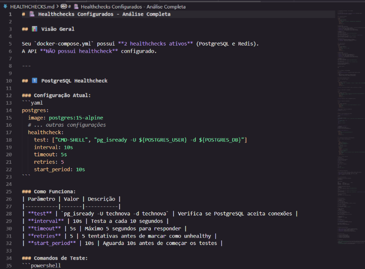
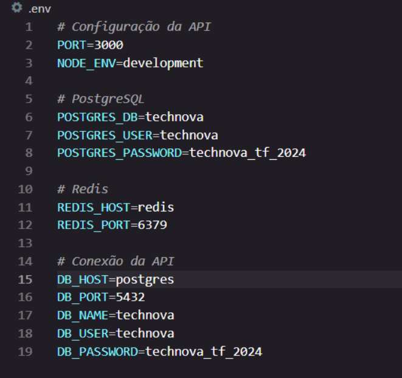
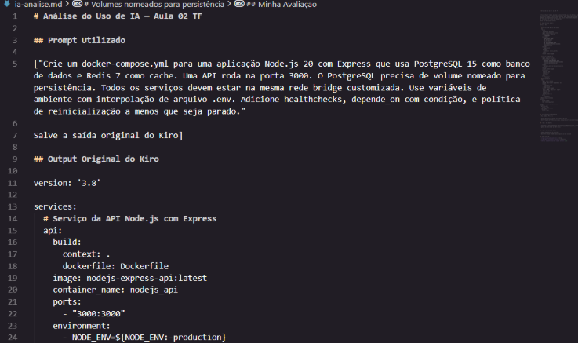
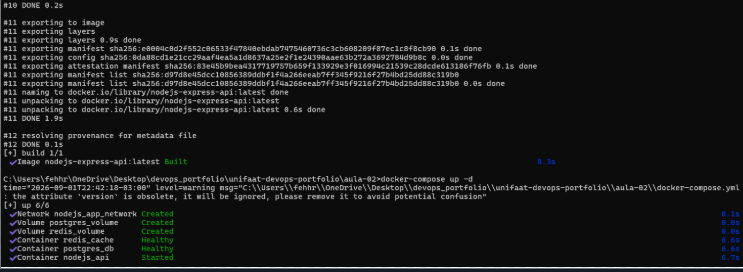
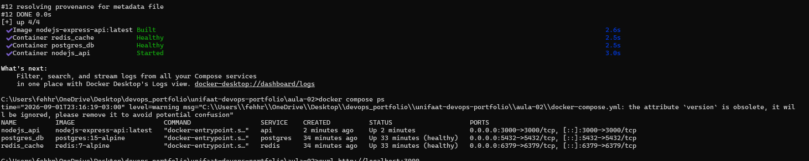

# Entrega — Aula 02: Docker Compose + IA como Copiloto

**Aluno:** [FERNANDA ROSA NOVAIS TAVARES]  
**RA:** [4025109]  
**Data:** [20/08/2026]

## Repositório

- URL: https://github.com/fehhnovais/unifaat-devops-portfolio

## Evidências

- [ ] `docker-compose.yml` com 3 serviços (API + PostgreSQL + Redis)

- [ ] Volume nomeado configurado para PostgreSQL

- [ ] Rede customizada conectando todos os serviços

- [ ] Healthchecks configurados

- [ ] Variáveis de ambiente via `.env` (não hardcoded)

- [ ] `ia-analise.md` preenchido com reflexão crítica

## Evidência do Ambiente Rodando

[Cole aqui o output do `docker compose ps` ou screenshot]

