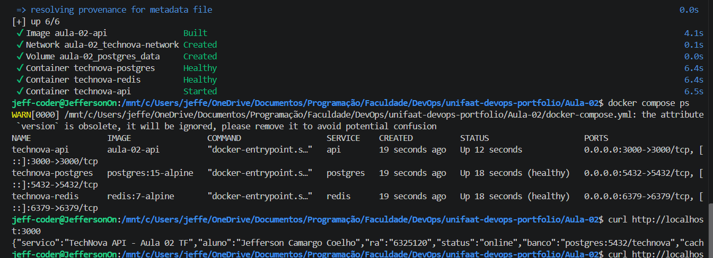

# Entrega — Aula 02: Docker Compose + IA como Copiloto

**Aluno:** Jefferson Camargo Coelho
**RA:** 6325120
**Data:** 27/08/2026

## Repositório

- URL: https://github.com/Jeff06-coder/unifaat-devops-portfolio

## Evidências

- [ ] `docker-compose.yml` com 3 serviços (API + PostgreSQL + Redis)
- [ ] Volume nomeado configurado para PostgreSQL
- [ ] Rede customizada conectando todos os serviços
- [ ] Healthchecks configurados
- [ ] Variáveis de ambiente via `.env` (não hardcoded)
- [ ] `ia-analise.md` preenchido com reflexão crítica

## Evidência do Ambiente Rodando

