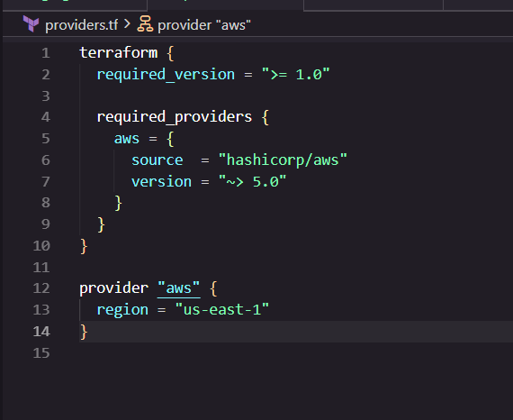
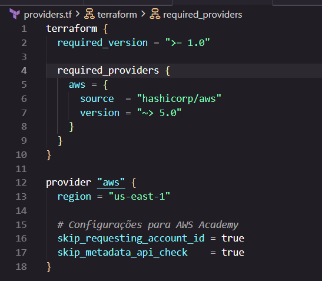
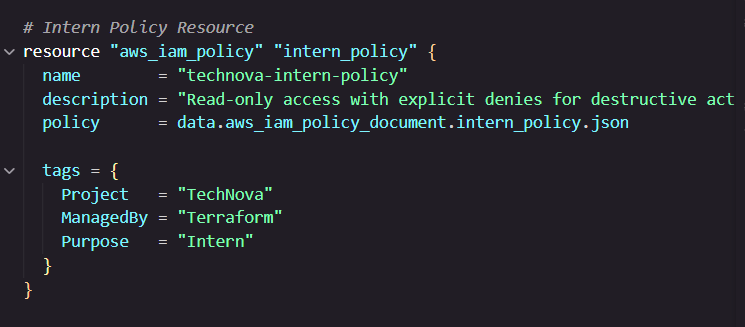
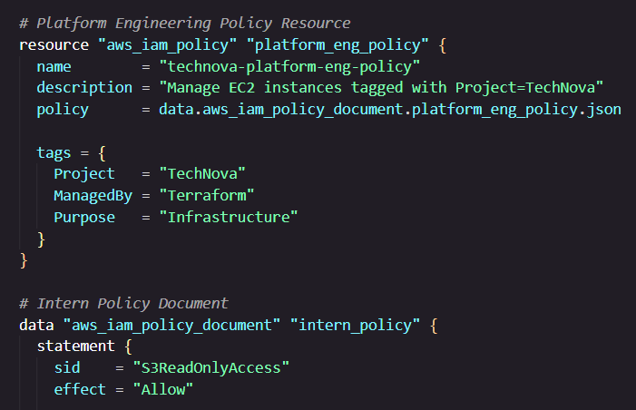
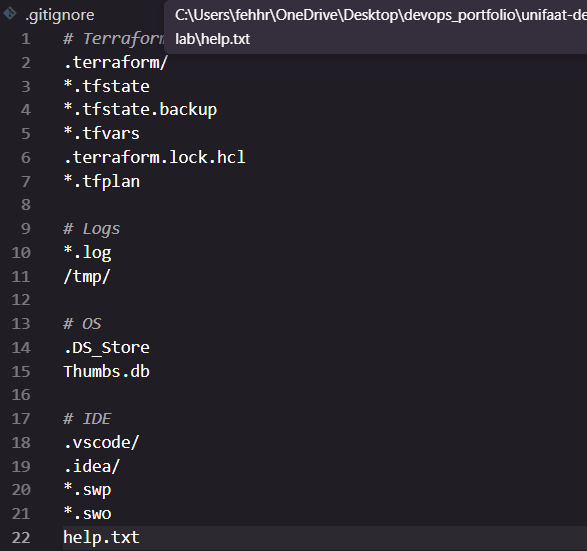

# Entrega — Aula 03: Terraform + IAM

**Aluno:** Fernanda Tavares  
**RA:** 4025109  
**Data:** 03/09/2026

## Repositório

- URL: https://github.com/fehhnovais/unifaat-devops-portfolio
- Pasta do projeto: `aula-03/`
- Branch: `main`

## Evidências

- [x] `providers.tf` com provider AWS configurado



- [x] `main.tf` com users, groups e memberships


- [x] `policies.tf` com mínimo 3 custom policies



- [x] `roles.tf` com service role + instance profile


- [x] `variables.tf` e `outputs.tf` configurados


- [x] `terraform-plan-output.txt` com evidência do plano


- [x] `README.md` com explicação do design e reflexão sobre menor privilégio


- [x] Tags obrigatórias em todos os recursos
- [x] `.gitignore` configurado (sem `.tfstate` no repositório)



## Evidência do Terraform Plan

```
Terraform used the selected providers to generate the following execution plan.
Resource actions are indicated with the following symbols:
  + create

Terraform will perform the following actions:

  # aws_iam_group.developers will be created
  + resource "aws_iam_group" "developers" {
      + arn       = (known after apply)
      + id        = (known after apply)
      + name      = "4025109-technova-developers"
      + path      = "/"
      + unique_id = (known after apply)
    }

  # aws_iam_group.platform_eng will be created
  + resource "aws_iam_group" "platform_eng" {
      + arn       = (known after apply)
      + id        = (known after apply)
      + name      = "4025109-technova-platform-eng"
      + path      = "/"
      + unique_id = (known after apply)
    }

  # aws_iam_user.juliana will be created
  + resource "aws_iam_user" "juliana" {
      + arn           = (known after apply)
      + id            = (known after apply)
      + name          = "4025109-juliana-dev"
      + path          = "/"
      + tags          = {
          + "Aluno"      = "Fernanda Tavares"
          + "Aula"       = "03"
          + "Disciplina" = "DevOps - UniFAAT 2026-2"
          + "ManagedBy"  = "Terraform"
          + "Project"    = "TechNova"
          + "RA"         = "4025109"
        }
      + unique_id     = (known after apply)
    }

  # aws_iam_user.rafael will be created
  + resource "aws_iam_user" "rafael" {
      + arn           = (known after apply)
      + id            = (known after apply)
      + name          = "4025109-rafael-platform"
      + path          = "/"
      + tags          = {
          + "Aluno"      = "Fernanda Tavares"
          + "Aula"       = "03"
          + "Disciplina" = "DevOps - UniFAAT 2026-2"
          + "ManagedBy"  = "Terraform"
          + "Project"    = "TechNova"
          + "RA"         = "4025109"
        }
      + unique_id     = (known after apply)
    }

  # aws_iam_user.lucas will be created
  + resource "aws_iam_user" "lucas" {
      + arn           = (known after apply)
      + id            = (known after apply)
      + name          = "4025109-lucas-intern"
      + path          = "/"
      + tags          = {
          + "Aluno"      = "Fernanda Tavares"
          + "Aula"       = "03"
          + "Disciplina" = "DevOps - UniFAAT 2026-2"
          + "ManagedBy"  = "Terraform"
          + "Project"    = "TechNova"
          + "RA"         = "4025109"
        }
      + unique_id     = (known after apply)
    }

  # aws_iam_group_membership.developers_membership will be created
  + resource "aws_iam_group_membership" "developers_membership" {
      + group = "4025109-technova-developers"
      + id    = (known after apply)
      + name  = "4025109-developers-membership"
      + users = [
          + "4025109-juliana-dev",
          + "4025109-rafael-platform",
          + "4025109-lucas-intern",
        ]
    }

  # aws_iam_group_membership.platform_eng_membership will be created
  + resource "aws_iam_group_membership" "platform_eng_membership" {
      + group = "4025109-technova-platform-eng"
      + id    = (known after apply)
      + name  = "4025109-platform-eng-membership"
      + users = [
          + "4025109-rafael-platform",
        ]
    }

  # aws_iam_policy.s3_read will be created
  + resource "aws_iam_policy" "s3_read" {
      + arn         = (known after apply)
      + id          = (known after apply)
      + name        = "4025109-technova-s3-read"
      + path        = "/"
      + tags        = {
          + "Aluno"      = "Fernanda Tavares"
          + "Aula"       = "03"
          + "Disciplina" = "DevOps - UniFAAT 2026-2"
          + "ManagedBy"  = "Terraform"
          + "Project"    = "TechNova"
          + "RA"         = "4025109"
        }
    }

  # aws_iam_policy.ec2_s3_full will be created
  + resource "aws_iam_policy" "ec2_s3_full" {
      + arn         = (known after apply)
      + id          = (known after apply)
      + name        = "4025109-technova-ec2-s3-full"
      + path        = "/"
      + tags        = {
          + "Aluno"      = "Fernanda Tavares"
          + "Aula"       = "03"
          + "Disciplina" = "DevOps - UniFAAT 2026-2"
          + "ManagedBy"  = "Terraform"
          + "Project"    = "TechNova"
          + "RA"         = "4025109"
        }
    }

  # aws_iam_policy.deny_destructive will be created
  + resource "aws_iam_policy" "deny_destructive" {
      + arn         = (known after apply)
      + id          = (known after apply)
      + name        = "4025109-technova-deny-destructive"
      + path        = "/"
      + tags        = {
          + "Aluno"      = "Fernanda Tavares"
          + "Aula"       = "03"
          + "Disciplina" = "DevOps - UniFAAT 2026-2"
          + "ManagedBy"  = "Terraform"
          + "Project"    = "TechNova"
          + "RA"         = "4025109"
        }
    }

  # aws_iam_role.ec2_role will be created
  + resource "aws_iam_role" "ec2_role" {
      + arn                   = (known after apply)
      + id                    = (known after apply)
      + name                  = "4025109-technova-ec2-role"
      + tags                  = {
          + "Aluno"      = "Fernanda Tavares"
          + "Aula"       = "03"
          + "Disciplina" = "DevOps - UniFAAT 2026-2"
          + "ManagedBy"  = "Terraform"
          + "Project"    = "TechNova"
          + "RA"         = "4025109"
        }
    }

  # aws_iam_instance_profile.ec2_profile will be created
  + resource "aws_iam_instance_profile" "ec2_profile" {
      + arn         = (known after apply)
      + id          = (known after apply)
      + name        = "4025109-technova-ec2-profile"
      + role        = "4025109-technova-ec2-role"
      + tags        = {
          + "Aluno"      = "Fernanda Tavares"
          + "Aula"       = "03"
          + "Disciplina" = "DevOps - UniFAAT 2026-2"
          + "ManagedBy"  = "Terraform"
          + "Project"    = "TechNova"
          + "RA"         = "4025109"
        }
    }

Plan: 14 to add, 0 to change, 0 to destroy.

Changes to Outputs:
  + developers_group_arn     = (known after apply)
  + platform_eng_group_arn   = (known after apply)
  + juliana_user_arn         = (known after apply)
  + rafael_user_arn          = (known after apply)
  + lucas_user_arn           = (known after apply)
  + s3_read_policy_arn       = (known after apply)
  + ec2_s3_full_policy_arn   = (known after apply)
  + deny_destructive_arn     = (known after apply)
  + ec2_role_arn             = (known after apply)
  + ec2_instance_profile_arn = (known after apply)
```

> Screenshot completa do `terraform plan` disponível em: 
