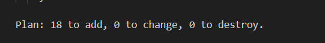

# Entrega — Aula 03: Terraform + IAM

**Aluno:** Maximus Ponciano
**RA:** 6325066
**Data:** 27/08/2026

## Repositório

- URL: https://github.com/MaximusPonciano/unifaat-devops-portfolio

## Evidências

- [x] `providers.tf` com provider AWS configurado
- [x] `main.tf` com users, groups e memberships
- [x] `policies.tf` com mínimo 3 custom policies
- [x] `roles.tf` com service role + instance profile
- [x] `variables.tf` e `outputs.tf` configurados
- [x] `terraform-plan-output.txt` com evidência do plano
- [x] `README.md` com explicação do design e reflexão sobre menor privilégio
- [x] Tags obrigatórias em todos os recursos
- [x] `.gitignore` configurado (sem `.tfstate` no repositório)

## Evidência do Terraform Plan

