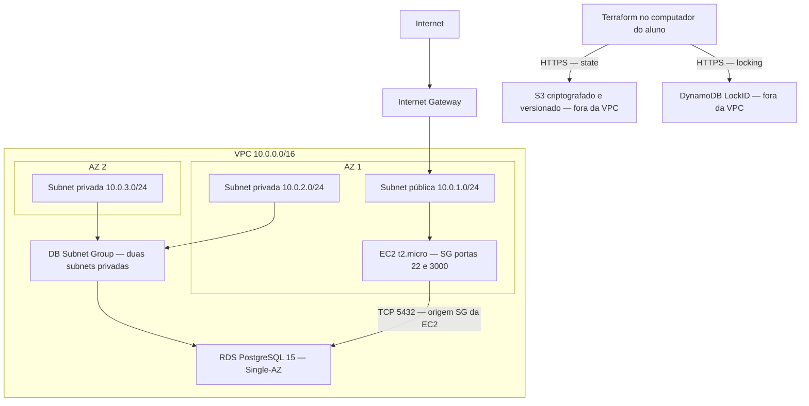

# Trabalho em Aula — Aula 05: RDS e Remote State

**Aluno:** rafael nogueira maruca  
**RA:** 6322006  
**Data da aula:** 14/09/2026

## Parte 1 — Análise dos Incidentes

### Cenário A: Perda de Dados

1. Os pedidos estavam na memória RAM do processo da API. Ao reiniciar a EC2, o processo terminou e essa memória foi perdida. A aplicação não havia gravado os pedidos em um armazenamento persistente.
2. Outros cenários: queda ou encerramento do processo Node.js; substituição da EC2; recriação de um container com dados somente em memória; interrupção da máquina ou implantação de uma nova versão que reinicie a aplicação.
3. Evitar reinicializações não resolve porque falhas, atualizações e substituições de servidores fazem parte da operação. A durabilidade dos pedidos não pode depender de um processo permanecer ativo para sempre.
4. Memória é temporária e vinculada ao processo/máquina. Dados persistentes são gravados em armazenamento durável e sobrevivem ao encerramento do processo. No projeto, PostgreSQL no RDS mantém os pedidos independentemente da EC2. Persistência não substitui backups e não protege contra uma exclusão intencional do banco.

### Cenário B: Perda do State

1. Sem o state e sem recuperá-lo de um backend, o Terraform não tem o vínculo entre os endereços dos recursos no código e os IDs reais da AWS. Um plan tende a propor criação dos recursos declarados, em vez de reconhecer automaticamente os existentes.
2. Executar apply pode duplicar recursos e gerar custos, ou falhar por nomes já existentes. Não é uma forma segura de recuperar a infraestrutura.
3. É possível reconstruir os vínculos com terraform import, importando cada recurso para o endereço correto e usando os IDs reais. Exemplo: `terraform import aws_vpc.main vpc-ID-REAL`. O código deve descrever o recurso importado; depois é necessário revisar o plan e ajustar diferenças antes de aplicar. Importar uma VPC não importa automaticamente suas subnets, SGs e instâncias.
4. Usar backend S3 compartilhado, com versionamento, criptografia e acesso restrito, além de locking DynamoDB. Recuperar primeiro uma versão válida do state, caso exista, é preferível a reconstruí-lo manualmente. O state também pode conter segredos, portanto não deve ser colocado no Git.

## Parte 2 — Design da Arquitetura

- A EC2 possui IP público e uma rota pelo Internet Gateway. SSH é permitido somente a partir do IP público /32 do aluno; 3000 é a porta prevista para a API. Liberar uma porta não significa que já exista um serviço escutando nela.
- RDS não possui acesso público e só aceita PostgreSQL a partir do SG da EC2. As subnets privadas usam uma tabela sem rota padrão para a internet. O tráfego EC2 → RDS usa a rota local da VPC; não precisa de NAT Gateway.
- O DB Subnet Group contém subnets em duas AZs para atender ao requisito do RDS e permitir alterações futuras de disponibilidade. Neste TF existe uma instância de banco Single-AZ, não uma réplica em cada subnet.
- S3 e DynamoDB são serviços regionais fora das subnets do projeto. Estarem fora da VPC não significa acesso público aos dados: o bucket bloqueia acesso público e o acesso depende de permissões AWS.
- A implementação escolhe as duas primeiras AZs disponíveis na região. Os nomes concretos são confirmados durante o plan.

## Parte 3 — Discussão: Conflito Simultâneo

- Pode ocorrer entre dois desenvolvedores, entre um pipeline CI/CD e uma execução manual, ou entre dois pipelines que compartilham o mesmo backend e a mesma chave de state.
- Dois states locais separados podem divergir; não existe coordenação entre os computadores. Quando há state compartilhado sem locking, escritas concorrentes também podem sobrescrever informações. O resultado pode ser perda de vínculos, planos incorretos, duplicação de recursos e dificuldade de manutenção ou destruição.
- Com DynamoDB, uma execução obtém o lock e as demais não podem modificar o mesmo state enquanto ele estiver ocupado. Por padrão, a outra operação pode falhar ao obter o lock; `-lock-timeout=5m` permite aguardar uma janela definida.
- Locking não faz merge de código. O segundo desenvolvedor precisa integrar as alterações no Git e gerar/revisar um novo plan contra o state atualizado. Caso use configuração antiga, ainda pode tentar reverter uma mudança do primeiro desenvolvedor.
- Se houver um lock residual após falha, verificar primeiro que não existe execução ativa. Liberar um lock à força durante uma execução elimina a proteção contra concorrência.

Estas são respostas individuais baseadas nos cenários do enunciado, sem alegação de participação em discussão de grupo. A infraestrutura descrita foi de fato aplicada e destruída no AWS Academy Learner Lab como parte do TF desta aula (evidências em `unifaat-devops-portfolio/aula-05/evidencias/`).
