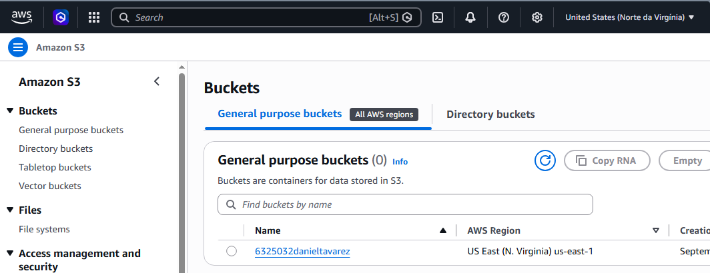

Entrega — Aula 05: RDS e Estado Remoto
Aluno: daniel de oliveira tavares junior RA: 6325032 Dados: 12/09/2026

Repositório
URL: https://github.com/danleltavarez/unifaat-devops-portf-lio
Evidências
VPC com sub-redes públicas e privadas em 2 AZs
RDS PostgreSQL (db.t3.micro) nas sub-redes privadas
EC2 t2.micro na sub-rede pública, conectando ao RDS
Security Groups corretores (porta 5432 apenas do SG da EC2)
Estado remoto configurado (S3 + DynamoDB)
Estado armazenado no S3 (evidência abaixo)
Conexão EC2 → RDS via psql (evidência abaixo)
 terraform destroyexecutado após evidências

Evidência do Estado no S3
 

 Evidência da Conexão EC2 → RDS
[ec2-user@ip-10-0-1-218 ~]$ psql -h technova-postgres.caagdgoffedb.us-east-1.rds.amazonaws.com \

 -U technova_admin -d technova_db -W
Senha: psql (14.24, servidor 15.17) AVISO: versão principal do psql 14, versão principal do servidor 15. Alguns recursos do psql podem não funcionar. Conexão SSL (protocolo: TLSv1.2, cifra: ECDHE-RSA-AES256-GCM-SHA384, bits: 256, compressão: desativada) Digite "help" para obter ajuda.

