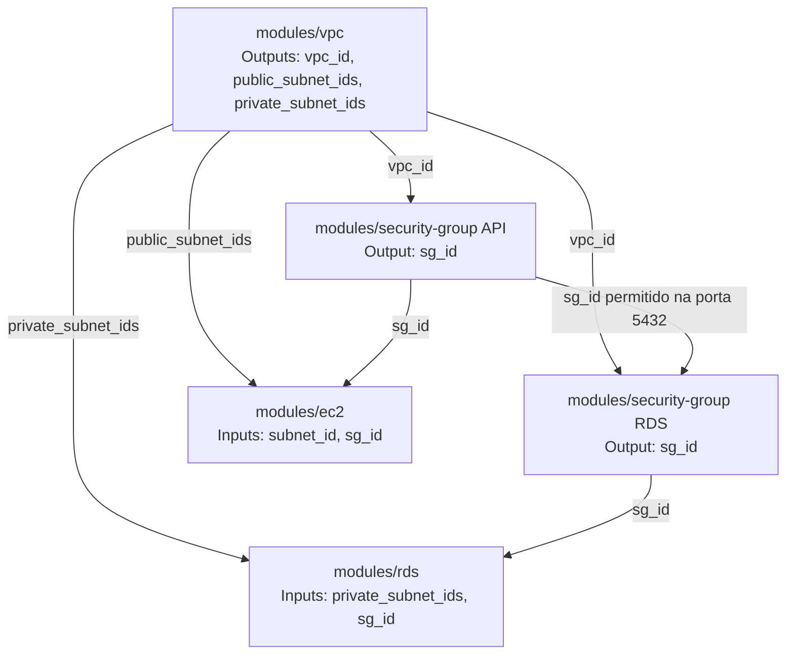

# Trabalho em Aula — Aula 06: Módulos Terraform

**Aluno:** Felipe Damasceno 
**RA:** 6325128  
**Data:** 17/09/2026

## Parte 1 — Identificação de Duplicação

### 1. Blocos de recursos duplicados

Existem **7 blocos de recursos duplicados por ambiente**, totalizando 14 blocos entre dev e staging:

1. `aws_vpc` — VPC do ambiente.
2. `aws_subnet` — subnet pública 1.
3. `aws_subnet` — subnet pública 2.
4. `aws_internet_gateway` — Internet Gateway.
5. `aws_security_group` — Security Group da API.
6. `aws_security_group` — Security Group do RDS.
7. `aws_instance` — instância EC2 da API.

Os recursos têm a mesma estrutura e diferem principalmente nos valores específicos do ambiente.

### 2. O que muda entre dev e staging

- Nome lógico do recurso Terraform: `dev` ou `staging`.
- CIDR da VPC: `10.0.0.0/16` no dev e `10.1.0.0/16` no staging.
- CIDRs das subnets: `10.0.1.0/24` e `10.0.2.0/24` no dev; `10.1.1.0/24` e `10.1.2.0/24` no staging.
- Prefixo dos nomes e tags: `technova-dev-*` ou `technova-staging-*`.
- Referências entre recursos, por exemplo `aws_vpc.dev.id` e `aws_vpc.staging.id`.

As zonas de disponibilidade, regras dos Security Groups, AMI, tipo da instância e chave SSH permanecem iguais no exemplo.

### 3. Módulos propostos

Eu criaria os seguintes módulos:

1. `modules/vpc`: VPC, subnets, Internet Gateway e, em uma versão completa, route tables.
2. `modules/security-group`: Security Group genérico com regras de entrada e saída configuráveis.
3. `modules/ec2`: instância EC2 e seus parâmetros de execução.
4. `modules/rds`: banco RDS, subnet group privado e parâmetros do banco.

Essa divisão separa a camada de rede dos controles de acesso e das cargas de trabalho.

### 4. Variáveis (inputs) dos módulos

| Módulo | Inputs principais |
|---|---|
| `vpc` | `name`, `environment`, `vpc_cidr`, `public_subnet_cidrs`, `private_subnet_cidrs`, `availability_zones`, `tags` |
| `security-group` | `name`, `vpc_id`, `ingress_rules`, `egress_rules`, `tags` |
| `ec2` | `name`, `ami_id`, `instance_type`, `subnet_id`, `security_group_ids`, `key_name`, `tags` |
| `rds` | `name`, `engine`, `engine_version`, `instance_class`, `allocated_storage`, `subnet_ids`, `security_group_ids`, `db_name`, `username`, `password` ou referência ao Secrets Manager, `tags` |

O módulo de Security Group recebe regras como objetos ou mapas, permitindo reutilizar o mesmo módulo para API, RDS e outros componentes.

### 5. Outputs dos módulos

| Módulo | Outputs principais |
|---|---|
| `vpc` | `vpc_id`, `public_subnet_ids`, `private_subnet_ids`, `internet_gateway_id` |
| `security-group` | `sg_id`, `sg_name` |
| `ec2` | `instance_id`, `private_ip`, `public_ip` |
| `rds` | `db_instance_id`, `db_endpoint`, `db_port`, `db_address` |

### 6. Linhas para adicionar um ambiente de produção

- **Código atual:** seria necessário copiar aproximadamente as 90 linhas do ambiente de staging e alterar nomes, CIDRs e referências. O arquivo passaria de cerca de 180 para aproximadamente 270 linhas.
- **Com módulos:** seria necessário adicionar apenas as chamadas dos módulos e seus valores de produção. Uma estimativa razoável é **20 a 30 linhas**, dependendo de quais módulos forem chamados separadamente e de como os parâmetros forem organizados.

Além de reduzir linhas, os módulos fazem com que uma correção na infraestrutura seja implementada uma vez e reutilizada pelos três ambientes.

## Parte 2 — Design de Módulos (Diagrama de Dependências)

A ordem natural de criação é: **VPC**, Security Groups e, depois, EC2/RDS. O Terraform calcula essa ordem automaticamente pelas referências entre outputs e inputs.

- **Módulo criado primeiro e por quê:** `modules/vpc`, porque os demais precisam da VPC e de suas subnets. Sem a VPC, não existem os identificadores de rede necessários.
- **Output da VPC que os Security Groups consomem:** `vpc_id`, usado para associar cada Security Group à rede correta.
- **Quantos módulos o EC2 depende:** diretamente de **2 módulos**: `vpc`, para obter `subnet_id`, e `security-group`, para obter `sg_id`. Indiretamente, depende também da infraestrutura criada dentro da VPC.
- **O que acontece com os outros módulos ao destruir a VPC:** os recursos dependentes precisam ser destruídos antes ou serão removidos pelo Terraform como parte da destruição planejada. EC2, RDS e Security Groups não podem continuar associados a uma VPC que deixou de existir.
- **Vantagem de um módulo genérico de Security Group:** regras, nomes e tags podem ser parametrizados e o mesmo código pode criar o SG da API, do RDS ou de outro serviço. Isso reduz duplicação e mantém um padrão único de segurança, sem impedir regras diferentes por ambiente ou finalidade.

### Discussão em grupo

1. **Módulos adicionais:** eu poderia separar `subnets` e `route-tables` da VPC em módulos próprios em uma infraestrutura maior. Para este exercício, mantê-los dentro de `modules/vpc` reduz a complexidade sem perder reutilização.
2. **Linhas para 3 ambientes:** sem módulos, aproximadamente `3 x 90 = 270` linhas de recursos. Com módulos, seriam três conjuntos de chamadas de módulos, aproximadamente 60 a 90 linhas, ou ainda menos usando `for_each`.
3. **Maior dificuldade da refatoração:** preservar o estado do Terraform. Se os endereços dos recursos mudarem ao migrar para módulos, pode ser necessário usar `moved` blocks ou `terraform state mv` para evitar recriações desnecessárias.
4. **Uso de `for_each`:** é possível declarar um mapa com os parâmetros de `dev`, `staging` e `production` e chamar os módulos uma única vez com `for_each`. Cada ambiente continuaria com seus próprios CIDRs, nomes e configurações.